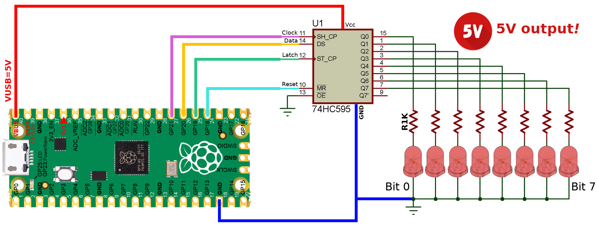

[Ce fichier existe également en FRANCAIS](readme.md)

# Use a 74HC595 shift register with MicroPython

This kind of component is really useful to send serial data to parallel output.

The 74HC595 can also be daisy chained to get mutliple bytes output (multiple of 8 bits).


The 74HC595 can also be used to append additional outputs on a microcontroler.

# Library

 The library must be copied to the MicroPython board before using the examples.

On a WiFi based microcontroler:

 ```
 >>> import mip
 >>> mip.install("github:mchobby/esp8266-upy/74HC595")
 ```

 Or by using the mpremote tool:

 ```
 mpremote mip install github:mchobby/esp8266-upy/74HC595
 ```

# Wiring

## Wiring to Pico

With a single 74HC595 you will get 8 bits.



With two of 74HC595 you will get 16 bits.


# Test

## write_byte

The most simple example is [write_byte.py](examples/write_byte.py) to send 8 bits (one _byte_) to the shift register.

``` python
from sn74hc595 import ShiftReg
from machine import Pin

# PINS: Data, Clock, Latch, Reset
reg = ShiftReg( Pin(20), Pin(21), Pin(19), Pin(18)  )
# Light one LED every two LEDs
reg.write_byte( 0b01010101 )
# Reset the 74HC595 buffer + update the output
reg.reset( latch=True ) #
```

## write_word

The [write_word.py](examples/write_word.py) script sends 16 bits (two bytes) in the right order to to be displayed on two daisy chained 74HC565.

``` python
from sn74hc595 import ShiftReg
from machine import Pin

reg = ShiftReg( Pin(20), Pin(21), Pin(19), Pin(18)  )
# Write the 16bits value with MSBF (Most Significatif Bit First)
# Will light up the LEDs in the 1111110111001010 order (bit 15 on left, bit 0 on right)
reg.write_word( 0xFDCA )
```

which produce the following result


## write_bytes

The [write_bytes.py](examples/write_bytes.py) allows to send an arbitrary number of bytes to  daisy chained 74HC595 (8 bits multiples).
