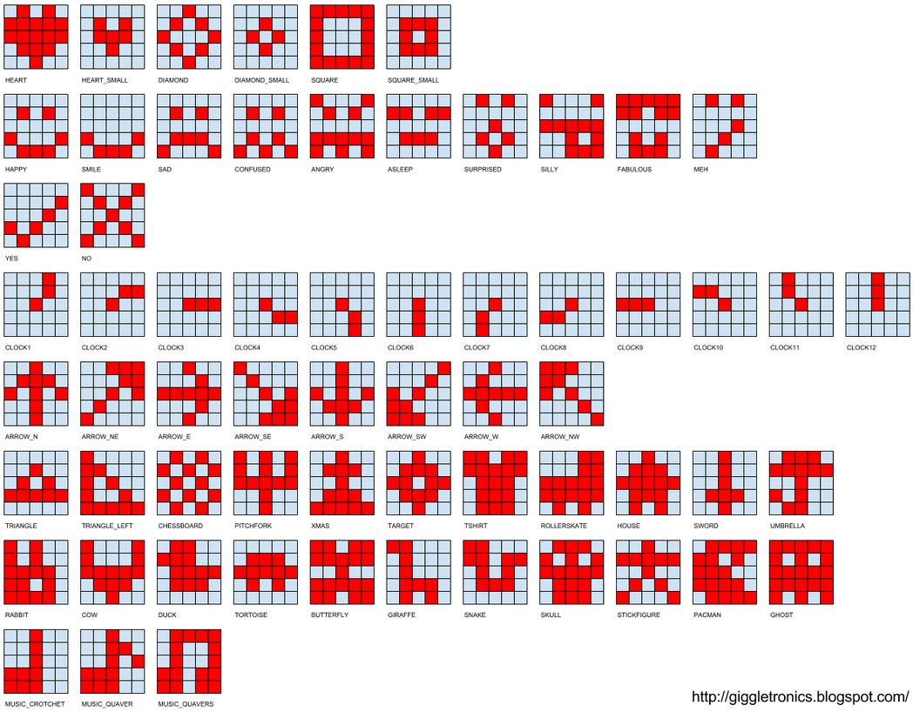

[Ce fichier existe aussi en FRANCAIS](readme.md)

# FrameBuffer GFX - FrameBuffer utility
This section contains class and exemple used to manipulates FrameBuffer.

* __[fbutil.py](lib/fbutil.py)__ :  circle, fill_circle, oval, fill_oval, rrect, fill_rrect, etc. Example: [here](https://github.com/mchobby/esp8266-upy/tree/master/ili934x/examples/fbutil)
* __[icon.py](lib/icon.py)__ :  5x5 icons definition from Micro:bit (coming from sense-hat sub-project).
* __[icons8.py](lib/icons8.py)__ :  8x8 icons definition looking like Micro:bit's one.
* __[icontls.py](lib/icontls.py)__ : Some functions to draw the icon in a FrameBuffer (used for display), or inside a terminal, or as a list of True/False values for the points.

# fbutil test

See [the examples available for the ili934x driver](https://github.com/mchobby/esp8266-upy/tree/master/ili934x/examples/fbutil) .

# icons test

The icon files are:
* [icons.py](lib/icons.py) : 5x5 pixels icons, identical to Micro:bit
* [icons8.py](lib/icons8.py) : 8x8 pixels icons (similar of Micro:bit's ones)


The graph here under allows you to identifies the icon named if the python script.




The examples [view_icons8.py](examples/view_icons8.py) and [list_icons8.py](examples/list_icons8.py) would respectively permit to display the icons into the REPL console AND to inspect the data lists of boolean values.


Here is the content of the `view_icons8.py` script

``` python
""" Display all the icons enclosed inside icons8.py inside the REPL session """
from icons8 import all_icons
from icontls import icon_as_text

for icon in all_icons:
	for line in icon_as_text( icon ):
		print( line )
	print( '' )
	print( '' )
	print( '' )
```

Which would produce result similar to the following when executed:

```
MicroPython v1.14 on 2021-02-05; Raspberry Pi Pico with RP2040
Type "help()" for more information.
>>>
>>> import view_icons8
  *  *  
 ******
********
********
 ******
  ****  
   **   
    *   


  *  *  
 ******
 ******
  ****  
   **   
    *   


   **   
  *  *  
 *    *
*      *
*      *
 *    *
  *  *  
   **   

...
```

You can also inspect the data defining the icon as list of boolean values.

```
MicroPython v1.14 on 2021-02-05; Raspberry Pi Pico with RP2040
Type "help()" for more information.
>>>
>>> from icons8 import GHOST
>>> from icontls import icon_as_list
>>> icon_as_list( GHOST )
[[False, True, True, True, True, True, True, False], [False, True, False, True, True, False, True, False], [True, True, False, True, True, False, True, True], [True, True, True, True, True, True, True, True], [True, True, True, True, True, True, True, True], [True, True, True, True, True, True, True, True], [True, False, True, False, False, True, False, True], [True, False, True, False, False, True, False, True]]
>>>
>>> from icontls import icon_as_text
>>> icon_as_text( GHOST )
[' ****** ', ' * ** * ', '** ** **', '********', '********', '********', '* *  * *', '* *  * *']
>>> for line in icon_as_text( GHOST ):
...     print( line )
...
 ******
 * ** *
** ** **
********
********
********
* *  * *
* *  * *
```

# Draw into a FrameBuffer

Many display drivers follows the MicroPython recommendation by using the FrameBuffer API of MicroPython.


Here follows an example script Voici displaying the PacMan icon on the OLED 128x64 display ([see this tutorial on the SSD1306 driver tutorial](https://github.com/mchobby/esp8266-upy/tree/master/oled-ssd1306#code-de-test)).

``` python
from machine import Pin, I2C
i2c = I2C( sda=Pin(4), scl=Pin(5) )
import ssd1306
lcd = ssd1306.SSD1306_I2C( 128, 32, i2c )

from icontls import draw_icon
from icons5 import PACMAN
# Draw the PacMan on the OLED framebuffer
# from position x=2, y=5 with the color 1
# (monochrome C=0->black, C=1->White)
draw_icon( lcd, PACMAN, 2, 5, 1 )
```


Please note that `draw_icon()` function also support 16bits color (as 16 bits integer). The color value is directly sent (as it) to the FrameBuffer API.
