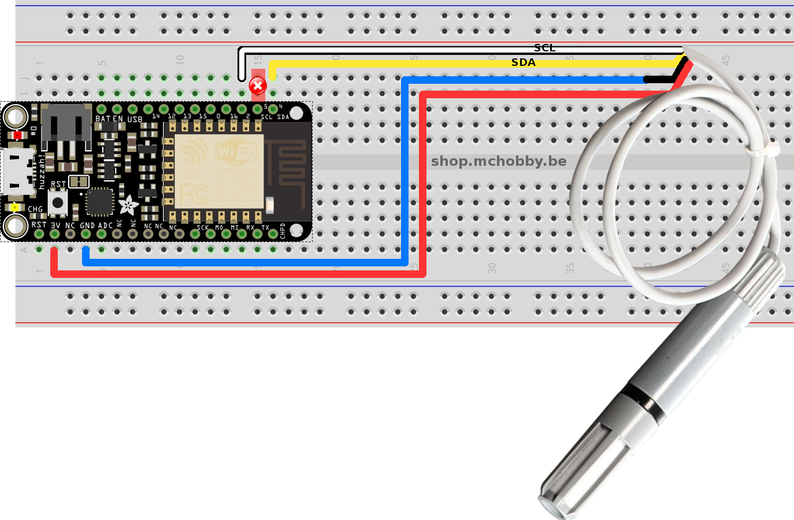
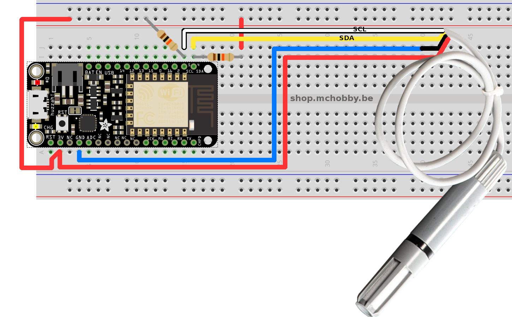
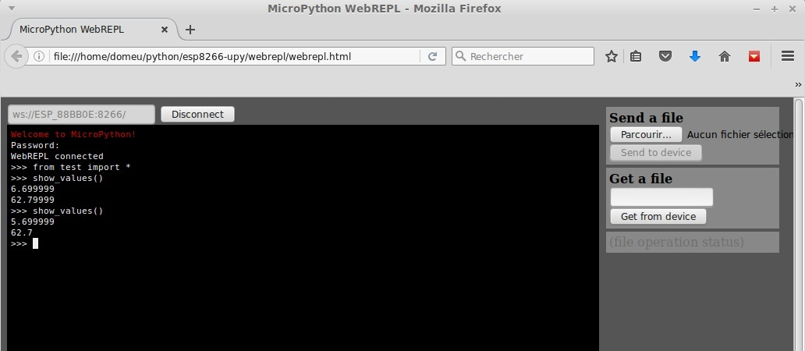

# Mesure température/humidité avec senseur AM2315 (ADA2315) et ESP8266 sous MicroPython

# Brancher

Nous ne l'avions pas remarqué directement mais l'AM2315 nécessite des résistance pull-up pour fonctionner car celle-ci ne sont ni présentes sur l'AM2315, ni sur l'ESP8266. C'est la raison pour laquelle nous avons opté pour un bus I2C sur les Pin 2 et 4!



Avec le temps, nous nous sommes rendu compte que le montage fonctionnait correctement avec les deux broches Pin 5 et 4 si d'autres composants I2C étaient présent sur le bus.

Etant donné que les différents breakout embraquent souvent des résistances pull-up, nous nous sommes rendu compte que c'est ce qui faisait défaut lorsque l'AM2315 était monté seul sur les Pin 5 et 4. Voici donc le montage alternatif de l'AM2315 avec résistance pull-up.



# Tester

```
# Utiliser un senseur AM2315 I2C temperature/humidité (ADA2315) avec ESP8266 sous MicroPython
#
# Shop: http://shop.mchobby.be/product.php?id_product=932
# Wiki: https://wiki.mchobby.be/index.php?title=MicroPython-Accueil#ESP8266_en_MicroPython

from am2315 import *
from machine import I2C, Pin

# Bus I2C
#   Ne pas utiliser la broche standard SCL (broche 5) car perturbe la
#   sequence de boot lorsque l'on utilise un bloc d'alim USB
#
i2c = I2C( sda=Pin(4), scl=Pin(2), freq=20000 )
#   Possible si utilisé avec des résistances pull-up ou autres breakout I2C.
# i2c = I2C( sda=Pin(4), scl=Pin(5), freq=20000 )

a = AM2315( i2c = i2c )

def show_values():
    if a.measure():
       print( a.temperature() )
       print( a.humidity() )

# Deux lectures consécutives sont parfois nécessaire
# pour faire une mise-à-jour connecte des valeurs lues.

show_values()
time.sleep( 1 )
show_values()
```

Ce qui donne le résultat suivant dans WebRepl



# Liste d'achat

* Shop: [senseur AM2315 (ADA2315)](http://shop.mchobby.be/product.php?id_product=932)
* Wiki: https://wiki.mchobby.be/index.php?title=MicroPython-Accueil#ESP8266_en_MicroPython
