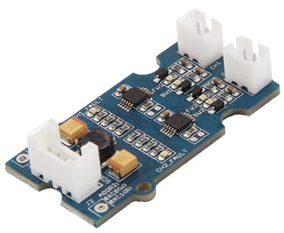
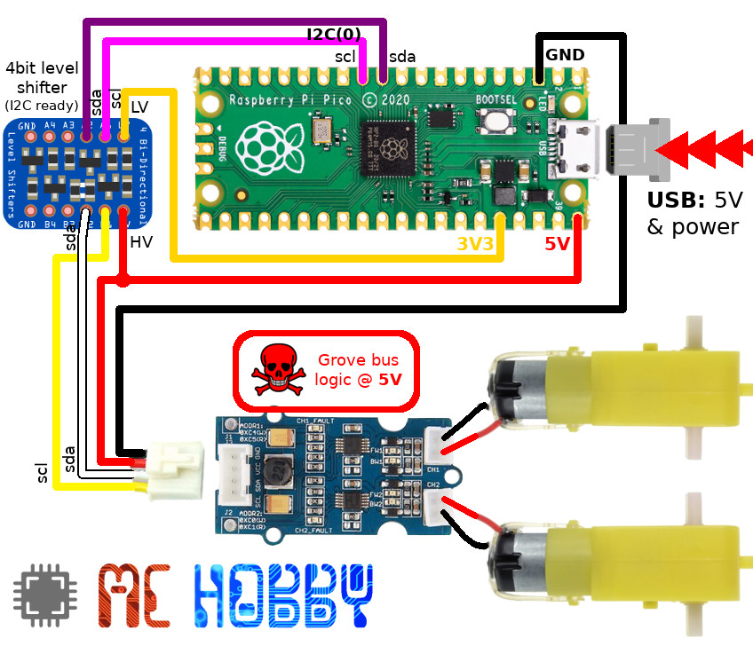

[Ce fichier existe également en FRANCAIS](readme.md)

# Use the Mini I2C Motor Driver (DRV8830) under MicroPython

This board is manufactured by SparkFun and SeeedStudio. The SeeedStudio version does have a Grove connector attached to it.



In the SeeedStudio version, the power supply is also used to power-up the motors as well as I2C logic level.

it be __absolutely necesary__ to use a Level Shifter over the SDA & SCL signals if the microcontroler is not 5V tolerant (eg: the Raspberry-Pi Pico)

# Wiring

## Raspberry-Pi Pico

A level shifter is used to the SDA and SCL signals to translate I2C level from 3.3V (Pico) to 5V (Grove) and vice-versa.



# Test

You will need to copy the [`lib/drv8830mot.py`](lib/drv8830mot.py) library on the MicroPython board before using the motor driver.

The following test code demonstrate the basic behavior by controling the two motors of a robotic plateform.

``` python
from machine import I2C
from drv8830mot import DRV8830
import time

# Pico - I2C(0), sda=IO8, scl=IO9
i2c = I2C(0, freq=100000)

# Activate the two motors controlers
mot1 = DRV8830( i2c, address=0x65 ) # Chanel 1
mot2 = DRV8830( i2c, address=0x60 ) # Chanel 2
print( 'Move forward full speed' )
mot1.drive( 63 )
mot2.drive( 63 )
time.sleep( 2 )
print( 'Stop' )
mot1.stop()
mot2.stop()
time.sleep( 1 )
print( 'Move backward Half speed' )
mot1.drive( -32 )
mot2.drive( -32 )
time.sleep( 2 )
print( 'Brake motors' )
mot1.brake()
mot2.brake()
time.sleep( 1 )
print( 'Stop motors' )
mot1.stop()
mot2.stop()
print( 'Thats all folks' )
```
# Shopping list
* [Raspberry-Pi Pico](https://shop.mchobby.be/product.php?id_product=2025
) @ MCHobby
* [4bits level-shifter (I2C compatible)](https://shop.mchobby.be/product.php?id_product=131)
