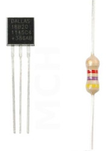
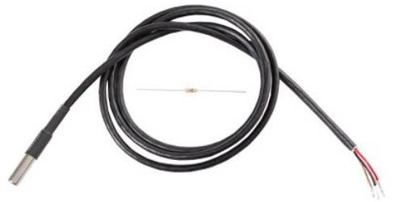
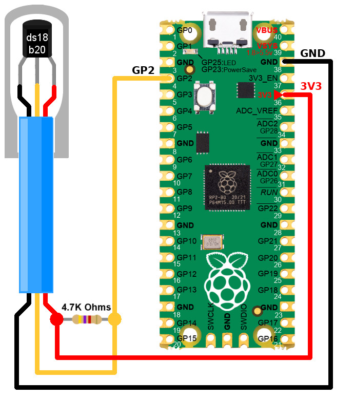

[This file also exists in ENGLISH](readme_ENG.md)

# Capteur de température DS18B20 (OneWire) sous MicroPython

Le DS18B20 est un capteur de température utilisant le bus 1-Wire (_One Wire_) pour la transmission de données dans les deux sens.

Le bus 1-Wire permet de brancher plusieurs capteurs sur un même bus et sur d'assez longue distance (~10m).

C'est pour ces raisons que le DS18B20 est populaire car il est très facile de monter une topologie en étoile avec plusieurs capteurs.

   

Il y a cependant un inconvénient, c'est la latence du bus qui limite le nombre d'acquisition (environ 1 fois toute les 2 secondes).

Si cela convient à l'asservissement de la température d'une pièce, cette latence est incompatible avec l'asservir une plaque chauffante.

Quelques caractéristiques:
* Plage de température utilisable: -55 à 125°C (-67°F à +257°F)
* Résolution: de 9 à 12 bits (sélectionnable)
* Interface: 1-Wire - nécessite qu'une seule broche digitale pour la communication.
* Identifiant Unique 64 bit (gravé dans le senseur en usine)
* Plusieurs capteurs peuvent partager une seule broche numérique
* Précision de +/-0.5°C de -10°C à +85°C
* Système d'alarme pour "Température limite"
* Requête exécutée en moins de 750ms
* Utilisable avec une tension de 3.0V à 5.5V (alimentation/data)

See wiki: https://wiki.mchobby.be/index.php?title=MicroPython-Accueil#ESP8266_en_MicroPython

# Bibliothèque
Les bibliothèques nécessaires sont:
* `ds18x20` :
 * habituellement inclus dans les firmwares microPython pour ESP.
 * disponible sur `micropython-lib` @ [https://github.com/micropython/micropython-lib/tree/master/micropython/drivers/sensor/ds18x20](https://github.com/micropython/micropython-lib/tree/master/micropython/drivers/sensor/ds18x20)
* `onewire` : déjà inclus dans les firmwares MicroPython.

Ces bibliothèques permettent de prendre en charge les capteurs DS18B20, capteurs que vous pouvez raccorder en étoile.

# Brancher

## DS18B20 sur Pyboard


## DS18B20 sur Raspberry-Pi Pico



## DS18B20 sur ESP8266


| Broche ESP8266 | Broche DS18B20 | Note                                                                                                       |
|----------------|----------------|------------------------------------------------------------------------------------------------------------|
| GND            | 1	          | Masse                                                                                                      |
| 3V             | 3              | Alimentation. Le DS18B20 fonctionne avec une tension d'alimentation de 3 à 5V    							 |
| 2              | 2 	          | OneWire Signal. Cette broche __doit également raccordée à +3V par l'intermédiaire d'une résistance de 4.7 KOhms.__ |

__Broches compatibles:__

Nous avons testé la bibliothèque sur les broches suivantes de l'ESP8266:

| Broche | Compatibilité |
|---|---|
| __14__ | OneWire compatible. |
| __12__ | OneWire compatible. |
| __13__ | OneWire compatible. |
| __15__ | __NON FONCTIONNEL__. Non compatible OneWire |
| __0__  | __NE PAS UTILISER__. Broche de boot. |
| __16__ | __NON FONCTIONNEL__. Non compatible OneWire |
| __2__  | OneWire compatible. |
| __5__  | _non testé._ Bus I2C (SCL) |
| __4__  | _non testé._ Bus I2C (SDA) |

# Tester

```
# Utilisation capteur température DS18B20 avec ESP8266, Pico ou Pyboard avec MicroPython
#
from machine import Pin
from onewire import OneWire
from ds18x20 import DS18X20
from time import sleep_ms

# PyBoard
bus = OneWire( Pin("Y3") )
# Pico
# bus = OneWire( Pin(2) )
# ESP8266
# bus = OneWire( Pin(2) )


ds = DS18X20( bus )

# Scanner tous les périphériques sur le bus
# Chaque périphérique à une adresse spécifique
roms = ds.scan()
for rom in roms:
	print( rom )

# Interrogation des capteurs
ds.convert_temp()
# attendre OBLIGATOIREMENT 750ms
sleep_ms( 750 )

# Lecture des température pour chaque périphérique
for rom in roms:
	temp_celsius = ds.read_temp(rom)
	print( "Temp: %s" % temp_celsius )
```

# Adresse des périphériques
Les adresses des périphériques (`rom` dans le code) sont constitués de 5 octets.

L'affichage des adresses rom se présente donc sous la forme d'une liste de `bytearray`. C'est une information binaire.

```
bytearray(b'(\xff\xd3\xe2p\x16\x03]')
```

# Source et ressources
* Référence officielle DS18x20 sous ESP8266: http://docs.micropython.org/en/v1.9.3/esp8266/esp8266/tutorial/onewire.html

# Liste d'achat
* Shop: [DS18B20](https://shop.mchobby.be/senseur-divers/259-senseur-temperature-ds12b20-extra-3232100002593.html) @ MCHobby
* Shop: [DS18B20 WaterProof](https://shop.mchobby.be/senseur-divers/151-senseur-temperature-ds18b20-etanche-extra-3232100001510.html) @ MCHobby
