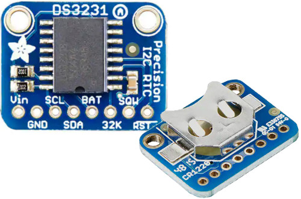
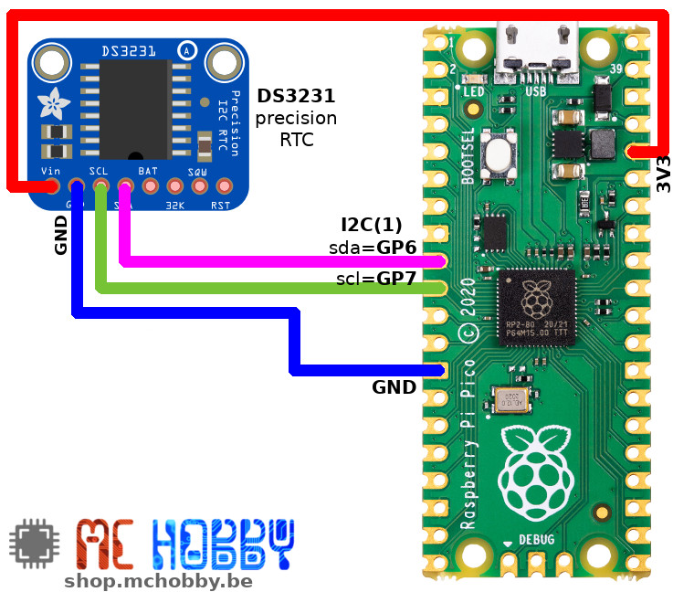

[This file also exists in ENGLISH](readme_ENG.md)

# Utiliser une RTC DS3231 avec MicroPython

Le PYBStick dispose d'une horloge interne (ou **RTC** pour **R**eal **T**ime **C**lock) qui nous sera utile dans toute une série d'applications.
Malheureusement, si on débranche le PYBStick, la RTC est **remise à zéro**. La date / heure n'est pas mémorisée, le PYBStick n'a pas de **batterie** pour préserver la date heure.

D'un autre côté, la Raspberry-Pi Pico ne dispose pas d'horloge RTC... lui en procurer une serait bien utile.



Dans le cas d'une application qui nécessiterait une horloge interne avec date heure correcte, nous devrons ajouter un composant RTC externe, disposant d'un emplacement pour une batterie.

Il en existe différents modèles, le module **RTC DS-3231** est particulièrement adapté dans notre cas. Précis, bon marché, il fonctionne en **3,3 Volts** !

# Bibliothèque

 Cette bibliothèque doit être copiée sur la carte MicroPython avant d'utiliser les exemples.

 Sur une plateforme connectée:

 ```
 >>> import mip
 >>> mip.install("github:mchobby/esp8266-upy/ds3231")
 ```

 Ou via l'utilitaire mpremote :

 ```
 mpremote mip install github:mchobby/esp8266-upy/ds3231
 ```

# Brancher

**Attention** : pour éviter d'endommager le PYBStick, ne brancher l'alimentation / USB sur le PYBStick qu'à partir du moment où le câblage ci-dessous sera terminé et vérifié !

Placer une pile dans l'emplacement prévu sur le module RTC DS3231. Cette pile permettra de conserver la date et l'heure en cas de coupure de l'alimentation. La configuration d'une RTC sans piles est souvent hazardeux et source d'erreur.

## Brancher sur PYBStick
Pour le branchement du module RTC au PYBStick, nous utiliserons l'interface i2C(1). Ci-dessous, la liste des connexions à réaliser.

|PYBStick 26|DS-3231|
|:-:|:-:|
|3.3V|VCC|
|GND|GND|
|S3 (SDA)|SDA|
|S5 (SCL)|SCL|


Une fois ce câblage terminé, brancher le PYBStick et lancer votre IDE microPython favori (dans notre cas **Thonny** https://thonny.org/)

## Brancher sur Pico
Pour le branchement du module RTC au Pico, nous utiliserons l'interface i2C(1). Ci-dessous, la liste des connexions à réaliser.

|Raspberry Pico|DS-3231|
|:-:|:-:|
|3.3V|VCC|
|GND|GND|
|GP6 (SDA)|SDA|
|GP7 (SCL)|SCL|



# Tester
## Initialisation date et heure

Lors d'une première mise sous tension du module RTC ou après le remplacement de la pile, il sera nécessaire d'initialiser la RTC pour mémoriser date et heure.

Nous commencerons par vérifier la connexion avec le module et lire la valeur actuelle mémorisée pour date et heure.

Dans la console **REPL** :

```python
>>> from machine import I2C
>>> from ds3231 import DS3231
>>> ds = DS3231(I2C(1) )
>>> ds.datetime()

(2000, 1, 1, 1, 0, 2, 18, 0)

>>>
```

La fonction ds.datetime() retourne un **tuple datetime**.

Les différentes valeurs sont, dans l'ordre :

|Position|Valeur|Description|
|-:|-:|-|
|0|2000|Année|
|1|1|Mois|
|2|1|Jour|
|3|1|Jour de la semaine|
|4|0|Heures|
|5|2|Minutes|
|6|18|Secondes|
|7|0|Sous-secondes (0-255)|

La date heure actuellement mémorisée dans le DS3231 est donc : **01/01/2000 00:02:18**

Comme ces valeurs ne sont pas correctes, nous allons initialiser / mémoriser date et heure dans le DS-3231.

Si nous utilisons l'éditeur **Thonny**, **l'horloge interne (RTC) du PYBStick** sera probablement initialisé avec une valeur date / heure correcte.

Pour vérifier si c'est bien le cas, sur une PYBStick et sur une Pyboard, il est possible d'interroger l'horloge RTC interne du MicroControleur :

```python
>>> from pyb import RTC
>>> rtc = RTC()
>>> rtc.datetime()

(2021, 1, 29, 5, 19, 7, 43, 140)

>>>
```

Si la date heure est correcte, nous pouvons initialiser l'horloge interne du Ds-3231 et vérifier ensuite la valeur mémorisée.

```python
>>> from pyb import RTC
>>> from machine import I2C
>>> from ds3231 import DS3231
>>> rtc = RTC()
>>> ds = DS3231( I2C(1) )
>>> ds.datetime()

(2000, 1, 1, 1, 0, 11, 57, 0)

>>> ds.datetime( rtc.datetime() )
>>> ds.datetime()

(2021, 1, 29, 5, 19, 15, 9, 0)

>>>
```

**Remarque** :  S'il n'y a pas de RTC (ou si l'horloge interne est incorrecte), il est possible de fixer l'heure de la RTC DS3231 directement à l'aide d'un tuple.

```python
>>> from machine import I2C
>>> from ds3231 import DS3231
>>> ds = DS3231( I2C(1) )
>>> ds.datetime( (2021, 1, 29, 5, 19, 15, 9, 0) )
>>>
```
Une fois la RTC DS3231 initialisée, celle-ci restera à l'heure... il sera possible de la relire à tout moment (et même d'initialiser la RTC interne du microcontrôleur si elle est disponible).

```python
>>> from machine import I2C
>>> from ds3231 import DS3231
>>> ds = DS3231( I2C(1) )
>>> ds.datetime( )

(2021, 1, 29, 5, 19, 16, 13)

>>> # Reinitialiser la RTC du microcontroleur avec la RTC DS3231
>>> from pyb import RTC
>>> rtc = RTC()
>>> rtc.datetime( ds.datetime() )
>>> rtc.datetime()

(2021, 1, 29, 5, 20, 20, 8, 255)

```

## Liens

[https://docs.micropython.org/en/latest/library/pyb.RTC.html](https://docs.micropython.org/en/latest/library/pyb.RTC.html)
