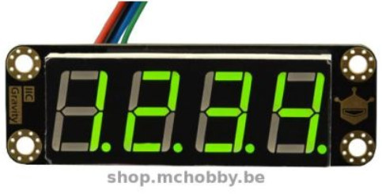

[Ce fichier existe également en FRANCAIS](readme.md)

# Display numeric value with 4x7 Digital LED Segment (DFR0645) with MicroPython

Such displays can be used to display numeric values like score, voltages, etc or very rudimentary text message.

Such displays exists:
* 4 digits
* multiple color (red, green)
* expose gravity connector (for quick wiring)



# Library

The library must be copied on the MicroPython board before using the examples.

On a WiFi capable plateform:

```
>>> import mip
>>> mip.install("github:mchobby/esp8266-upy/grav-digital-led")
```

Or via the mpremote utility :

```
mpremote mip install github:mchobby/esp8266-upy/grav-digital-led
```

# Wiring

Notice that I2C bus must be limited to 100 Khz for this component to work properly.

## Raspberry-Pi Pico

Wiring will be the same for 4 or 8 digit display.


| Module Pin | Wire Color | Pico Pin | Remark     |
|------------|------------|----------|------------|
| SDA        | green      | 6        | I2C(1).sda |
| SCL        | blue       | 7        | I2C(1).scl, 100 Khz max |
| GND        | black      | GND      |            |
| VCC        | red        | 3V3      |            |

# Testing

If you want to use this sensor, it will be necessary to install the `ledseg4.py` library on the MicroPython board.

The following test code show various data on the 4 LED display.

```
from machine import I2C
from ledseg4 import LedSegment4

# Raspberry-Pi Pico
i2c = I2C(1, freq=100000 ) # sda=GP6, scl=GP7 , limited to 100 KHz
dis = LedSegment4( i2c )  # DFR0645 4 digit LED display

# Display integers
dis.int( 4289 )
dis.int(-43)

# Display float
dis.float(0.1)
dis.float(-3.1415)

# Brightness control
# (from 0=min to 7=max)
dis.brightness( 4 )

# Switch display off or on
dis.off()
dis.on()
```

The library is also able to print a rudimentary text message containing ASCII (7bits) content.

If the string is longer than display then the message is scrolled.

Unknown characters are replaced with blank (space).

```
from machine import I2C
from ledseg4 import LedSegment

# Raspberry-Pi Pico
i2c = I2C(1, freq=100000 ) # sda=GP6, scl=GP7 , limited to 100 KHz
dis = LedSegment4( i2c )  # DFR0645 4 digit LED display

# Display integers
dis.print("halo") # immediate return
dis.print("Micropython is great!") # scroll the text.
```


Text scrolling can be accelerated or reduced by using the `delay_ms` parameter which change the time between scroll steps (500ms by default).

```
dis.print("Fast scrolling text", delay_ms=200 )
```

# Shopping list
* [Raspberry-Pi Pico](https://shop.mchobby.be/en/search?controller=search&s=pico) @ MCHobby
* [Green I2C display 4 digit 7 segments - 22 mm (SEN0645)](https://shop.mchobby.be/fr/leds/2092-afficheur-i2c-vert-4-chiffres-de-7-seg-22-mm-3232100020924-dfrobot.html) @ MCHobby
* [Green I2C display 4 digit 7 segments - 22 mm (SEN0645)](https://www.dfrobot.com/product-1966.html) @ DFRobot
