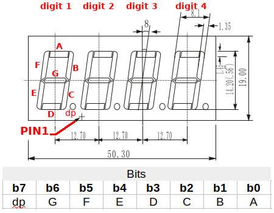

[Ce fichier existe également en FRANCAIS](readme.md)

# Display numeric value with 4x7 and 8x7 Digital LED Segment (DFR0645, DFR646) with MicroPython

A displays can be used to display numeric values like scores, voltages, etc or very rudimentary text message.

The DFR0645 offers the following features:
* 4 digits
* 8 levels of brightness
* Chipset **TM1650**
* multiple color (red, green)
* Gravity connector (for quick wiring)
* DFR0645


The DFR0646 offers the following features:
* 8 digits
* 16 levels of brightness
* Blinking (0.5, 1, 2 hertz)
* Chipset **VK16K33**
* Various color (red, green)
* Gravity connector (for quick wiring)
* DFR646


# Library

The library must be copied on the MicroPython board before using the examples.

On a WiFi capable plateform:

```
>>> import mip
>>> mip.install("github:mchobby/esp8266-upy/grav-digital-led")
```

Or via the mpremote utility :

```
mpremote mip install github:mchobby/esp8266-upy/grav-digital-led
```

# Wiring

Notice that I2C bus must be limited to 100 Khz for the 4 digits display to work properly.

The 8 digits LED display can work at the standard 400 KHz bus.

## Raspberry-Pi Pico

**Wiring is IDENTICAL for 4 or 8 digit LED display**.


| Module Pin | Wire Color | Pico Pin | Remark     |
|------------|------------|----------|------------|
| SDA        | green      | 6        | I2C(1).sda |
| SCL        | blue       | 7        | I2C(1).scl, 100 Khz max for DFR0645. |
| GND        | black      | GND      |            |
| VCC        | red        | 3V3      |            |

# Testing

If you want to use this sensor you will have to install the following library on your MicroPython board
* DFR0645 : 4 digits display is driven by `ledseg4.py` .
* DFR0646 : 8 digits display is driven by `ledseg8.py` .

## DFR0645 - 4 Digit LED Display

The following test codes comes from [test.py](examples/test.py) and [test_print.py](examples/test_print.py) are designed for the "**4 Digit LED display**" (DFR0645).

Notice that we use the `LedSegment4` class from the library `ledseg4`.

```
from machine import I2C
from ledseg4 import LedSegment4

# Raspberry-Pi Pico
i2c = I2C(1, freq=100000 ) # sda=GP6, scl=GP7 , limited to 100 KHz
dis = LedSegment4( i2c )  # DFR0645 4 digit LED display

# Display integers
dis.int( 4289 )
dis.int(-43)

# Display float
dis.float(0.1)
dis.float(-3.1415)

# Brightness control
# (from 0=min to 7=max)
dis.brightness( 4 )

# Switch display off or on
dis.off()
dis.on()
```

The library is also able to print a rudimentary text message containing ASCII (7bits) content.

If the string is longer than display then the message is scrolled.

Unknown characters are replaced with blank (space).

```
from machine import I2C
from ledseg4 import LedSegment

# Raspberry-Pi Pico
i2c = I2C(1, freq=100000 ) # sda=GP6, scl=GP7 , limited to 100 KHz
dis = LedSegment4( i2c )  # DFR0645 4 digit LED display

# Display string
dis.print("halo") # immediate return
dis.print("Micropython is great!") # scroll the text.
```


Text scrolling can be accelerated or reduced by using the `delay_ms` parameter which change the time between scroll steps (500ms by default).

```
dis.print("Fast scrolling text", delay_ms=200 )
```

## DFR0646 - 8 Digit LED Display

The following test codes comes from [test8.py](examples/test8.py) and [test8_print.py](examples/test8_print.py) are designed for the "**8 Digit LED display**" (DFR0646).

Notice that we use the `LedSegment8` class from the library `ledseg8`.

```
from machine import I2C
from ledseg8 import LedSegment8, VK16K33_BLINK_1HZ, VK16K33_BLINK_2HZ, VK16K33_BLINK_0HZ5
from time import sleep

# Raspberry-Pi Pico
i2c = I2C(1) # sda=GP6, scl=GP7
dis = LedSegment8( i2c ) # DFR0646 8 digit LED display

# Display integers
dis.int( 4289213 )
sleep(2)
dis.int(-4366444)
sleep(2)

# Display float
dis.float(0.101)
sleep(2)
dis.float(7890.101)
sleep(2)
dis.float(-3.14159265) # pi
sleep(2)
dis.float(6.283185307179586) # tau

# Brightness control (0..15)
for i in range( 16 ): # 0..15
	dis.brightness( i )
	dis.print( 'br  %s' % i )
	sleep(1)

d = {VK16K33_BLINK_1HZ:"1 Hz", VK16K33_BLINK_2HZ:"2 Hz", VK16K33_BLINK_0HZ5 : "0.5Hz"}
for freq in (VK16K33_BLINK_1HZ, VK16K33_BLINK_2HZ, VK16K33_BLINK_0HZ5):
		dis.print( "Bl %s" % d[freq] )
		dis.blink( freq )
		sleep( 5 )
dis.blink_off()

dis.print( "end" )
sleep(2)
# Switch display off
dis.off()
```

The library is also able to print a rudimentary text message containing ASCII (7bits) content.

If the string is longer than display then the message is scrolled.

Unknown characters are replaced with blank (space).

```
from machine import I2C
from ledseg8 import LedSegment8
from time import sleep

# Raspberry-Pi Pico
i2c = I2C(1) # sda=GP6, scl=GP7
dis = LedSegment8( i2c ) # DFR0646 8 digit LED display

dis.print("halo") # immediate return
sleep(2)
dis.print("14FE") # immediate return
sleep(2)
dis.print("Micropython is great!") # scroll the text.
sleep(2)
dis.print("amigos") # no scrolling.
```

As previous example, the text scrolling can also be accelerated or reduced by using the `delay_ms` parameter.

```
dis.print("Fast scrolling text", delay_ms=200 )
```

## manipulating the display

As rule of thumb, the privates methods (with `__` prefix) should only be used from within the library. In the facts, you can also call them from your own user scripts! Thanks to this, you can **create your own animations** by directly manipulating the data sent to the display.

The display data is updated with the method `__set_raw_value( pos, data )` where:
* `pos` is the digit position from (0..3 or 0..7 depending on the display).
* `data` la byte where buts activates the 7 segments LEDs (see here below)



Then, the data are sent to the display by calling the methods `__send_buf()` .


# Shopping list
* [Raspberry-Pi Pico](https://shop.mchobby.be/en/search?controller=search&s=pico) @ MCHobby
* [Green I2C display 4 digit 7 segments - 22 mm (SEN0645)](https://shop.mchobby.be/fr/leds/2092-afficheur-i2c-vert-4-chiffres-de-7-seg-22-mm-3232100020924-dfrobot.html) @ MCHobby
* [Green I2C display 4 digit 7 segments - 22 mm (SEN0645)](https://www.dfrobot.com/product-1966.html) @ DFRobot
* [Green I2C display 8 digit 7 segments - 22 mm (SEN0646)](https://shop.mchobby.be/fr/leds/2584-afficheur-i2c-vert-8-chiffres-de-7-seg-22-mm-3232100025844-dfrobot.html) @ MCHobby
* [Green I2C display 8 digit 7 segments - 22 mm (SEN0646)](https://www.dfrobot.com/product-1979.html) @ DFRobot
