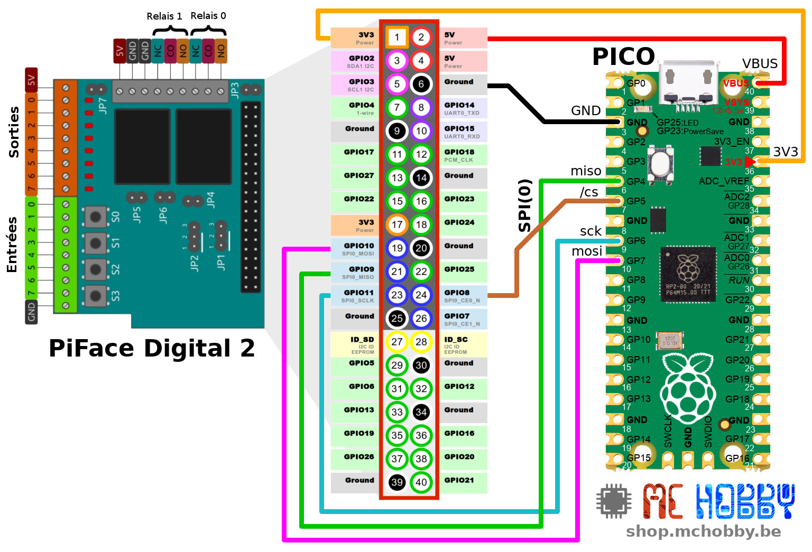

[Ce fichier existe également en FRANCAIS](readme.md)

# Using the PiFace-Digital (v1 or v2) under MicroPython

The PiFace Digital 1 and [PiFace Digitial 2](https://shop.mchobby.be/fr/pi-hats/221-piface-digital-2-pour-raspberry-pi-3232100002210.html) are identical from hardware point of view (only the form-factor is different).


This HAT, fit use a MCP23S17 (SPI) as board controleur. So the PiFace can be controled with any of the SPI capable microcontroler.

The PiFace does fit the following hardware:
* 2 relais (two directions each)
* 4 momentaneous push buttons
* 8 digital inputs
* 8 output (open collector)
* 8 LEDs (indicators)

[The PiFace usage is documented in French on the MC Hobby wiki](https://wiki.mchobby.be/index.php?title=PiFace2-Manuel) and also inside the [manufacturer documentation (in english)](http://df.mchobby.be/RASP-PIFACE-DIGITAL2/Operating-Instruction.pdf)

# Library

The library must be copied on the MicroPython board before using the examples.

On a WiFi capable plateform:

```
>>> import mip
>>> mip.install("github:mchobby/esp8266-upy/hat-piface")
```

Or via the mpremote utility :

```
mpremote mip install github:mchobby/esp8266-upy/hat-piface
```

# Wiring

This HAT is made for the Raspberry-Pi but can be wired on other nano-computer or microcontroler.

## Raspberry-Pi Pico

Here how to wire the [Raspberry-Pi Pico](https://shop.mchobby.be/fr/pico-raspberry-pi/2025-pico-rp2040-microcontroleur-2-coeurs-raspberry-pi-3232100020252.html) to a PiFace Digital.




## PYBStick + PYBSTICK-HAT-FACE
The following screenshot show a PiFace Digital (v1) plug on a [PYBStick board](https://shop.mchobby.be/fr/micropython/1844-pybstick-standard-26-micropython-et-arduino-3232100018440-garatronic.html) under MicroPython with the PYBSTICK-HAT-FACE adapter (see [this documentation](https://shop.mchobby.be/fr/micropython/1935-interface-pybstick-vers-raspberry-pi-3232100019355.html))


# PYBStick 26
If you do not have the PYBStick-HAT-FACE adapteur, the following wiring will do the job:


# Pyboard
If you are using a Pyboard then the following wiring will also do the job:


# Test

The library needs to be installed on the micropython board Before using the various examples:
* [piface.py](lib/piface.py) : PyFace control library
* Dependancies : the ZIP archive (available in the [lib/](lib) folder- does contains the additionnal libraries for `piface`.

Thoses files must be copied to the MicroPython board.

The examples are written for the __PYBSTICK__. If you want to use them with the Pyboard, the __S24__ pin must be replaced by the __X5__ in the demo scripts.

## Read an input

The example script here below comes from the [test_input.py](examples/test_input.py) script.

It read the inputs... each input seperately.

For each input reading, the library will contact the HAT and fetch the data needed. So this approach will require more bandwidth on the I2C bus.

``` python
from machine import SPI, Pin
from piface import PiFace
import time

# PYBStick / PYBStick-HAT-FACE
spi = SPI( 1, phase=0, polarity=0 ) # SCLK=S23, MISO=S21, MOSI=S19
cs = Pin( 'S24', Pin.OUT, value=True ) # SPI_CE0=S24, use X5 for Pyboard
# Raspberry-pico
# spi = SPI( 0, phase=0, polarity=0 )
# cs = Pin( 5, Pin.OUT, value=True )

piface = PiFace( spi, cs, device_id=0x00 )

# Read all inputs (one at once)
try:
	print( "Press CTRL+C to halt script" )
	while True:
		for i in range( 0, 8 ): # 0..7
			if piface.inputs[ i ]:
				print( "Input %s is pressed" % i )
		time.sleep_ms( 300 )
except:
	print( "That s all folks" )
```

## Read all inputs
The following example, coming from [test_input2.py](examples/test_input2.py), shows how to read all the inputs with only one operation.

``` python
from machine import SPI, Pin
from piface import PiFace
import time

# PYBStick / PYBStick-HAT-FACE
spi = SPI( 1, phase=0, polarity=0 ) # SCLK=S23, MISO=S21, MOSI=S19
cs = Pin( 'S24', Pin.OUT, value=True ) # SPI_CE0=S24, use X5 for Pyboard
# Raspberry-pico
# spi = SPI( 0, phase=0, polarity=0 )
# cs = Pin( 5, Pin.OUT, value=True )

piface = PiFace( spi, cs, device_id=0x00 )

# Read all inputs @ once
try:
	# Prepare Input names list
	pin_names =  ['IN%i' % pin for pin in range(8) ]
	print( "Press CTRL+C to halt script" )
	while True:
		values = piface.inputs.all # Get all input @ once
		datas = zip(pin_names,values) # Combine the two list [ (pin_name0,value0), (pin_name1,value1), ... ]
		print( ", ".join( ["%s:%s" % (name_value[0],name_value[1]) for name_value in datas] ))
		time.sleep(0.5)
except:
	print( "That s all folks" )
```

## Change output state

The [test_output.py](examples/test_output.py) script shows how to alter the state of outputs.

``` python
from machine import SPI, Pin
from piface import PiFace
import time

# PYBStick / PYBStick-HAT-FACE
spi = SPI( 1, phase=0, polarity=0, baudrate=400000 ) # SCLK=S23, MISO=S21, MOSI=S19
cs = Pin( 'S24', Pin.OUT, value=True ) # SPI_CE0=S24, use X5 for Pyboard
# Raspberry-pico
# spi = SPI( 0, phase=0, polarity=0 )
# cs = Pin( 5, Pin.OUT, value=True )

piface = PiFace( spi, cs, device_id=0x00 )

# Make a chase on outputs
try:
	print( "Press CTRL+C to halt script" )
	while True:
		for i in range( 8 ): # 0..7
			piface.outputs[i] = True
			time.sleep_ms( 300 )
			piface.outputs[i] = False
except:
	piface.reset() # Reset all outputs
```

# Shopping list
* [Raspberry-Pi Pico board](https://shop.mchobby.be/fr/pico-raspberry-pi/2025-pico-rp2040-microcontroleur-2-coeurs-raspberry-pi-3232100020252.html)
* [PYBStick board](https://shop.mchobby.be/fr/micropython/1844-pybstick-standard-26-micropython-et-arduino-3232100018440-garatronic.html) and [PYBStick-Hat-Face](https://shop.mchobby.be/fr/micropython/1935-interface-pybstick-vers-raspberry-pi-3232100019355.html)
* [MicroPython Pyboard board](https://shop.mchobby.be/fr/56-micropython)
* [PiFace Digital 2](https://shop.mchobby.be/fr/pi-hats/221-piface-digital-2-pour-raspberry-pi-3232100002210.html) available at MCHobby
