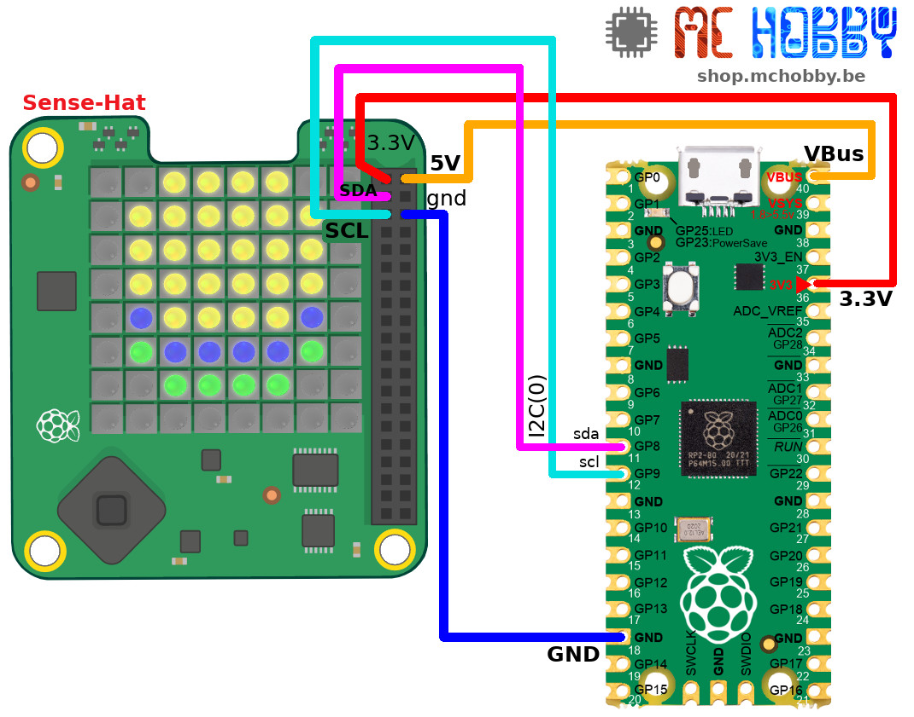
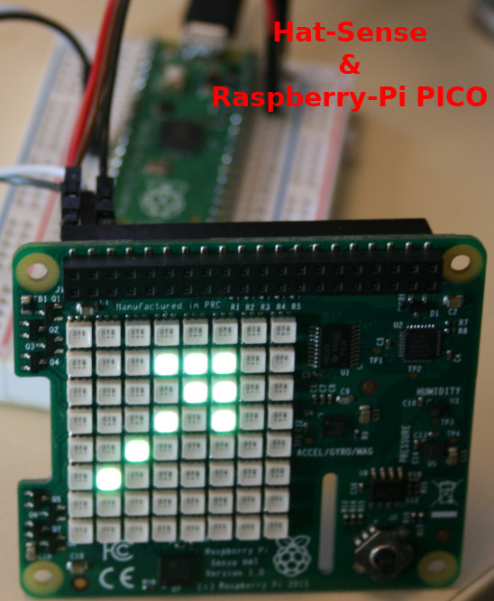

[Ce fichier existe aussi en FRANCAIS](readme.md)

# Use a Sense-Hat under MicroPython

The Sense Hat does embed orientation, magnetometer, gyroscope, accelerometer, pressure, humidity, temperature sensor as well as a joystick and a 8x8 RGB LEDs matrix.
The se,se hat can be used to make many experiment, apps, human-machine computer and also games.


With the Sense-Hat, you can measure the rotation speed, orientation to the ground, the humidity level, the room temperature, etc.

Even if this HAT was designed for the Raspberry-Pi, you can also use it with other nano-computer and/or microcontroler.

Le following picture shows the Sense-Hat coupled to a PYBStick under MicroPython.


Porting this board to MicroPython is based on the "[Sense Hat Unchained](https://github.com/bitbank2/sense_hat_unchained)" GitHub's project with its C code source writtent by Larry Bank.

# Video

You can see this project in action in the "[Sense-Hat under MicroPython](https://youtu.be/PUU4EqAMHds)" on this YouTube video.

# Wiring

## Raspberry-Pi PICO

Here how to wire the Hat on the Pico. You can also use the [Pico-Hat adapter](https://shop.mchobby.be/fr/pico-raspberry-pi/2037-interface-hat-pour-raspberry-pi-pico-3232100020375.html) to plug the HAT on the Pico.



## MicroPython PYBoard


## MicroPython PYBStick


__---> PYBStick-Hat-Face <---__

It is also to use the [__PYBStickHAT-FACE__](https://shop.mchobby.be/fr/nouveaute/1935-interface-pybstick-vers-raspberry-pi-3232100019355.html) interface PCB to quickly couple any HAT to a PYBStick (see the initial presentation picture).

It is also the wiring method used when writting the MicroPython library for the Sense-Hat.

# Test

Before using the various examples script files, il will be necessary to copy the [sensehat.py](lib/sensehat.py) library to your MicroPython board.

If you also want to use the icons (identical to the Micro:bit ones), the file [icons.py](lib/icons.py) will also be required on your board.

## Using the LEDs matrix

The [test_basic.py](examples/test_basic.py) script (showed here below) shows a series of graphical operation on the LED matrix.
As the `SenseHat` class inherit of `FrameBuffer` then you can use all the [graphical methods offered by FrameBuffer](https://docs.micropython.org/en/latest/library/framebuf.html)

``` python
from machine import I2C
from sensehat import SenseHat
import time

# PYBStick, Hat-Face: Sda=S3, Scl=S5
# Pyboard, Sda=X10, Scl=X9
i2c = I2C( 1 )
# Raspberry-Pi Pico, Sda=GP8, Scl=GP9
# i2c = I2C( 0 )

hat = SenseHat( i2c )

# See the FrameBuffer doc @ https://docs.micropython.org/en/latest/library/framebuf.html
#
hat.fill( hat.color(255,0,0) ) # Red
hat.update() # Draw it on LED matrix
time.sleep(1)

hat.fill( hat.color(0,255,0) ) # Green
hat.update()
time.sleep(1)

hat.fill( hat.color(0,0,255) ) # Bleu / Blue
hat.update()
time.sleep(1)

# draw nested rectangles
hat.clear()
hat.rect( 0,0, 8,8, hat.color(255,0,0) ) # Outside = Red
hat.rect( 1,1, 6,6, hat.color(0,255,0) ) # Green
hat.rect( 2,2, 4,4, hat.color(0,0,255) ) # Blue
hat.rect( 3,3, 2,2, hat.color(255,255,0) ) # Yellow
hat.update()
time.sleep(2)

# Horizontal Scanning line from top to bottom
for y in range(8):
	hat.clear( update=False ) # just erase internal memory
	hat.hline(0, y, 8, hat.color(238,130,238) ) # Violet
	hat.update()
	time.sleep(0.200)

# Vertical Scanning line from left to right
hat.clear()
for x in range(8):
	hat.clear( update=False )
	hat.vline(x, 0, 8, hat.color(91,60,17) ) # brown
	hat.update()
	time.sleep(0.200)

hat.clear()

# Display random pixel (with random color)
from random import randint
while True:
	hat.pixel( randint(0,7), randint(0,7), hat.color(randint(0,255),randint(0,255),randint(0,255) ) )
	hat.update()
```
The [test_scroll.py](examples/test_scroll.py) example, visible here below, does scroll a text on the Matrix.

Note:
* The `scroll()` method is blocking. Main script continue to execute instruction only when the text has been fully scrolled.
* The optional `c` parameter can be use to give the color (white by default)
* The optional `delay_ms` parameter can be use to mention a custom delay between pixels column scrolls (100 ms by default).
* A buffer of `8*(Number_of_charaters+2)` bytes is allocated while displaying the text.

``` python
from machine import I2C
from sensehat import SenseHat
import time

# PYBStick, Hat-Face: Sda=S3, Scl=S5
# Pyboard, Sda=X10, Scl=X9
i2c = I2C( 1 )
# Raspberry-Pi Pico, Sda=GP8, Scl=GP9
# i2c = I2C( 0 )

hat = SenseHat( i2c )

hat.clear()
hat.scroll( "Sense-Hat running under MicroPython!" )
```

The [test_image.py](examples/test_image.py) example, showed here below, show how to display a custom picture with the `pixels()` method.

``` python
from machine import I2C
from sensehat import SenseHat
import time

# PYBStick, Hat-Face: Sda=S3, Scl=S5
# Pyboard, Sda=X10, Scl=X9
i2c = I2C( 1 )
# Raspberry-Pi Pico, Sda=GP8, Scl=GP9
# i2c = I2C( 0 )

hat = SenseHat( i2c )

# Define color code
w = hat.color(150, 150, 150)
b = hat.color(0, 0, 255)
e = hat.color(0, 0, 0)

# Define the image as a list of data.
# 8 row of 8 pixels each, so 64 pixels
image = [
e,e,e,e,e,e,e,e,
e,e,e,e,e,e,e,e,
w,w,w,e,e,w,w,w,
w,w,b,e,e,w,w,b,
w,w,w,e,e,w,w,w,
e,e,e,e,e,e,e,e,
e,e,e,e,e,e,e,e,
e,e,e,e,e,e,e,e
]

# Send the image to the matrix
hat.clear()
hat.pixels(image)
hat.update()

# Horizontal mirror + re-display
while True:
	time.sleep(1)
	hat.flip_h() # or flip_v()
	hat.update()

```

The [test_icon.py](examples/test_icon.py) example, partially showed here below, show how to display a predefined icon on the matrix. The icons are defined into the file  `lib/icons.py` (file which must also be present on the board).

``` python
from machine import I2C
from sensehat import SenseHat
from icons import HEART, HEART_SMALL
import time
from random import randint

# PYBStick, Hat-Face: Sda=S3, Scl=S5
# Pyboard, Sda=X10, Scl=X9
i2c = I2C( 1 )
# Raspberry-Pi Pico, Sda=GP8, Scl=GP9
# i2c = I2C( 0 )

hat = SenseHat( i2c )

# Display a pulsing heart
red = hat.color(200, 0, 0)
for i in range(10):
	hat.clear()
	hat.icon( HEART, color=red )
	hat.update()
	time.sleep(1)

	hat.clear()
	hat.icon( HEART_SMALL, color=red )
	hat.update()
	time.sleep(1)
```

Note:
* Only the active pixel are drawed (the black pixels are not drawed/reset)
* the optional `clear` parameter clear the FrameBuffer before drawing the icon. This parameter is `True` by defaut. By setting it to `False`, it is possible to draw an icon over a colored background of you choice.
* The optional `x` parameter let you indicates the x position to display the icon (set to 1 by default, the second column),
* The optional `y` parameter let you indicates the y position to display the icon (set to 1 by default, the second row),
* The optional `color` parameter let ou indicates the icon drawing color (0x7BEF by default, less agressive white).



There is an obvious reason for those 5x5 pixels icons, this is because Amélie (my daugther) dit re-encode the Micro:bit icons from the following image published on  giggletronics.blogspot.com . The icons are are available in the [icons.py](lib/icons.py) script file.


The [test_text.py](examples/test_text.py) example, partially visible here below, indicates how to draw a character into the LED matrix. The `FrameBuffer.text()` method draws text into a FrameBuffer. Please note that the matrix framebuffer is just large enough to draw a single letter (so the first letter of a text).

``` python
from machine import I2C
from sensehat import SenseHat
import time

# PYBStick, Hat-Face: Sda=S3, Scl=S5
# Pyboard, Sda=X10, Scl=X9
i2c = I2C( 1 )
# Raspberry-Pi Pico, Sda=GP8, Scl=GP9
# i2c = I2C( 0 )

hat = SenseHat( i2c )

hat.clear()
hat.text( "A",0,0, hat.color(125,125,125) )
hat.update()
time.sleep(1)
```

## Joystick

The `joystick` property return the joystick state (JOY_UP, JOY_DOWN, JOY_RIGHT, JOY_LEFT, JOY_ENTER) or None when the joystick is not used.


``` python
from machine import I2C
from sensehat import *
from icons import ARROW_N,ARROW_S,ARROW_E,ARROW_W,TARGET
import time

# PYBStick, Hat-Face: Sda=S3, Scl=S5
# Pyboard, Sda=X10, Scl=X9
i2c = I2C( 1 )
# Raspberry-Pi Pico, Sda=GP8, Scl=GP9
# i2c = I2C( 0 )

hat = SenseHat( i2c )
hat.clear()

while True:
	hat.clear(update=False) # clear the content of the FameBuffer
	j = hat.joystick
	if j == JOY_UP:
		hat.icon(ARROW_N)
	elif j == JOY_DOWN:
		hat.icon(ARROW_S)
	elif j == JOY_RIGHT:
		hat.icon(ARROW_W)
	elif j == JOY_LEFT:
		hat.icon(ARROW_E)
	elif j == JOY_ENTER:
		hat.icon(TARGET)
	hat.update()
	```

## Pressure and temperature

The `press` property will return a tuple with the athmospheric pressure (in hPa) and the temperature.

The [test_press.py](examples/test_press.py), listed below, show how to read the data from the pressure sensor.

``` python
from machine import I2C
from sensehat import *
import time

# PYBStick, Hat-Face: Sda=S3, Scl=S5
# Pyboard, Sda=X10, Scl=X9
i2c = I2C( 1 )
# Raspberry-Pi Pico, Sda=GP8, Scl=GP9
# i2c = I2C( 0 )

hat = SenseHat( i2c )

while True:
	# read pressure and temperatur
	print( "%8.2f hPa, %3.1f Celcius" % hat.pressure )
	time.sleep( 1 )
```

## Humidity and temperature

The `humidity` property returns a tuple with relative humidity (in percentà and the temperatur.

The [test_hum.py](examples/test_hum.py), listed here below, shows how to read the data coming from the humidity sensor.

``` python
from machine import I2C
from sensehat import *
import time

# PYBStick, Hat-Face: Sda=S3, Scl=S5
# Pyboard, Sda=X10, Scl=X9
i2c = I2C( 1 )
# Raspberry-Pi Pico, Sda=GP8, Scl=GP9
# i2c = I2C( 0 )

hat = SenseHat( i2c )

while True:
	# Read tghe humiditiy and the temperatur
	print( "%3.1f %%RH, %3.1f Celcius" % hat.humidity )
	time.sleep( 1 )
```
## Magnetomètre

The 3 axis magnetometer car be used to detect magnetic fields in the 3D space area.


The [test_mag.py](examples/test_mag.py) test script, visible below, can read the magnetic fields accordingly to the x, y, z axis. We have tested this feature with a Rare Heart magnet.

``` python
from machine import I2C
from sensehat import *
import time

# PYBStick, Hat-Face: Sda=S3, Scl=S5
# Pyboard, Sda=X10, Scl=X9
i2c = I2C( 1 )
# Raspberry-Pi Pico, Sda=GP8, Scl=GP9
# i2c = I2C( 0 )

hat = SenseHat( i2c )

while True:
	# Magnetometer read
	print( "x: %i , y: %i , z: %i" % hat.mag )
	time.sleep( 1 )
```

## Gyroscope
The gyroscope and the `gyro` property can read the modification of rotation in the 3 axis.


The gyro [test_gyro.py](examples/test_gyro.py) test script, visible here below, did shows the values in the 3 axis. Just rotate the board to see the resulting value variations (while rotating)... because in asbsence of any rotation the values tends to return to their original values.  


``` python
from machine import I2C
from sensehat import *
import time

# PYBStick, Hat-Face: Sda=S3, Scl=S5
# Pyboard, Sda=X10, Scl=X9
i2c = I2C( 1 )
# Raspberry-Pi Pico, Sda=GP8, Scl=GP9
# i2c = I2C( 0 )

hat = SenseHat( i2c )

while True:
	# Gyroscope read
	print( "Roll(x): %i , Pitch(y): %i , Yaw(z): %i" % hat.gyro )
	time.sleep( 0.300 )
```

# Accelerometer
The accelerometer detect acceleration and deceleration (and shock) and the sense-hat orientation to the ground (the terrestial acceleration -G- which is directed toward the center of the earth).


The [test_acc.py](examples/test_acc.py) test script, visible here below, displaus the accelerometer values according to the 3 axis x,y & Z.

``` python
from machine import I2C
from sensehat import *
import time

# PYBStick, Hat-Face: Sda=S3, Scl=S5
# Pyboard, Sda=X10, Scl=X9
i2c = I2C( 1 )
# Raspberry-Pi Pico, Sda=GP8, Scl=GP9
# i2c = I2C( 0 )

hat = SenseHat( i2c )

while True:
	# read the accelerometer
	print( "x: %i , y: %i , z: %i" % hat.acc )
	time.sleep( 0.3 )
```

# Shopping list
* [Sense-Hat](https://shop.mchobby.be/fr/pi-hats/687-sense-hat-pour-raspberry-pi-3232100006874.html) @ MCHobby
* [MicroPython Pyboard](https://shop.mchobby.be/fr/micropython/570-micropython-pyboard-3232100005709.html) @ MCHobby
* [Raspberry-Pi Pico](https://shop.mchobby.be/fr/pico-raspberry-pi/2025-pico-rp2040-microcontroleur-2-coeurs-raspberry-pi-3232100020252.html) @ MCHobby
* [Pico-Hat adapter](https://shop.mchobby.be/fr/pico-raspberry-pi/2037-interface-hat-pour-raspberry-pi-pico-3232100020375.html) HAT interface for Raspberry-Pi Pico @ MCHobby
* [MicroPython PYBStick](https://shop.mchobby.be/fr/micropython/1844-pybstick-standard-26-micropython-et-arduino-3232100018440-garatronic.html) @ MCHobby
* [MicroPython PYBStick-HAT-FACE](https://shop.mchobby.be/fr/nouveaute/1935-interface-pybstick-vers-raspberry-pi-3232100019355.html) @ MCHobby
