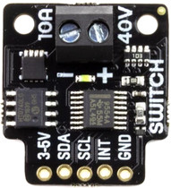
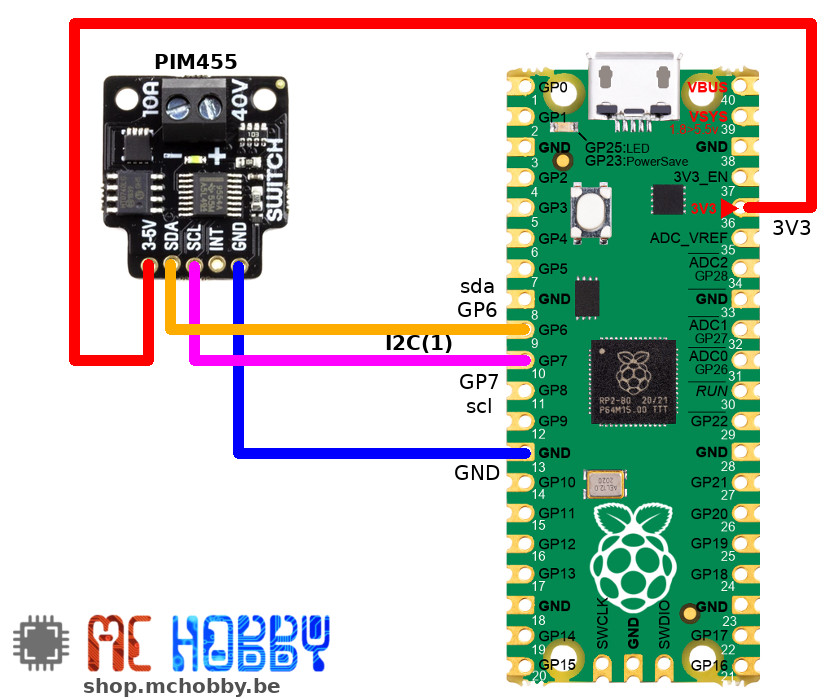

[Ce fichier existe aussi en FRANCAIS](readme.md)

# Control a 40V / 10A load via I2C with the HT0740 breakout from Pimoroni (PIM455)

This small breakout can switch a 10A current up to 40V (non PWMable).



This board features:
* HT0740 MOSFET driver chip
* TCA9554A I2C expander chip
* TPN2R304PL MOSFET
* White status LED
* 3.3V or 5V compatible
* Fully-isolated
* 2 address bits availables (at the back)

# Wire

## Wire HT0740 to aRaspberry-Pi PICO



## Wire the HT0740 to Pyboard


# Example

The example [test_on_off.py](examples/test_on_off.py) shows how to use the HT0740 class.

``` python
from machine import I2C
from ht0740 import HT0740
from time import sleep

# Pico, sda=GP6, scl=GP7
i2c = I2C(1)
# Pyboard, sda=X10, scl=X9
# i2c = I2C(1)

power = HT0740( i2c )

power.on()
sleep(2)
power.off()
sleep(2)

# Another way to activate the output
power.output( True )
sleep(2)
power.output( False )
print( "That s all Folks!")
```

# Shopping list
* [HT0740 40V 10A MOSFET breakout](https://shop.mchobby.be/fr/bouton/1990-40v-10a-mosfet-controlable-via-i2c-3232100019904-pimoroni.html) @ MCHobby
* [MicroPython Pyboard](https://shop.mchobby.be/fr/micropython/570-micropython-pyboard-3232100005709.html) @ MCHobby
* [Raspberry-Pi PICO](https://shop.mchobby.be/fr/pico-raspberry-pi/2025-pico-rp2040-microcontroleur-2-coeurs-raspberry-pi-3232100020252.html) @ MCHobby
