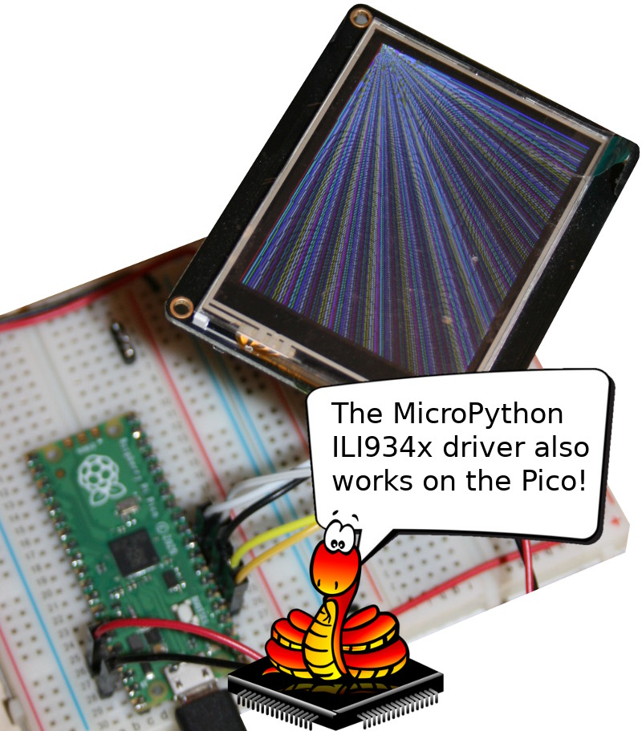
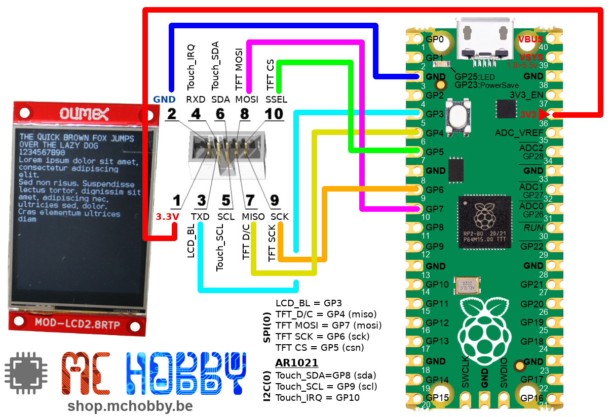

[This file also exists in ENGLISH](readme_ENG.md)

# Pilote ILI9341/ILI9340 générique pour différent TFT - No FrameBuffer


Ce pilote:
* permet de contrôler des écrans à base de contrôleur ILI9341 / ILI9340
* effectue les opérations directement dans la mémoire du contrôleur ILIxxxx.
* __Ne dérive pas de FrameBuffer!__

Le bibliothèque [ili934x](lib/ili934x.py) expose une interface __imitant__ l'[API de FrameBuffer](http://docs.micropython.org/en/latest/library/framebuf.html?highlight=framebufer) de MicroPython. Le but est de pouvoir utiliser ce pilote comme si c'était un FrameBuffer.

# API description

L'API du pilote ILI934x [est détaillée dans le document API.md](api.md)

L'interface tactile (film resistif) est pris en charge par le [stmpe610 et son pilote MicroPython](https://github.com/mchobby/esp8266-upy/tree/master/stmpe610).

# Crédit
Ce pilote est basé sur les travaux suivants:
* [Micropython Driver for ILI9341 display de Jeffmer](https://github.com/jeffmer/micropython-ili9341) (GitHub)
* [Micropython Driver for ILI9341 de Ropod](https://github.com/mchobby/pyboard_drive/tree/master/ILI9341) (GitHub)
* [FreeType generator (binary font file for MicroControler)](https://github.com/mchobby/freetype-generator) (GitHub)

# Brancher

## Pico + 2.4" FeatherWing

La carte [Raspberry-Pi Pico](https://shop.mchobby.be/fr/pico-raspberry-pi/2025-pico-rp2040-microcontroleur-2-coeurs-raspberry-pi-3232100020252.html) fonctionne aussi sous MicroPython.

Voici les raccordements à effectuer entre le Pico et le [TFT 2.4" FeatherWing d'Adafruit](https://shop.mchobby.be/fr/feather-adafruit/1050-tft-featherwing-24-touch-320x240-3232100010505-adafruit.html).


``` python
from machine import SPI, PIN
spi = SPI( 0 )
cs_pin = Pin(5) # PICO GP5
dc_pin = Pin(3) # PICO GP3
rst_pin = None  # PICO

# r in 0..3 is rotation, r in 4..7 = rotation+miroring (Use 3 for landscape mode)
lcd = ILI9341( spi, cs=cs_pin, dc=dc_pin, rst=rst_pin, w=320, h=240, r=0)
```
Voici le résultat de l'exécution de [test_lines.py](examples/test_lines.py).



## PYBStick + 2.4" FeatherWing

La [PYBStick est une carte de Garatronic](https://shop.mchobby.be/fr/micropython/1844-pybstick-standard-26-micropython-et-arduino-3232100018440-garatronic.html) qui fonctionne aussi bien sous MicroPython que sous Arduino.

Voici les raccordements à effectuer sur le [TFT 2.4" FeatherWing d'Adafruit](https://shop.mchobby.be/fr/feather-adafruit/1050-tft-featherwing-24-touch-320x240-3232100010505-adafruit.html).


``` python
from machine import SPI, PIN
spi = SPI( 1, baudrate=40000000 )
cs_pin = Pin("S15") # PYBStick
dc_pin = Pin("S13") # PYBStick
rst_pin = None      # PYBStick

# r in 0..3 is rotation, r in 4..7 = rotation+miroring (Use 3 for landscape mode)
lcd = ILI9341( spi, cs=cs_pin, dc=dc_pin, rst=rst_pin, w=320, h=240, r=0)
```

## PYBStick + Olimex 2.8" TFT UEXT

La [PYBStick est une carte de Garatronic](https://shop.mchobby.be/fr/micropython/1844-pybstick-standard-26-micropython-et-arduino-3232100018440-garatronic.html) qui fonctionne aussi bien sous MicroPython que sous Arduino.

Voici les raccordement à effectuer sur le [TFT 2.8" d'Olimex](https://shop.mchobby.be/fr/afficheur-lcd-tft-oled/1866-afficheur-28-tactile-couleur-320x240px-uext-3232100018662-olimex.html).


L'attribution des broches sur l'UEXT est la suivante:

```
     Descr    : UEXT Pin  (PYBStick)  (PYBStick)  UEXT Pin : Descr
    ================================================================
                                  UEXT
                                +-------+
                           3.3V | 1   2 | GND
LCD BackLight : uext-tx   (S24) | 3   4 | (S22) uext-rx   : Touch IRQ
        Touch : uext-scl  ( S5) | 5   6 | ( S3) uext-sda  : Touch
      TFT D/C : uext-miso (S21) | 7   8 | (S19) uext-mosi : TFT MOSI
      TFT SCK : uext-sck  (S23) | 9  10 | (S26) uext-cs   : TFT CS
                                +-------+
```

__A propos de la configuration__:

* Sur l'afficheur TFT 2.8" et son connecteur UEXT, Olimex utilise uniquement la ligne  MOSI pour envoyer les données vers l'afficheur (MISO n'étant pas utilisé).
* La ligne S21 normalement réservée à MISO est exploitée pour contrôler le signal Data/Command du TFT vers l'afficheur. Il n'est donc pas possible d'utiliser le bus SPI matériel puisque S21 doit être piloté indépendamment en sortie.
* Les données sont donc envoyées vers l'écran en utilisant un bus SPI logiciel (_BitBanging_) sur les broches S19, S23, S26. Comme il faut impérativement une broche MISO pour le bus SPI logiciel, celle-ci est fixée arbitrairement sur la broche S16 non utilisée.

__A propos des performances__:
Etant donné que l'afficheur utilise un bus SPI Logiciel (_BitBanging_), le débit est donc limité sur le bus, ce qui impacte le taux de rafraîchissement.

``` python
from machine import SPI
from machine import Pin
from ili934x import *

# PYBStick config requires Bit-Banging one-way SPI for Olimex.
# MISO (S26) of UEXT is used for D/C.
# SPI must declare a MISO! So we used a unused in the project (S16 in this case) as fake pin
spi = SPI( -1, mosi=Pin("S19", Pin.OUT), miso=Pin("S16", Pin.IN), sck=Pin("S23", Pin.OUT) )
cs_pin = Pin("S26")
dc_pin = Pin("S21")
rst_pin = None

# r in 0..3 is rotation, r in 4..7 = rotation+miroring # Use 3 for landscape mode
lcd = ILI9341( spi, cs=cs_pin, dc=dc_pin, rst=rst_pin, w=320, h=240, r=0)
```
L'afficheur peut également être connecté sur un PYBStick à l'aide de la [carte d'interface PYBStick-Feather-Face](https://shop.mchobby.be/product.php?id_product=1996) comme indiqué sur l'image ci-dessous.


## Pico + Olimex 2.8" TFT UEXT

Les détails du point ci-dessus (avec la PYBStick) s'appliquent également au Pico.

Voici le schéma de raccordement du LCD avec le Pico.



``` python
from machine import SPI
from machine import Pin
from ili934x import *

# Utiliser une autre pin MISO valable! Par ex: GP16
spi = SPI( 0, mosi=Pin(7, Pin.OUT), miso=Pin(16, Pin.IN), sck=Pin(6, Pin.OUT) )
cs_pin = Pin(5) # GP5
dc_pin = Pin(4) # GP4 (broche miso du bus standard)
rst_pin = None

# r in 0..3 is rotation, r in 4..7 = rotation+miroring # Use 3 for landscape mode
lcd = ILI9341( spi, cs=cs_pin, dc=dc_pin, rst=rst_pin, w=320, h=240, r=0)
```


## Pico + MSP2202 2.2" TFT

Aussi connu sous la référence DIS25400R chez Elecrow, cet afficheur TFT nécessite l'usage d'une broche __Reset__ pour fonctionner.


L'instance du pilote est créée comme suit:

``` python
from machine import SPI, Pin
from ili934x import *
spi = SPI( 0, baudrate=40000000 ) # 40 Mhz
cs_pin = Pin(10, Pin.OUT, value=True)
dc_pin = Pin(9, Pin.OUT)
rst_pin = Pin(15, Pin.OUT, value=1)
lcd = ILI9341( spi, cs=cs_pin, dc=dc_pin, rst=rst_pin, w=320, h=240, r=0)

red = color565(255,0,0)
lcd.fill( red )
```

Voir l'exemple [test_print_msp2202.py](examples/test_print_msp2202.py) pour plus d'informations.

# Tester

Tous les tests sont conduits avec l'afficheur [TFT 2.4" FeatherWing d'Adafruit](https://shop.mchobby.be/fr/feather-adafruit/1050-tft-featherwing-24-touch-320x240-3232100010505-adafruit.html) mais fonctionne aussi avec les autres TFTs présentés sur cette page. Il faudra cependant adapter les instructions de création des bus.

Tous les exemples sont stockés dans le sous-répertoire [examples/](examples)

# Ressources
* [TFT 2.2" MSP2202 - Elecrow's DIS25400R](https://shop.mchobby.be/product.php?id_product=2380) @ MCHobby
* [TFT 2.2" MSP2202 - Elecrow's DIS25400R](https://www.elecrow.com/2-2inch-tft-lcd-color-screen-display-module-240x320-serial-port.html) @ EleCrow
* [TFT 2.4" FeatherWing d'Adafruit](https://shop.mchobby.be/product.php?id_product=1050) @ MCHobby
* [TFT 2.8" d'Olimex](https://shop.mchobby.be/product.php?id_product=1866) @ MCHobby
* [carte d'interface PYBStick-Feather-Face](https://shop.mchobby.be/product.php?id_product=1996) @ MCHobby
* [ILI9341 Datasheet](https://cdn-shop.adafruit.com/datasheets/ILI9341.pdf) _stored at Adafruit Industries_
