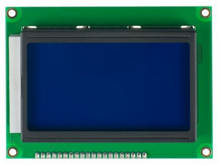
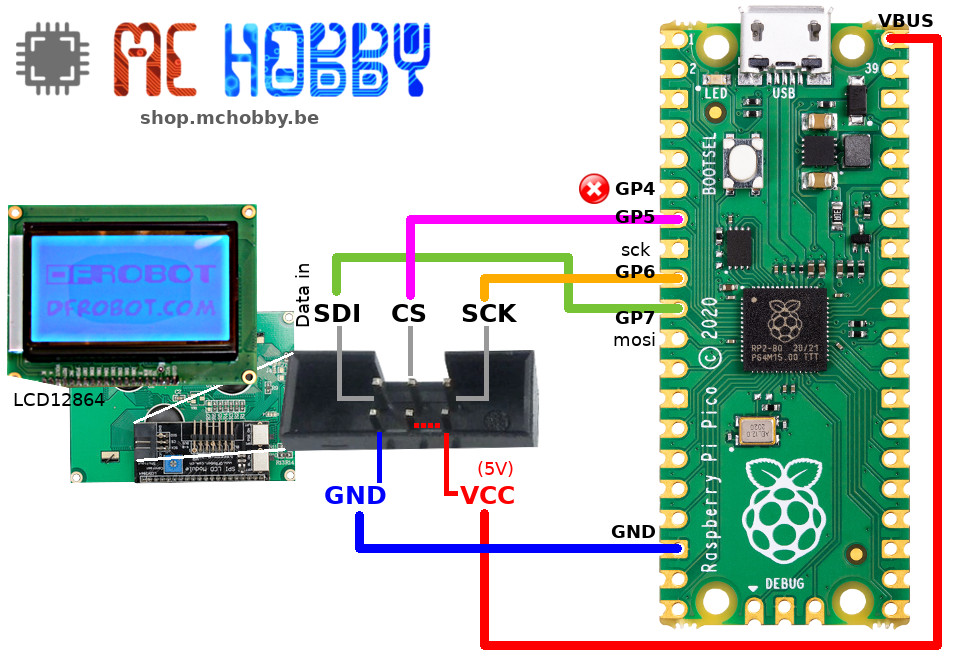
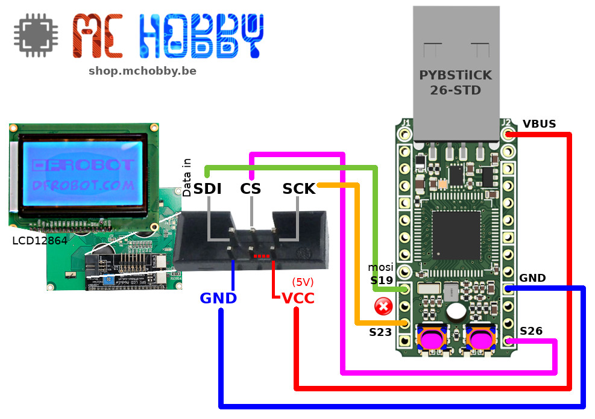
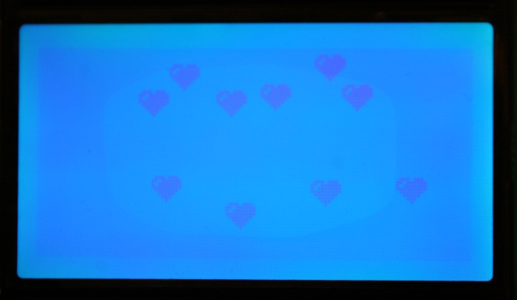

[Ce fichier existe également en FRANCAIS](readme.md)

# Using a graphical LCD display of 128x64 pixels under MicroPython

DFRobot offers a LiquidCristal LCD with 128 x 64 individual pixels (DFR0091) that can be driven from SPI bus (with only 3 wires, MISO is not used).



# Library

The library must be copied on the MicroPython board before using the examples.

On a WiFi capable plateform:

```
>>> import mip
>>> mip.install("github:mchobby/esp8266-upy/lcdspi-lcd12864")
```

Or via the mpremote utility :

```
mpremote mip install github:mchobby/esp8266-upy/lcdspi-lcd12864
```

# Wire

Before using the LCD display, it must be configured for SPI mode communication and activate the backlight.


## Wire to PICO



The needed bus and signals must be created as follows

``` python
# Pico: GP7=mosi, GP6=sck, GP5=/ss
cs = Pin( 5, Pin.OUT, value=0 )
spi = SPI( 0 )
spi.init( polarity=0, phase=1 )
```

## Wire to PYBStick



The needed bus and signals must be created as follows

``` python
# PYBStick: S19=mosi, S23=sck, S26=/ss
cs = Pin( 'S26', Pin.OUT, value=0 )
spi = SPI( 1 )
spi.init( polarity=0, phase=1 )
```

## Wire to Pyboard


The needed bus and signals must be created as follows

``` python
# PYBOARD: Y8=mosi, Y6=sck, Y5=/ss
cs = Pin( 'Y5', Pin.OUT, value=0 )
spi = SPI( 2 )
spi.init( polarity=0, phase=1 )
```

_Note: This setup has not been tested but would work exactly the same way as the PYBStick._

# Usage

## test_simple.py

The MicroPython driver does expose the `SPI_LCD12864` class inheriting from `FrameBuffer`. As a conséquence, SPI_LCD12864 can use all [the drawing methods available on FrameBuffer](https://docs.micropython.org/en/latest/library/framebuf.html) .

The [test_simple.py](examples/test_simple.py) example script show how to make simple FrameBuffer drawing.

``` python
from machine import SPI, Pin
from lcd12864 import SPI_LCD12864
import time

# PYBStick: S19=mosi, S23=sck, S26=/ss
spi = SPI( 1 )
spi.init( polarity=0, phase=1 )
cs = Pin( 'S26', Pin.OUT, value=0 )

lcd = SPI_LCD12864( spi=spi, cs=cs )
# text at X=10, Y=25, color=1 (drawing)
lcd.text( "MicroPython !", 10, 25, 1 )
# draw two rects
lcd.rect(0,0,128,64,1)
lcd.rect(3,3,128-6,64-6,1)
# display FrameBuffer on LCD
lcd.update()
```


## test_icon.py

The [test_icon.py](examples/test_icon.py) example script draws an icon on the display.

Coding and drawing an icon on the LCD is quite simple. It is just manipulating pixel onto the FrameBuffer.

``` python
HEART_ICON = [
  [0,0,0,0,0,0,0,0,0,0,0],
  [0,0,1,1,1,0,1,1,1,0,0],
  [0,1,1,0,1,1,1,1,1,1,0],
  [0,1,0,1,1,1,1,1,1,1,0],
  [0,1,1,1,1,1,1,1,1,1,0],
  [0,0,1,1,1,1,1,1,1,0,0],
  [0,0,0,1,1,1,1,1,0,0,0],
  [0,0,0,0,1,1,1,0,0,0,0],
  [0,0,0,0,0,1,0,0,0,0,0],
  [0,0,0,0,0,0,0,0,0,0,0] ]

def draw_icon( lcd, from_x, from_y, icon ):
    for y, row in enumerate( icon ):
        for x, color in enumerate( row ):
            if color==None:
                continue
            lcd.pixel( from_x+x,
                       from_y+y,
                       color )
```



## test_pbmlcd.py

The [test_pbmlcd.py](examples/test_pbmlcd.py) example script displays the content of the `mpy.pbm` image (at PBM format) onto the LCD display.


The [mpy.pbm](examples/mpy.pbm) file must be present at the root of microcontroler file system.

The `imglib` library ([see this repository](https://github.com/mchobby/esp8266-upy/tree/master/FILEFORMAT)) must also be available on the MicroPython board. The documentation also explain how to create a Pbm image.

``` python
from machine import SPI, Pin
from lcd12864 import SPI_LCD12864
from img import open_image

# PYBStick: S19=mosi, S23=sck, S26=/ss
cs = Pin( 'S26', Pin.OUT, value=0 )
spi = SPI( 1 )
spi.init( polarity=0, phase=1 )

lcd = SPI_LCD12864( spi=spi, cs=cs )

def color_transform( rgb ):
	# transform the clipreader (r,g,b) color to the target FrameBuffer color (2 colors)
	return 0 if rgb==(0,0,0) else 1

reader = open_image( 'mpy.pbm' )
reader.clip(0,0,lcd.width,lcd.height)
# Copy the clipped aread TO a target FrameBuffer (lcd) at is starting
# position 0,0 for the given clipping width,height .
reader.copy_to(lcd, 0,0, color_transform )
lcd.update()
```


## Using other Font files

The default font used by MicroPython is too fat for many of the display... not very elegant.

Here some of the alternatives:
* [__FreeType-Generator__ : many fonts for FrameBuffer](https://github.com/mchobby/freetype-generator)
* [__SMALL-FONT__ : lighter for MicroPython](https://github.com/mchobby/esp8266-upy/tree/master/SMALL-FONT)

## test_raw.py

The [examples/test_raw.py](examples/tesraw.py) script was the very first portage of the arduino library to MicroPython. This is the code base for the driver.

# Shopping list

* [LCD 128x64 display (DFR0091)](https://shop.mchobby.be/fr/gravity-boson/1878-afficheur-lcd-128x64-spi-3-fils-3232100018785-dfrobot.html) @ MCHobby
* [PYBStick-Std-26 microcontroler](https://shop.mchobby.be/fr/pybstick/1844-pybstick-standard-26-micropython-et-arduino-3232100018440-garatronic.html) @ MCHobby
