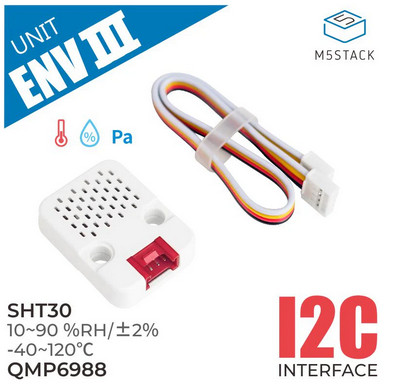

Ce fichier existe également en [Français ici](readme.md)

# Using an I2C Grove ENV III environmental sensor with (U001-C) with MicroPython

ENV III is an environmental sensor that integrates SHT30 and QMP6988 internally to detect temperature, humidity, and atmospheric pressure data. SHT30 is a high-precision and low-power digital temperature and humidity sensor, and supports I2C interface (SHT30:0x44 , QMP6988:0x70).QMP6988 is an absolute air pressure sensor specially designed for mobile applications, with high accuracy and stability, suitable for environmental data collection and detection types of projects.



* Simple and easy to use
* High accuracy
* I2C communication interface

# Wiring

The sensor  can be powered with 3.3V or 5V power supply.

The SDA / SCL data lines are at 3.3V level.

## ENV III I2C sensor with Raspberry-Pi Pico


# Test

The [env3.py](lib/env3.py) library must be copied on your MicroPython microcontroler.

## Reading the environmental sensor Sensor

The [test.py](examples/test.py) script do reads the sensor value every 100ms.

``` python
xxx
```
