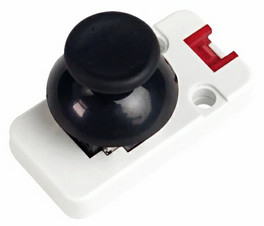

This file also exist in [English here](readme_ENG.md)

# Utiliser un Joystick I2C (U024) Grove avec MicroPython

Cette unité est un contrôle analogique de type joystick utilisant le bus I2C pour communiquer avec le microcontrôleur.

Le joystick propose un control sur 3-axes:
* Les axes X/Y avec offset analogique,
* L'axe Z comme entrée numérique à deux positions (bouton pressé ou relâché).



Ce type de joystick convient pour des application de type console de jeu, contrôle robot.

En utilisant ce joystick et la bibliothèque, vous pourrez obtenir les valeurs `x`, `y` et `button` .


# Bibliothèque

Cette bibliothèque doit être copiée sur la carte MicroPython avant d'utiliser les exemples.

Sur une plateforme connectée:

```
>>> import mip
>>> mip.install("github:mchobby/esp8266-upy/m5stack-u024")
```

Ou via l'utilitaire mpremote :

```
mpremote mip install github:mchobby/esp8266-upy/m5stack-u024
```

# Brancher

Le joystick peut être alimenté en 3.3V ou 5V.

Les signaux SDA / SCL sont en logique 3.3V.

## Joystick I2C avec Raspberry-Pi Pico


# Test

## Lecture joystick reading

Le script [test.py](examples/test.py) permet de lire la position du joystick, lecture répétée toutes les 100ms.

``` python
from machine import I2C
from joyi2c import Joystick
from time import sleep

# Pico - I2C(1) - sda=GP6, scl=GP7
i2c = I2C(1)
# M5Stack core
# i2c = I2C( sda=Pin(21), scl=Pin(22) )

joy = Joystick(i2c)
while True:
	joy.update() # Capturer l'etat du joystick via I2C
	print( "X: %4i, Y: %4i, Button: %s" % (joy.x, joy.y, joy.button) )
	sleep( 0.1 )
```
