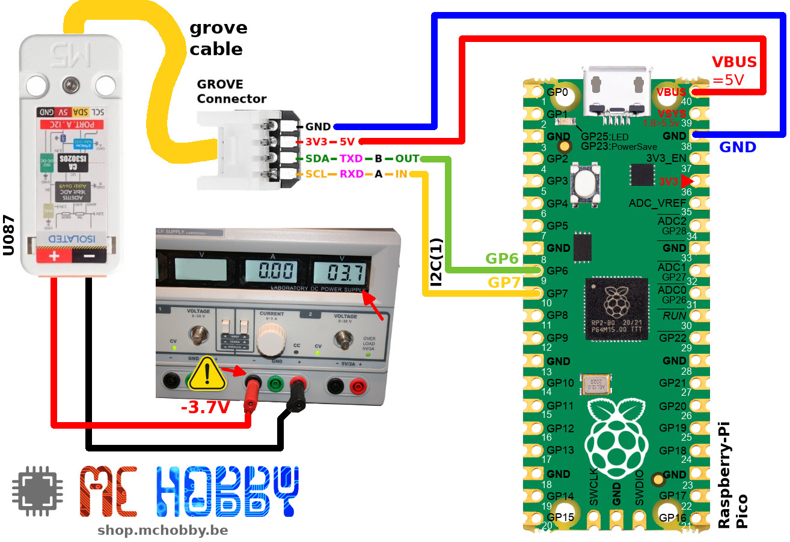
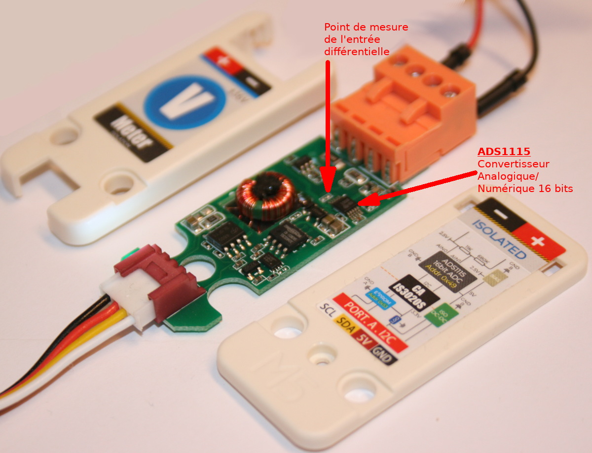
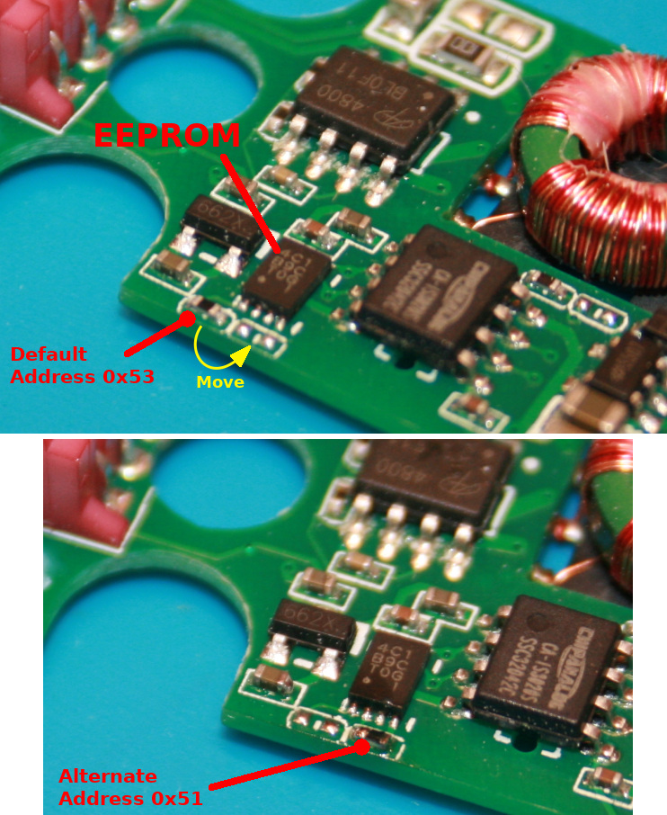
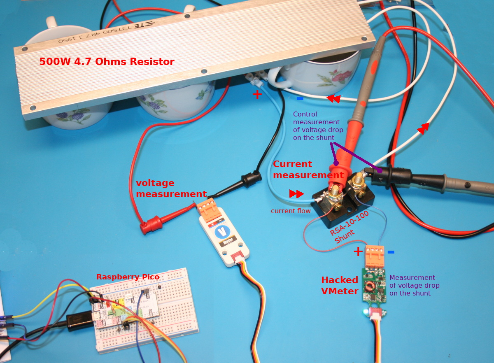
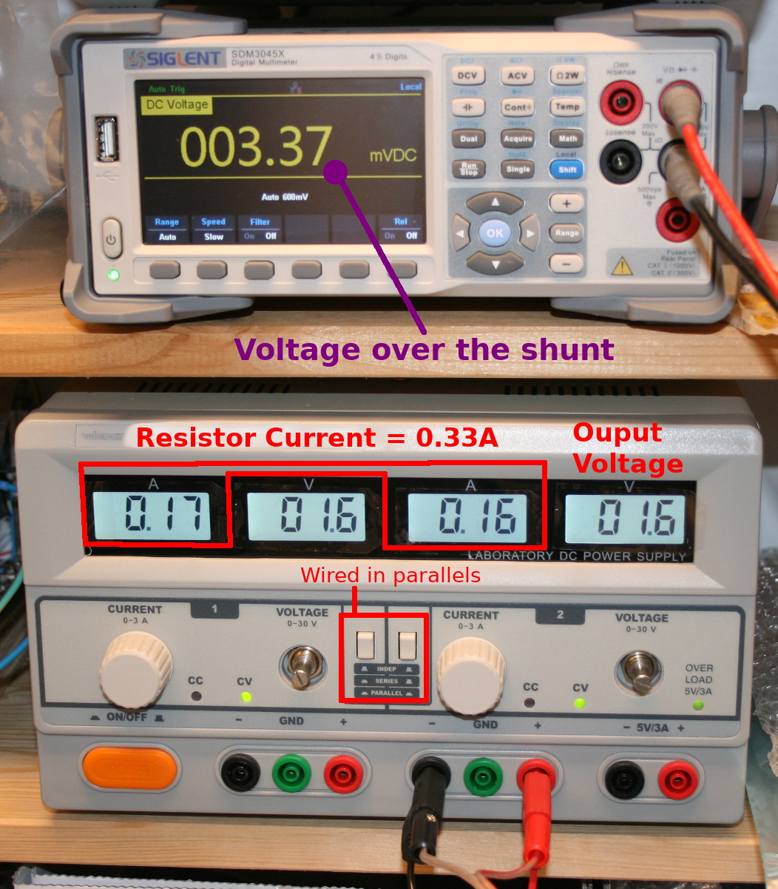

This file also exist in [English here](readme_ENG.md)

# Utiliser un module voltmètre I2C (U087) Grove avec MicroPython

Cette module Voltmètre permet de mesurer la tension en temps réel (grâce au convertisseur analogique-vers-numérique 16-bits ADS1115).


Le module communique par l'intermédiaire du bus I2C avec l'hôte.

L'alimentation DC-DC interne est isolée, ce qui permet d'assurer une meilleure précision analogique. Le bus I2C est également isolé à l'aide du composant CA-IS3020S (un isolateur I2C faible puissance).

L'isolateur et le convertisseur DC/DC isolé évite également que le bruit du circuit mesuré ou une surtension puisse passer vers le circuit basse tension via le bus I2C et le microcontrôleur. Cela protège également les composants fragile d'une pollution de bruit par la masse.

Chaque unité est calibrée en usine et les données de calibration sont stockée dans l'EEPROM présente sur le module. La tension maximale mesurable est de l'ordre de 36V.

__Alimentation 5V requise:__

Ce module doit être alimenté en 5V pour assurer un bon fonctionnement. Par contre, les signaux SDA/SCL du bus I2C sont bien en logique 3.3V. Ce module peut donc être utilisé avec vos microcontrôleurs 3.3V comme ESP32, Pico, Pyboard, M5Stack core, Raspberry.

# Bibliothèque

Cette bibliothèque doit être copiée sur la carte MicroPython avant d'utiliser les exemples.

Sur une plateforme connectée:

```
>>> import mip
>>> mip.install("github:mchobby/esp8266-upy/m5stack-u087")
```

Ou via l'utilitaire mpremote :

```
mpremote mip install github:mchobby/esp8266-upy/m5stack-u087
```

# Brancher

## Raspberry-Pi Pico




# Test

## Lecture de tension

Le script [test_volts.py](examples/test_volts.py) permet de lire la valeur du voltmetre dans sa configuration par défaut, lecture répétée toutes les 300ms.

``` python
from machine import I2C
from vmeter import *
from time import sleep

# Pico - I2C(1) - sda=GP6, scl=GP7
i2c = I2C(1, freq=10000)

vmeter = Voltmeter(i2c)
while True:
	print( 'Voltage: %5.3f Volts' % vmeter.voltage )
	sleep( 0.3 )
```

Ce qui affiche le résultat suivant en faisant varier la tension sur le voltmètre:

```
MicroPython v1.15 on 2021-04-18; Raspberry Pi Pico with RP2040
Type "help()" for more information.
>>>
>>> import test_volts
Voltage: -3.722 Volts
Voltage: -3.726 Volts
Voltage: -4.558 Volts
Voltage: -4.649 Volts
Voltage: -4.617 Volts
Voltage: -3.714 Volts
Voltage: -3.624 Volts
Voltage: -3.628 Volts
Voltage: -0.012 Volts
Voltage: -0.192 Volts
Voltage: 0.024 Volts
Voltage: 0.027 Volts
Voltage: 0.008 Volts
Voltage: -0.016 Volts
Voltage: 0.055 Volts
Voltage: 3.624 Volts
Voltage: 3.628 Volts
Voltage: 5.080 Volts
Voltage: 6.698 Volts
Voltage: 6.769 Volts
Voltage: 8.539 Volts
Voltage: 9.007 Volts
```
## Lecture détaillée

Le script d'exemple [test_simple.py](examples/test_simple.py) permet de lire la tension sur le module Voltmètre _avec informations complémentaires_.

C'est aussi l'occasion de tester un gain différent offrant une meilleure résolution mais qui abaisse aussi la tension maximale acceptée par le module Voltmètre.

L'exemple ci-dessous reprend l'utilisation du module sur un Pico pour mesurer une tension de référence arbitraire de 3.7V (branché à l'envers sur le module).


``` python
MPY: soft reboot
MicroPython v1.15 on 2021-04-18; Raspberry Pi Pico with RP2040
Type "help()" for more information.

>>> import test_simple
M5Stack - U087 - Voltmeter
--------------------------

Max voltage : +/- 16 V (depends on ADC gain)
Resolution  : 0.98153 v/unit
Sample rate : 8 SPS
Voltage     : -3719.033 mV
Voltage     : -3716.844 mV (calibrated)
Raw ADC     : 3789
>>>
```

La tension lue est bien de 3.7 Volts.

En utilisant les données de calibrations stockées dans l'EEPROM (fonctionnement par défaut de la bibliothèque), la tension lue est très précisément de __-3.716844 Volts__.


L'utilisation d'un multimètre Siglent SDM3045x au même moment (à quelques ms près) révèle que la tension sur le module voltmètre est de __-3.7157 Volts__ .

__Le module voltmètre offre une résolution allant jusqu'à presque 3 décimales!__

# VMeter Hacking

Le module VMeter dispose de nombres protections et représente un implémentation de choix de l'ADS1115. Pour les besoins d'un projet, il était nécessaire de lire une tension (jusque 60V) et le courant (jusque 11A) traversant une résistance de charge.

Le module VMeter est capable de lire une tension POSITIVE jusque 70V (grâce au pont diviseur).

J'avais donc besoin de pouvoir lire une tension sur un shunt RSA-10-100 (100 mV @ 10A) avec un grande précision. J'ai donc hacker le module VMeter pour utiliser directement l'ADS1115 et modifier l'adresse I2C de celui-ci pour pouvoir utiliser deux modules VMeter en même temps.



Voici les modifications à réaliser.


Pour faire cohabiter plusieurs modules sur un même bus I2C, il faut également modifier l'adresse de l'EEPROM.



__Le banc de test__ est composé comme suit:





Le script de [test_hack.py](examples/test_hack.py) permet de lire la chute de tension provoquée par le courant passant dans le shunt.

``` python
from machine import I2C
from vmeter import *
from time import sleep

# Pico - I2C(1) - sda=GP8, scl=GP9
i2c = I2C(1, freq=10000)
# M5Stack core
# i2c = I2C( sda=Pin(21), scl=Pin(22) )

vmeter = Voltmeter(i2c, ads1115_addr=0x4b, eeprom_addr=0x51 ) # Addr-->Scl
while True:
	# read ADC voltage (in millivolts)
	print( 'ADC Voltage: %5.3f mV' % vmeter.adc_mv )
	sleep( 0.3 )
```

Script qui produit le résultat suivant:

```
ADC Voltage: 3.313 mV
ADC Voltage: 3.313 mV
ADC Voltage: 3.375 mV
ADC Voltage: 3.313 mV
ADC Voltage: 3.313 mV
ADC Voltage: 3.313 mV
```

Le shunt produit 100mV pour 10A. Soit 1mv par 0.1A (100mA).

En mesurant une tension de 3.31 mV sur le shunt, le courant qui y circule est donc de 0.331 A.

# Liste d'achat
* [Module Voltmetre (M5Stack u087)](https://shop.mchobby.be/fr/grove/2153-m5stack-voltmetre-mesure-de-tension-36v-ds1115-grove-3232100021532-m5stack.html) @ MCHobby
* [Module Voltmetre (M5Stack u087)](https://shop.m5stack.com/products/voltmeter-unit-ads1115) @ M5Stack
* [Raspberry-Pi Pico avec Header](https://shop.mchobby.be/fr/pico-rp2040/2036-pico-header-rp2040-microcontroleur-2-coeurs-raspberry-pi-3232100020368.html) @ MCHobby
* [Connecteur Grove](https://shop.mchobby.be/fr/m5stack-esp/1929-connecteur-grove-vers-broches-5pcs-3232100019294-m5stack.html) @ MCHobby
* [Connecteur Grove avec broche](https://shop.mchobby.be/fr/m5stack-esp/2145-connecteur-grove-vers-broches-10pcs-3232100021457-m5stack.html) @ MCHobby
