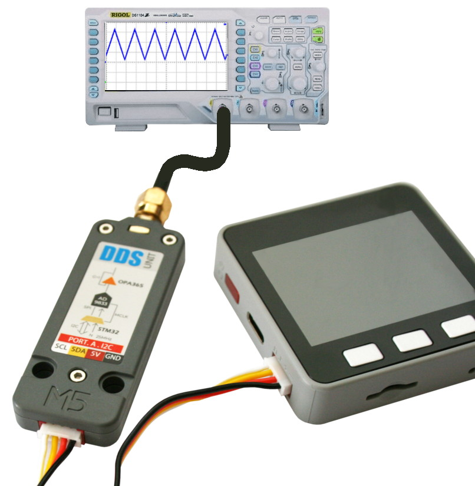
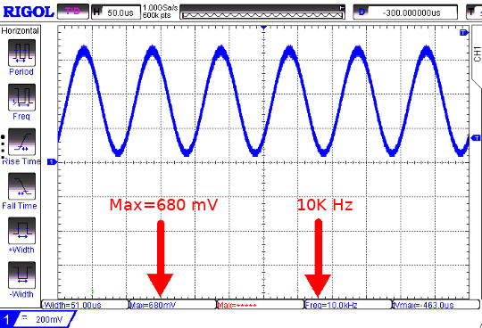
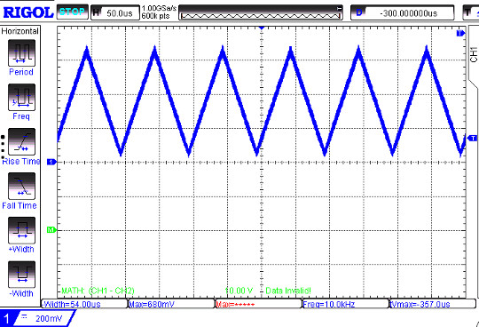

This file also exist in [English here](readme_ENG.md)

# Utiliser le DDS Unit AD9833 (U105) I2C Grove avec MicroPython

Le module "[U105: DDS Unit AD9833](https://shop.m5stack.com/products/dds-unit-ad9833)" de M5Stack est un module I2C permettant de générer des signaux sinusoïdaux, carrés, triangles et dents de scie avec modification de fréquences et modification de déphasage. Ce module est équipé d'une interface Grove permettant de faciliter les raccordements sur les plateformes exposant cette connectique.


A noter que Le signal de sortie de l'AD9833 est de l'ordre de 680mV.

# Brancher

## Brancher sur Pico

  

## Brancher sur M5Stack Core



# Tester

Après avoir copié la bibliothèque [lib/mdds.py](lib/mdds.py), il est possible d'exécuter les scripts d'exemples.

## test_simple

Le script [test_simple.py](examples/test_simple.py) repris ci-dessous crée une onde sinusoïdale à 10 KHz.

``` python
from machine import I2C
from mdds import *
from time import sleep

# Pico - I2C(0) - sda=GP8, scl=GP9
i2c = I2C(0)
# M5Stack core
# i2c = I2C( sda=Pin(21), scl=Pin(22) )

dds = DDS(i2c)

freq = 10000 # 10 KHz
phase = 0
dds.quick_out( SINUS_MODE, freq, phase )
```


## test_waves

Le script [test_waves.py](examples/test_waves.py) change de forme d'onde toutes les secondes.

``` python
from machine import I2C
from mdds import *
from time import sleep

# Pico - I2C(0) - sda=GP8, scl=GP9
i2c = I2C(0)
# M5Stack core
# i2c = I2C( sda=Pin(21), scl=Pin(22) )

shapes = ( SINUS_MODE, TRIANGLE_MODE, SQUARE_MODE, SAWTOOTH_MODE )
shape_names = { SINUS_MODE : "Sinus", TRIANGLE_MODE : "Triangle",
                SQUARE_MODE : "Square", SAWTOOTH_MODE : "SawTooth"}
dds = DDS(i2c)

while True:
	for shape in shapes:
		print( '%s @ 10 KHz' % shape_names[shape] )
		dds.quick_out( shape, freq=10000, phase=0 )
		sleep( 1 )
```

Les captures ci-dessous reprennent les signaux en triangle et en carré.




__Notes:__ Le signal en "dent de scie" est composé en itérations successives et donc a une fréquence inférieure à celle communiquée au générateur de signal.

## test_freq

Le script [test_freq.py](examples/test_freq.py) change la fréquence d'une onde sinusoïdale de 10 KHz (10 000 Hz) à 1 MHz (1 000 000 Hz).

Voyez également l'exemple [test_freq2.py](examples/test_freq2.py) pour les signaux en carré et en triangle.

``` python
from machine import I2C
from mdds import *
from time import sleep_ms

# Pico - I2C(0) - sda=GP8, scl=GP9
i2c = I2C(0)
# M5Stack core
# i2c = I2C( sda=Pin(21), scl=Pin(22) )


dds = DDS(i2c)
# quick_out set & use the freq register 0 & phase register 0
dds.quick_out( SINUS_MODE, freq=10000, phase=0 )

# set_freq() is I2C bus efficient but will reset signal mode to sinus
while True:
	for f in range( 10000, 1000000, 10000 ):
		print( 'Set freq @ %s KHz' % (f//1000) )
		dds.set_freq( reg=0, freq=f )
		sleep_ms(100)
```

## test_saw

Le script [test_saw.py](examples/test_saw.py) configure la sortie en dent de scie.

__NOTE:__ le signal en dent de scie est généré à fréquence fixe de 55.9Hz .

``` python
from machine import I2C
from mdds import *
from time import sleep

# Pico - I2C(0) - sda=GP8, scl=GP9
i2c = I2C(0)
# M5Stack core
# i2c = I2C( sda=Pin(21), scl=Pin(22) )

dds = DDS(i2c)

# Generates the SAW TOOTH signal at 55.9Hz (fixed frequency)
dds.quick_out( SAWTOOTH_MODE, freq=1, phase=0 )
```


# Où acheter
* [M5Stack U105: DDS Unit (AD9833)](https://shop.mchobby.be/fr/nouveaute/2151-m5stack-generateur-de-signal-dds-stm32f0-ad9833-grove-3232100021518.html) @ MCHobby
* [M5Stack U105: DDS Unit (AD9833)](https://shop.m5stack.com/products/dds-unit-ad9833) @ M5Stack
* [Grove to Pin](https://shop.mchobby.be/product.php?id_product=2145)
* [Grove to Pad](https://shop.mchobby.be/product.php?id_product=1929)
