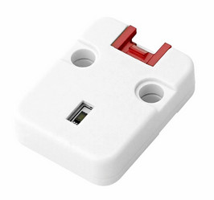
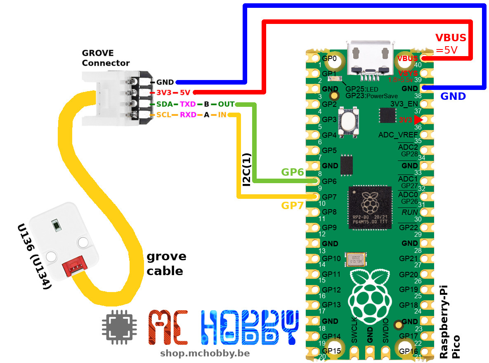

This file also exists in [ENGLISH here](readme_ENG.md)

# Utiliser le BH1750FVI, capteur de luminosité ambiante I2C (U136/U134) avec MicroPython

L'unité Grove DLight est un capteur de luminosité Ambiante numérique utilisant le capteur BH1750FVI. Ce capteur communique via un bus I2C, utilise un convertisseur analogique 16 bits (ADC) et offre une large gamme de mesure de 1 à 65535 Lux.



De taille compacte et avec une faible consommation, ce capteur est idéal pour les applications de mesure de luminosité.
Parmi ses caractéristiques, nous avons:
* Support des changements de source lumineuses (incandescent, fluorescent, halogène, LED blanches, lumière du soleil, etc)
* Large gamme de mesure en LUX (1 à 65535 lux)

# Bibliothèque

Cette bibliothèque doit être copiée sur la carte MicroPython avant d'utiliser les exemples.

Sur une plateforme connectée:

```
>>> import mip
>>> mip.install("github:mchobby/esp8266-upy/m5stack-u136")
```

Ou via l'utilitaire mpremote :

```
mpremote mip install github:mchobby/esp8266-upy/m5stack-u136
```

# Brancher

Le capteur peut être alimenté avec 3.3V ou 5V.

Les lignes de données SDA / SCL sont en logique 3.3V.

## Capteur luminosité ambiante avec Raspberry-Pi Pico



# Test

La bibliothèque [dlight.py](lib/dlight.py) doit être copiée sur votre microcontrôleur Python.

## Lecture de luminosité

Le script [test.py](examples/test.py) lit la valeur du capteur toutes les 200ms.

``` python
from machine import I2C
from dlight import *
from time import sleep

# Pico - I2C(1) - sda=GP6, scl=GP7
i2c = I2C(1)
# M5Stack core
# i2c = I2C( sda=Pin(21), scl=Pin(22) )

ambiant = AmbiantLight(i2c)
# Set the mode
ambiant.set_mode( CONTINUOUSLY_H_RESOLUTION_MODE )
while True:
	print( 'Light: %i Lux' % ambiant.lux )
	sleep( 0.200 )
```

Notez qu'il est possible d'utiliser d'autres modes avec ce capteur:
* CONTINUOUSLY_H_RESOLUTION_MODE
* CONTINUOUSLY_H_RESOLUTION_MODE
* CONTINUOUSLY_H_RESOLUTION_MODE2
* CONTINUOUSLY_L_RESOLUTION_MODE
* ONE_TIME_H_RESOLUTION_MODE
* ONE_TIME_H_RESOLUTION_MODE2
* ONE_TIME_L_RESOLUTION_MODE

Les constantes et impacts sont décris dans [la fiche technique du BH1750FVI (see detail of the product)](https://shop.mchobby.be/product.php?id_product=2444).
