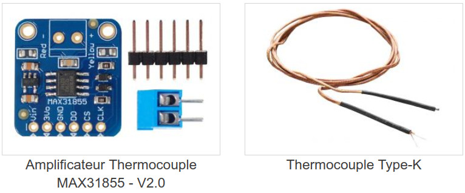
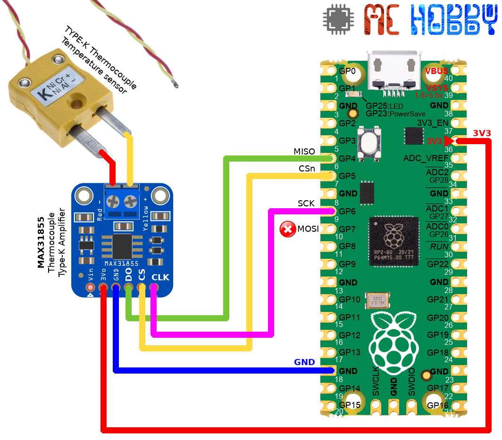

[Ce fichier existe engalement en FRANCAIS ici](readme.md)

# Use a Type-K thermocouple + MAX31855 with your MicroPython board

The type-K thermocouple are mare with 2 materials producing some voltages when the temperature changes.

The type-K thermocouple can read temperature from -200°C to 1350°C.

However, the coltage is so small that an amplifier is required. This is the purpose of MAX31855's based breakout board.



The MAX31855 can communicates with the MicroControler through a SPI bus __configured in mode 0__.

Only the MISO line is used on the bus. The MOSI __will not be wired__ between the MAX31855 and the MCU. However, as the MOSI is attached to the SPI bus, it cannot be relocated for other usage.

# Calibration recommended

A __same thermocouple__ wired to distinct amplifiers would returns almost the same temperature varying in the range of 2 degrées for each other. I did noticed the difference between my MAX31855 amplifier and SIGLENT SDM3045x (a difference from 2.7°C).

This remind us to calibrates the sensors and applies correction factor to the readings.

# Wiring

## with Raspberry-Pi Pico

Here how to wire a MAX31855 to a Raspberry-Pi Pico.



# Test

It will be necessary to install the [lib/max31855.py](lib/max31855.py) library on the MicroPython board before to reading the temperature.

The [test_simple.py](examples/test_simple.py) example, visible here below, would read the sensor temperature.

``` python
from machine import Pin, SPI
from max31855 import MAX31855
import time

# Pico - SPI(0) - GP5=CSn, GP4=Miso, GP6=Sck, GP7=Mosi (allocated but not used)
cs = Pin(5, Pin.OUT, value=True ) # SPI CSn
spi = SPI(0, baudrate=5000000, polarity=0, phase=0)

tmc = MAX31855( spi=spi, cs_pin= cs )

while True:
	print( "Temp: %s" % tmc.temperature() )
	time.sleep( 1 )
```

Which returns the following information:

```
Temp: 25.8
Temp: 25.8
Temp: 25.6
Temp: 25.7
Temp: 25.7
Temp: 25.8
```

# Shopping list
* [Raspberry-Pi Pico](https://shop.mchobby.be/fr/pico-rp2040/2025-pico-rp2040-microcontroleur-2-coeurs-raspberry-pi-3232100020252.html)
* [Type-K temperature sensor](https://www.adafruit.com/product/269) @ Adafruit Industries
* [Type-K semperature sensor](https://shop.mchobby.be/fr/temperature/301-thermocouple-type-k-3232100003019.html) @ MCHobby
* [MAX31855 amplifier](https://shop.mchobby.be/fr/temperature/302-amplificateur-thermocouple-max31855-v20-3232100003026-adafruit.html) @ MCHobby
