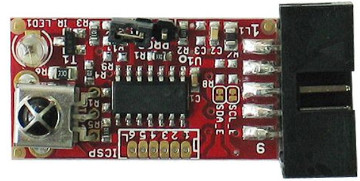
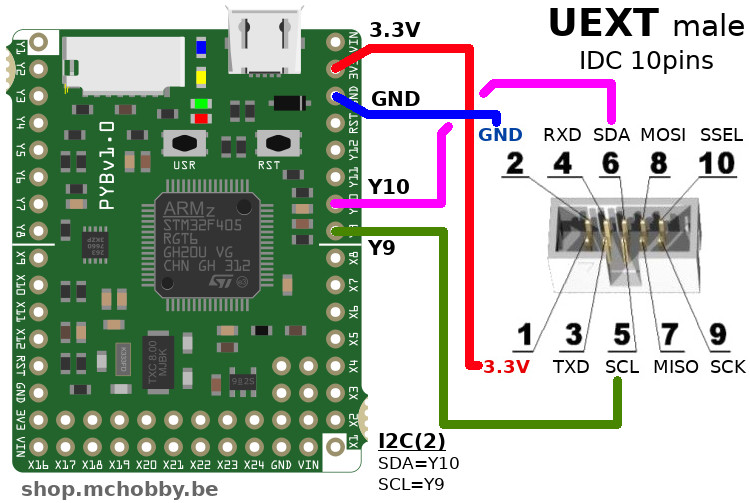
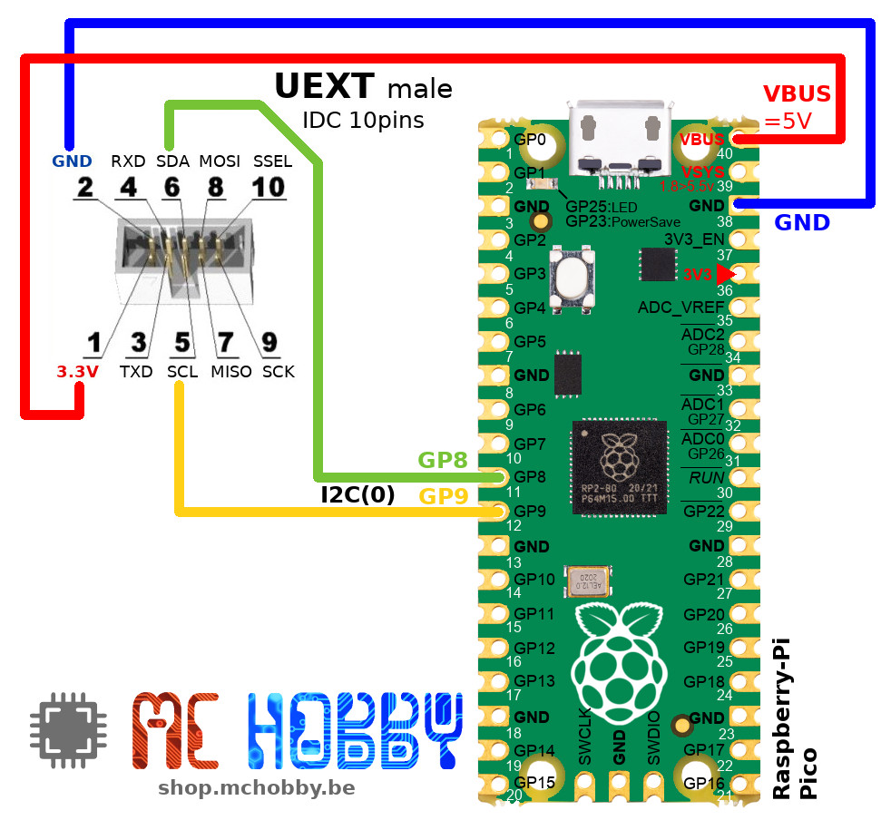

[Ce fichier existe également en FRANCAIS](readme.md)

# Using an I2C infrared remote emitter-receiver controler with you MicroPython board

This module does allow your project to communicate on a short distance (~5m) via infrared. As it implements the RC5 and SIRCS protocols (see more details below), this module can be used to receive command from Sony / Philips remotes OR can act as such temotes.

Advanced users could even use a pair od modules to initiate bidirectional infrared communication to automate communication between 2 smarts modules (the SIRCS protocole will help for this).



This module can handle 2 IR protocole among the most populars:

__RC5 protocol:__

Also called RC-5, this binary protocole was created by the __Philips__ company to control audio-visual devices. It does use a 36 KHz carrier to send command encoded over 6 bits (0..63) to a device identified by a 5 bits (0..31) address. This correspond to 32*64 = 2048 combinations.


__SIRCS protocol:__

Also called Cntrl-S, this binary protocol where created by __Sony__ to control audio-visual devices. It does use a 40 KHz carrier to send the command encoded over  7 bits (0..127) to a 5 bits (0..31) device address. Device address could be extended to 13 bits, but this is not supported by the IRDA+ module.

# Wiring
The sensor is easy to quite easy to connect to a board already having UEXT connector (see the [UEXT adapter for pyboard](https://github.com/mchobby/pyboard-driver/tree/master/UEXT), the [Pyboard-UNO-R3](https://shop.mchobby.be/fr/nouveaute/1745-adaptateur-pyboard-vers-uno-r3-extra-3232100017450.html) board, the [Pico-Hat for Raspberry-Pi Pico](https://shop.mchobby.be/fr/pico-rp2040/2037-interface-hat-pour-raspberry-pi-pico-3232100020375.html) ).

## Mod-Irda on Pyboard

Wire an UEXT (IDC 10 broches) connecteur directly to a Pyboard like shown here below. Then just plug your module on that connector.



When using this wiring, the test scripts must be changes to use the I2C(2) bus.

## Mod-Irda to Pico

Wire an UEXT (IDC 10 broches) connector directly to a Raspberry-Pi Pico as showned here below. Then just plug your module on that connector.



# Library

The library must be copied on the MicroPython board before using the examples.

On a WiFi capable plateform:

```
>>> import mip
>>> mip.install("github:mchobby/esp8266-upy/modirdaplus")
```

Or via the mpremote utility :

```
mpremote mip install github:mchobby/esp8266-upy/modirdaplus
```

# Test
The library [irdaplus.py](lib/irdaplus.py) must be copied to your MicroPython board.

## SIRCS reading (Sony remote)

The [test_sirc_read.py](examples/test_sirc_read.py) example receives the Sony IR command and print it on the REPL session.


Please note:
* Calling the `read_command()` method may return `None` if there is no command transmited.
* The I2C bus has been slowed down to 10K baud for a more reliable communication over the I2C bus.

``` python
from machine import I2C
from time import sleep_ms
from irdaplus import IrdaPlus, MODE_SIRC

# Pico sda=GP8, scl=GP9
i2c = I2C(0, freq=10000 ) # Slow down the bus to improve communication reliability

irda = IrdaPlus( i2c )
print( "SIRCS (SONY) IR Remote decoder" )
print( "IRDA Module ID: %i" % irda.get_id() )

irda.set_mode( MODE_SIRC )
while True:
    decoded = irda.read_command()
    if decoded:
        print( 'device %i, command %i' % decoded )
    sleep_ms( 300 )
```

Which produce the following result! We did added annotations about the remote button used.

``` python
MicroPython v1.14 on 2021-02-05; Raspberry Pi Pico with RP2040
Type "help()" for more information.
>>>
>>> import test_sirc_read
SIRCS (SONY) IR Remote decoder
IRDA Module ID: 84

=== TV ==========
--- On/Off
device 1, command 21
device 1, command 21
--- Vol+ & Vol-
device 1, command 18
device 1, command 19
device 1, command 19
--- Prog+ & Prog-
device 1, command 16
device 1, command 16
device 1, command 17
device 1, command 17
--- Mute
device 1, command 20
device 1, command 20
device 1, command 20
device 1, command 20

--- #0
device 1, command 9
device 1, command 9
--- #1..#9
device 1, command 0
device 1, command 1
device 1, command 2
device 1, command 3
device 1, command 3
device 1, command 4
device 1, command 4
device 1, command 5
device 1, command 5
device 1, command 6
device 1, command 6
device 1, command 7
device 1, command 7
device 1, command 8

=== TV ==========
--- TV: menu
device 1, command 96
--- TV: OK (Play)
device 1, command 101
--- TV: UP (Pause)
device 1, command 116
device 1, command 116
-- TV: DOWN (Stop)
device 1, command 117
device 1, command 117
--- TV: LEFT (Backward)
device 1, command 52
--- TV: RIGHT (Forward)
device 1, command 51

--- TV: Red

--- TV: Green

--- TV: Yellow

--- TV: Blue


=== VCR ==========
--- VCR: Play
device 11, command 26
device 11, command 26
--- VCR: Pause
device 11, command 25
--- VCR: Stop
device 11, command 24
device 11, command 24
--- VCR: Left
device 11, command 27
--- VCR: Right
device 11, command 28

--- VCR:Red (audio)
device 3, command 76
device 3, command 76
--- VCR:Green (brightness)
device 3, command 77
device 3, command 77
--- VCR:Yellow (Nothing received)

-- VCR:Blue (alignment)
device 3, command 79
device 3, command 79
```

## Sending SIRCS (Sony remote)

The module can also act as a remote control. The [test_sirc_write.py](examples/test_sirc_write.py) script do send Vol+ and Vol- to a Sony TV devices.

``` python
from machine import I2C
from time import sleep, sleep_ms
from irdaplus import IrdaPlus, MODE_SIRC

# Pico sda=GP8, scl=GP9
i2c = I2C(0, freq=10000 ) # Ralentir le bus pour une communication plus fiable

irda = IrdaPlus( i2c )
print( "SIRCS (SONY) IR Remote send command" )
print( "IRDA Module ID: %i" % irda.get_id() )

irda.set_mode( MODE_SIRC )

# Temps minimal requis par le module IRDA+ pour envoyer la commande et être
# près a réceptionner d'autres instructions sur le bus I2C.
# En dessous de 30ms, de multiples écritures planterons le bus I2C.
SEND_PAUSE_MS = 30
print( "Send pause ms = %s" % SEND_PAUSE_MS )

# Envoyer Vol+ vers Sony TV
print( "Send Vol+" )
for i in range( 20 ):
    irda.send_command( device=1, cmd=18 ) # Aussi 16 sur certaines TV Sony
    sleep_ms( SEND_PAUSE_MS )

sleep( 1 )

# Envoyer Vol- vers Sony TV
print( "send Vol-" )
for i in range( 20 ):
    irda.send_command( device=1, cmd=19 ) # aussi 17 sur certaines TV Sony
    sleep_ms( SEND_PAUSE_MS )
print( "Done!" )
```

## Envoi/Réception RC5 (télécommande Philips)

Le fonctionnement en 'MODE_RC5' (Philips) est identique au mode 'MODE_SIRCS' (Sony).

Le seule différence réside dans la réception des commandes puisque la méthode `read_command()` retourne un 3ieme élément `toggle` (True/False) dans le tuple.

``` python
from machine import I2C
from time import sleep_ms
from irdaplus import IrdaPlus, MODE_RC5

# Pico sda=GP8, scl=GP9
i2c = I2C(0, freq=10000 ) # Ralentir le bus pour une communication plus fiable

irda = IrdaPlus( i2c )
irda.set_mode( MODE_RC5 ) # Activation télécommande Philips

print( "RC5 (PHILIPS) IR Remote decoder" )
print( "Module ID: %i" % irda.get_id() )
while True:
    decoded = irda.read_command()
    if decoded:
        print( 'device %i, command %i, toggle %s' % decoded )
    sleep_ms( 300 )
```

# Ou acheter
* [MOD-IRDA+ : module infrarouge](https://shop.mchobby.be/fr/pico-rp2040/2037-interface-hat-pour-raspberry-pi-pico-3232100020375.html) @ MCHobby
* [MOD-IRDA+ : module infrarouge](https://www.olimex.com/Products/Modules/Interface/MOD-IRDA+/open-source-hardware) @ Olimex
