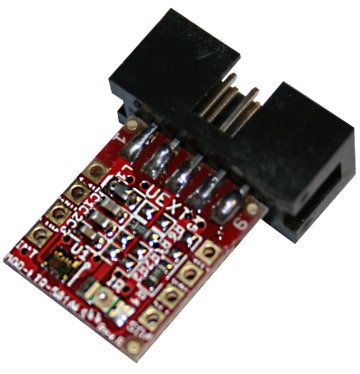
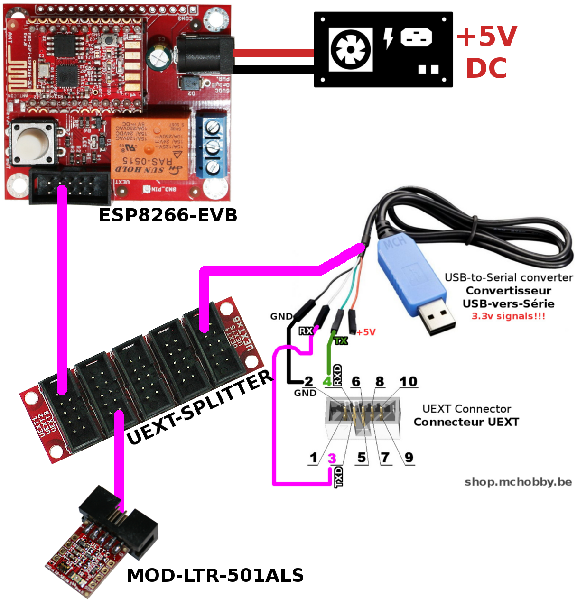

[This file also exists in ENGLISH](readme_ENG.md)

# Utiliser un détecteur de luminosité Ambiante LTR-501ALS d'Olimex sous MicroPython

Le module utilise un MOD-LTR-501ALS pour effectuer une lecture de luminosité de 0.01 à 64.000 Lux (64K lux) et détection de proximité (jusqu'à 10cm). L'avantage du module MOD-LTR-501ALS est qu'il expose un port UEXT facilitant les raccordements.



Cette carte expose
* Utilise le __bus I2C__
* Propose une lecture de de la luminosité ambiante, détecteur de proximité (jusqu'à 10cm)
* Un connecteur UEXT pour faciliter le raccordement

# ESP8266-EVB sous MicroPython
Avant de se lancer dans l'utilisation du module MOD-LTR-501ALS sous MicroPython, il faudra flasher votre ESP8266 en MicroPython.

Nous vous recommandons la lecture du tutoriel [ESP8266-EVB](https://wiki.mchobby.be/index.php?title=ESP8266-DEV) sur le wiki de MCHobby.

Ce dernier explique [comment flasher votre carte ESP8266 avec un câble console](https://wiki.mchobby.be/index.php?title=ESP8266-DEV).

## Port UEXT

Sur la carte ESP8266-EVB, le port UEXT transport le port série, bus SPI et bus I2C. La correspondance avec les GPIO de l'ESP8266 sont les suivantes.


# Bibliothèque

Cette bibliothèque doit être copiée sur la carte MicroPython avant d'utiliser les exemples.

Sur une plateforme connectée:

```
>>> import mip
>>> mip.install("github:mchobby/esp8266-upy/modltr501")
```

Ou via l'utilitaire mpremote :

```
mpremote mip install github:mchobby/esp8266-upy/modltr501
```

## Détail de la bibliothèque

__Note__: la bibliothèque est basée sur le magnifique bibliothèque réalisée par Olimex pour Arduino.

La bibliothèque `ltr501.py` offre les fonctionnalités suivantes:

__Membres:__
* `data_ready` : permet de savoir si le capteur a une donnée prête à la lecture. Retourne une liste avec le type de donnée disponible. Soit DR_LUX pour une donnée de luminosité, soit DR_PROXIMITY pour information de proximité.
* `lux` : permet de lire la valeur de luminosité, en Lux. Retourne un tuple avec (ALS_0, ALS_1) correspondant respectivement aux convertisseurs ADC (supposé être lumière visible et lumière infrarouge).  
* `proximity` : Permet de lire la valeur du senseur de proximité. Retourne un tuple (valeur brute, distance_cm)

__Methodes:__
* `who_am_i()` : Identification du LTR-501ALS. Doit retourner 0x80
* `init(...)`  : initialize the capteur avec le paramètrage par défaut.


__Methode init(...)__:

`def init( lux_range )`:

Appelé depuis le contructeur, permet de pré-configurer le capteur avec une valeur par défaut. Active les capteurs Lux et Proximité.
* Capteur de luminosité (ALS) en mode Actif, Gamme de 64k lux, Temps d'intégration 100ms, taux de répétition 500ms
* Capteur de proximié (PS) en mode Actif, GAIN x1, débit de mesure: 100ms
* LED Infrarouge: 60Hz, 50% cycle utile, 50mA, 127 pulsation (utilisé pour la détection de proximité)

Parametres:
* __lux_range__ : `LUX_RANGE_64K`  dynamique de 2 Lux à 64000 Lux, `LUX_RANGE_320` gain dynamique de 0.01 Lux à 320 Lux.


# Brancher

## MOD-LTR-501ALS sur ESP8266-EVB

Pour commencer, j'utilise un [UEXT Splitter](http://shop.mchobby.be/product.php?id_product=1412) pour dupliquer le port UEXT. J'ai en effet besoin de raccorder à la fois le câble console pour communiquer avec l'ESP8266 en REPL __et__ raccorder le module MOD-LTR-501ALS



# Tester

## Exemple avec MOD-LTR-501ALS
L'exemple ci-dessous fait une lecture de données brutes et  et l'affiche dans la session REPL.

```from machine import I2C, Pin
from time import sleep
from ltr501 import *

i2c = I2C( sda=Pin(2), scl=Pin(4) )
ltr = LTR_501ALS( i2c ) # gamme de 2 Lux à 64000 Lux

# Utiliser le contructeur suivant pour la gamme de 0.01 à 320 Lux range
#
# ltr = LTR_501ALS( i2c, lux_range = LUX_RANGE_320 )

while True:
    # Y a t'il des données disponibles?
    dr = ltr.data_ready

    # Luminosité disponible?
    if DR_LUX in dr:
        # Lecture des convertisseurs analogiques ALS_0 et ALS_1.
        l = ltr.lux  

        # ALS_0 semble être en lumière visible
        # ALS_1 devrait être l'infrarouge.
        print( "Lux ALS_0, ALS_1 = ", l )

    # Proximité disponible ?
    if DR_PROXIMITY in dr:
        # Lecture de valeur_senseur et distance en cm
        p = ltr.proximity

        print( "Proximity value, cm =" , p )

    # Separateur et attendre
    print( '-'*40 )
    sleep( 1 )


print( "That's the end folks")
```

ce qui produit le résultat suivant:

```
Lux ALS_0, ALS_1 =  (9, 26)
Proximity value, cm = (1382, 3.24866)
----------------------------------------
Lux ALS_0, ALS_1 =  (11, 26)
Proximity value, cm = (1453, 2.90181)
----------------------------------------
Lux ALS_0, ALS_1 =  (12, 25)
Proximity value, cm = (953, 5.34441)
----------------------------------------
Lux ALS_0, ALS_1 =  (13, 25)
Proximity value, cm = (827, 5.95994)
----------------------------------------
Lux ALS_0, ALS_1 =  (13, 25)
Proximity value, cm = (760, 6.28725)
----------------------------------------
Lux ALS_0, ALS_1 =  (14, 25)
Proximity value, cm = (737, 6.39961)
----------------------------------------
Lux ALS_0, ALS_1 =  (14, 26)
Proximity value, cm = (716, 6.5022)
----------------------------------------
Lux ALS_0, ALS_1 =  (14, 27)
Proximity value, cm = (702, 6.57059)
----------------------------------------
```

# Où acheter
* Shop: [UEXT Module MOD-LTR-501ALS](http://shop.mchobby.be/product.php?id_product=1415) module à base de LTR-501ALS
* Shop: [Module WiFi ESP8266 - carte d'évaluation (ESP8266-EVB)](http://shop.mchobby.be/product.php?id_product=668)
* Shop: [UEXT Splitter](http://shop.mchobby.be/product.php?id_product=1412)
* Shop: [Câble console](http://shop.mchobby.be/product.php?id_product=144)
* Wiki: https://wiki.mchobby.be/index.php?title=MICROPYTHON-MOD-LTR501ALS
