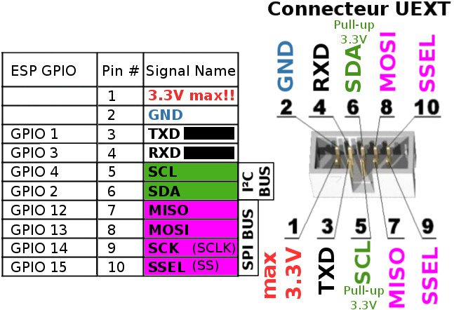
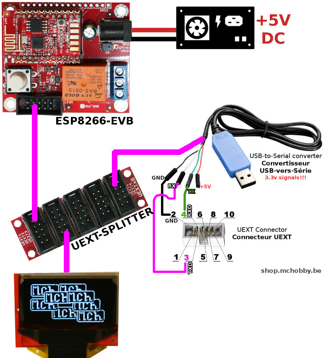

[This file also exists in ENGLISH](readme_ENG.md)

# Utiliser un MOD-OLED-128x64 d'Olimex avec ESP8266 sous MicroPython

MOD-OLED-128x64 est un afficheur OLED 128x64 pixels equipé d'un port UEXT.


Cette carte expose
* Utilise le Bus I2C
* Fonctionne en 3.3v
* Propose une surface d'affichage de 128x64 pixels
* Un connecteur UEXT pour faciliter le raccordement

La bibliothèque MicroPython `ssd1603.py` permet de manipuler les écrans OLED 128x64

# A propos ESP8266-EVB sous MicroPython
Avant de se lancer dans l'utilisation du module MOD-OLED sous MicroPython, il faudra flasher votre ESP8266 en MicroPython.

Nous vous recommandons la lecture du tutoriel [ESP8266-EVB](https://wiki.mchobby.be/index.php?title=ESP8266-DEV) sur le wiki de MCHobby.

Ce dernier explique [comment flasher votre carte ESP8266 avec un câble console](https://wiki.mchobby.be/index.php?title=ESP8266-DEV).

## Port UEXT

Sur la carte ESP8266-EVB, le port UEXT transport le port série, bus SPI et bus I2C. La correspondance avec les GPIO de l'ESP8266 sont les suivantes.



# Bibliothèque

La bibliothèque à utiliser se trouve sur [esp8266-upy/oled-ssd1306](https://github.com/mchobby/esp8266-upy/tree/master/oled-ssd1306) suivez les instructions d'installation qui s'y trouve.

# Brancher
##  MOD-OLED-128x64 sur ESP8266-EVB

Pour commencer, j'utilise un [UEXT Splitter](http://shop.mchobby.be/product.php?id_product=1412) pour dupliquer le port UEXT. J'ai en effet besoin de raccorder à la fois le câble console pour communiquer avec l'ESP8266 en REPL __et__ raccorder le module MOD-OLED-128x64



# Tester

## Créer l'instance du module

Dans tous les cas de figure, l'écran OLED sera créé sous la référence __lcd__ .

```
# Utilisation de la bibliothèque ssd1306 avec ESP8266-EVB
# sous MicroPython
#
# Shop: https://shop.mchobby.be/uext/1411-uext-module-oled-display-128-x-64-3232100014114-olimex.html
# Wiki: https://wiki.mchobby.be/index.php?title=MICROPYTHON-MOD-OLED

from machine import Pin, I2C
i2c = I2C( sda=Pin(2), scl=Pin(4) )
import ssd1306
lcd = ssd1306.SSD1306_I2C( 128, 64, i2c )
```

# Tester la bibliothèque
Dans les exemples ci-dessous, voici les paramètres que vous retrouverez dans les différents appels de fonction:


* __x__ : position du point par rapport au côté gauche de l'écran.
* __y__ : position du point par rapport au dessus de l'écran.
* __w__ : largeur (du mot Width).
* __h__ : hauteur (du mot Height).
* __c__ : __couleur (1=point allumé, 0=point éteint)__

```
# -- Rempli l'écran en blanc --
lcd.fill(1)
lcd.show()  # Afficher!

# Remplis un rectangle en noir
# fill_rect( x, y, w, h, c )
lcd.fill_rect( 10,10, 20, 4, 0 )
lcd.show()  # Afficher!
```

## Autres exemples
* [Voir les exemples dans oled-ssd1306](https://github.com/mchobby/esp8266-upy/tree/master/oled-ssd1306)
* [UEXT Module MOD-OLED-128x64](https://wiki.mchobby.be/index.php?title=MICROPYTHON-MOD-OLED)

# Où acheter
* Shop: [UEXT Module MOD-OLED-128x64](http://shop.mchobby.be/product.php?id_product=1411)
* Shop: [Module WiFi ESP8266 - carte d'évaluation (ESP8266-EVB)](http://shop.mchobby.be/product.php?id_product=668)
* Shop: [UEXT Splitter](http://shop.mchobby.be/product.php?id_product=1412)
* Shop: [Câble console](http://shop.mchobby.be/product.php?id_product=144)
* Wiki: https://wiki.mchobby.be/index.php?title=FEATHER-MICROPYTHON-OLED
