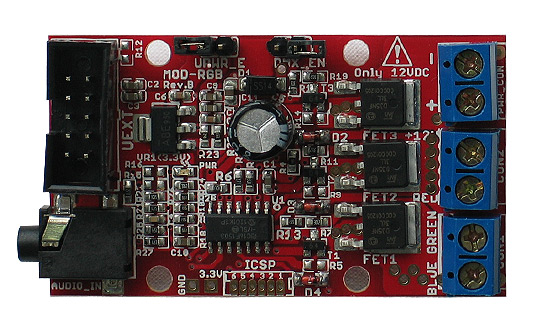

[Ce fichier existe également en FRANCAIS ici](readme.md)

# Use an Olimex MOD-RGB with ESP8266 under MicroPython

MOD-RGB is an I2C interface board from Olimex exposing a UEXT connector.



The board offers:
* A customised Firmware for I2C bus or DMX
* 3 power channel with over-courant protection
* 5 Amp max current per channel
* LEDs control from PWM signal @ 1KHz
* Stereo input (jack)
* Mode selection jumper: DMX/I2C
* Board Logic power jumper: UEXT/external
* UEXT Connector

# About ESP8266-EVB under MicroPython
Before to use this module, it will be necessary to flash the MicroPython firmware onto the ESP8266.

You can read the steps on our [ESP8266-EVB](https://wiki.mchobby.be/index.php?title=ESP8266-DEV) tutorial (on MCHobby's WIKI, French).


## UEXT connector

On the ESP8266-EVB, the UEXT connector does ship UART, SPI, I2C buses as well as 3.3V power. The UEXT pins to ESP8266 GPIO are described in the following picture.


# Library

The library must be copied on the MicroPython board before using the examples.

On a WiFi capable plateform:

```
>>> import mip
>>> mip.install("github:mchobby/esp8266-upy/modrgb")
```

Or via the mpremote utility :

```
mpremote mip install github:mchobby/esp8266-upy/modrgb
```

## Library details
The `modrgb.py` library expose the following interface:

__Membres:__
None.

__Methodes:__
* `mod_rgb.pwm( enable )`   : True/False activates the PWM output over the LEDs. The target color is visible on the strip LED when enabled.
* `mod_rgb.audio( enable )` : True/False activate audio mode over the strip LED.
* `mod_rgb.set_rgb( color )`: Set the RGB color from a (red,green,blue) tuple each having a value between 0 to 255.
* `mod_rgb.black()`         : Shutoff the LEDs (black color).
* `mod_rgb.board_id()`      : returns the board identification.
* `mod_rgb.change_address( 0x22 )` : Change the I2C address to 0x22 (instead of the default value 0x20). The "prog" jumper must be closed when issuing this command!

## Knowns issue

* I2C stability have been detected in case of Stress Test situation. [see this ticket on the Olimex Forum](https://www.olimex.com/forum/index.php?topic=6721.0)

# Wiring

## ESP8266-EVB from Olimex

As first operation, I did plug a [UEXT Splitter](http://shop.mchobby.be/product.php?id_product=1412) to duplicates the UEXT port. We do need to use the serial lines for the REPL session with the computer __and__ we do need to plug the Game Controler.


# Testing

## MOD-RGB example
```
# Using theu MOD-RGB from Olimex with MicroPython
#
# Shop: [UEXT RGB board (MOD-RGB)](http://shop.mchobby.be/product.php?id_product=1410)
# Wiki: https://wiki.mchobby.be/index.php?title=MICROPYTHON-MOD-RGB

from machine import I2C, Pin
from time import sleep_ms
from modrgb import MODRGB

i2c = I2C( sda=Pin(2), scl=Pin(4) )
rgb = MODRGB( i2c ) # default address=0x20

# A color is code within a (r,g,b) tuple
# Set color to rose
rgb.set_rgb( (255, 102, 204) )
sleep_ms( 5000 )

# Simple color suite
red=(255,0,0)
green=(0,255,0)
blue=(0,0,255)
color_suite = [red,green,blue,(255,255,255)]
for c in color_suite:
    rgb.set_rgb( c )
    sleep_ms( 2000 )

rgb.black()
print( "That's the end folks")
```

## Stress Test example
Content of the example available in the `stress.py` script.

```
# Stress Test on Olimex's MOD-RGB with MicroPython
#
# Shop: http://shop.mchobby.be/product.php?id_product=1410
# Wiki: ---

from machine import I2C, Pin
from time import sleep_ms
from modrgb import MODRGB
from rgbfx import randrange

i2c = I2C( sda=Pin(2), scl=Pin(4) )
rgb = MODRGB( i2c ) # default address=0x20
rgb.pwm( True )

iter = 0
print( 'MOD-RGB start I2C stress test' )
while True:
    color = (randrange( 255 ), randrange( 255 ), randrange( 255 ) )
    iter += 1
    print( 'Iteration %s with color %s' % (iter, color))
    rgb.set_rgb( color )

print( "That's the end folks")
```

## RGB Effect example
Here the content of the `testfx.py` script.

It requires the additional `rgbfx.py` library (installed together with `modrgb.py`).

```
# RGB with Olimex's MOD-RGB under MicroPython
#
# Shop: http://shop.mchobby.be/product.php?id_product=1410
# Wiki: https://wiki.mchobby.be/index.php?title=MICROPYTHON-MOD-RGB

from machine import I2C, Pin
from time import sleep_ms
from modrgb import MODRGB
import rgbfx

i2c = I2C( sda=Pin(2), scl=Pin(4) )
rgb = MODRGB( i2c ) # default address=0x20
rgb.pwm( True )

# A color is code within a (r,g,b) tuple
# Set color to rose
rose = (255, 102, 204)
rgb.set_rgb( rose )
sleep_ms( 1000 )

# Candle effect
#    Know issue: cyclical calls will stuck the MOD-RGB I2C bus.
rgb.pwm( True )
rgbfx.candle( rgb )
rgb.pwm( False )
sleep_ms( 1000 )

# Fade-in / Fade-out
#    Know issue: cyclical calls will stuck the MOD-RGB I2C bus.
#
rgb.pwm( True )
rgbfx.fade_inout( rgb, rose )
rgb.pwm( False )
sleep_ms( 1000 )

# Cycling the color wheel
#    Know issue: cyclical calls will stuck the MOD-RGB I2C bus.
rgb.pwm( True )
rgbfx.cycle_wheel( rgb )
rgb.pwm( False )
sleep_ms( 1000 )


# Disable
rgb.pwm( False )
print( "That's the end folks")
```

# Change the MOD-RGB I2C address

The following example will change the MOD-RGB I2C address from 0x20 (default) to 0x22.

NOTICE: The "prog" jumper must be set while running `change_address()` .

```
# Change the Olimex's MOD-RGB to 0x22
#
# Shop: http://shop.mchobby.be/product.php?id_product=1410

from machine import I2C, Pin
from modrgb import MODRGB

i2c = I2C( sda=Pin(2), scl=Pin(4) )
brd = MODRGB( i2c, addr=0x20 )
brd.change_address( 0x22 )
```

As the address change is instantaneous, the I2C ACK is sent to the newer (0x22) whereas the command did comes from 0x20 (default address).
This will result in I2C error because the microcontroler will never receives the ACK from address 0x20 (as expected). MicroPython will then raise the error messahe `OSError: [Errno 110] ETIMEDOUT` (inline with underlaying source of the error).

An `i2c.scan()` can be used to check the address change on the bus.

# Shopping list
* Shop: [UEXT RGB Module (MOD-RGB)](http://shop.mchobby.be/product.php?id_product=1410)
* Shop: [ESP8266 WiFi module - ESP8266-EVB Evaluation board](http://shop.mchobby.be/product.php?id_product=668)
* Shop: [UEXT Splitter](http://shop.mchobby.be/product.php?id_product=1412)
* Shop: [Console cable](http://shop.mchobby.be/product.php?id_product=144)
