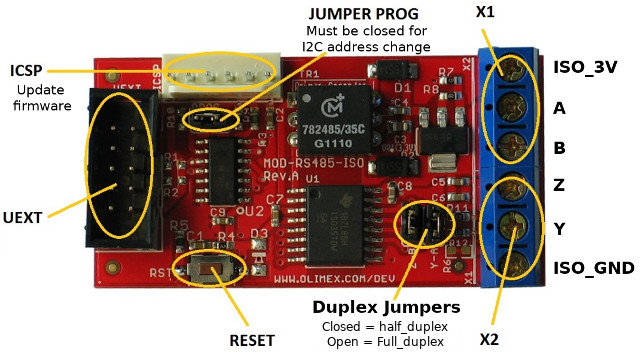

# Utiliser un module MOD-RS485-ISO d'Olimex (RS485) avec MicroPython

=== UNDER CONSTRUCTION ===


Le MOD-RS485-ISO est un convertisseur RS232/I2C vers RS485

Il propose les fonctionnalités suivantes:
* Alimentation: 3.3V
* Modes: Half duplex / Full duplex
* Interface de donnée: UART ou I2C
 * PASS_MODE : Signal sur TX est passé directement vers le périphérique présent sur la ligne RS-485. C'est pareil pour RX.
 * BRIDGE_MODE : TX et RX sont désactivées. Les données peuvent être envoyées vie le bus I2C.
* Interface de configuration: I2C
* 134 à 1 000 000 bauds
* Interface UEXT
* Peut se brancher à l'aide de fils dupont
* Utilise un PIC16F18324 pour assurer les fonctionnement du module

## Half-Duplex / Full-Duplex configuration



Les cavaliers doivent être fermé pour utiliser le mode HALF-DUPLEX (A, B, GND), celui utilisé avec le DMX 3 broches.

Pour utiliser le mode FULL-DUPLEX (A-B, Y-Z, GND), il faut ouvrir les cavaliers Duplex.

## Manuel

Cette carte dispose d'un [manuel utilisateur publié sur la page produit d'Olimex](https://www.olimex.com/Products/Modules/Interface/MOD-RS485-ISO/resources/MOD-RS485-ISO-UM.pdf).

Plus d'informations sur [la page du fabriquant](https://www.olimex.com/Products/Modules/Interface/MOD-RS485-ISO/open-source-hardware).

# Brancher

## MOD-RS485-ISO vers Pyboard


# Tester

Après avoir copié la bibliothèque [rs485iso.py](lib/rs485iso.py) sur votre carte, vous pouvez exécuter les scripts de tests.

## Tester le module

Il est assez facile de tester le bon fonctionnement du module MOD-RS485-ISO avec un oscilloscope 2 voies.


Où l'on peut y voir la trace du Signal A (en bleu) et du Signal B (en rouge). La différence A-B (en vert) est malheureusement cachée derrière les courbes A & B.

Configuration:
1. Placer le module en mode HALF-DUPLEX (les cavalier duplex en place)
2. brancher le canal 1 de l'oscilloscope sur la sortie A
3. brancher le canal 2 de l'oscilloscope sur la sortie B
4. brancher la masse de l'oscilloscope sur la sortie ISO_GND

Les canaux 1 et 2 doivent être réglés sur 1V/div et la base de temps sur 200µS.

Si votre oscilloscope dispose de fonctions mathématiques, réalisez une soustraction des canaux 1 et 2 (puisque RS485 est un bus différentiel).

Enfin, exécutez le script [test_sender.py](examples/test_sender.py) qui envoi des données sur le bus. Il est alors possible de voir passer (et capturer la transmission des données).

Le script [test_sender.py](examples/test_sender.py) affiche les messages envoyés sur le bus.

```
PYB: sync filesystems
PYB: soft reboot
MicroPython v1.10 on 2019-01-25; PYBv1.1 with STM32F405RG
Type "help()" for more information.
>>> import test_sender
Setting TX control...
Setting bridged mode...
Setting baud...
Sending...  1/50: MCHobby is the best
Sending...  2/50: MCHobby is the best
...

...
Sending...  47/50: MCHobby is the best
Sending...  48/50: MCHobby is the best
Sending...  49/50: MCHobby is the best
Sending...  50/50: MCHobby is the best
That s all Folks
```
Message dont on peut inspecter une partie de la trame... que je me suis amusé à décoder.


## xxxxx

# Ou acheter
* [MOD-RS485-ISO](https://shop.mchobby.be/fr/uext/2104-module-communication-rs485-rs422-isolation-galvanique-uext-3232100021044-olimex.html) @ MCHobby
* [MOD-RS485-ISO](https://www.olimex.com/Products/Modules/Interface/MOD-RS485-ISO/open-source-hardware) @ Olimex
* [MicroPython Pyboard](https://shop.mchobby.be/fr/micropython/570-micropython-pyboard-3232100005709.html) @ MCHobby
