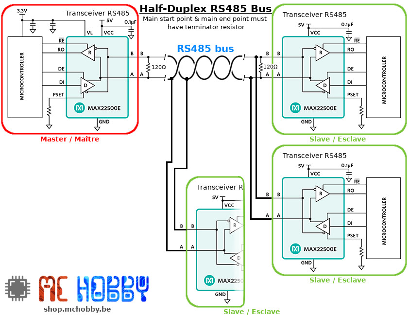
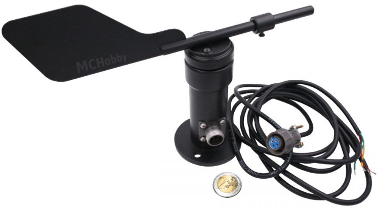

[Ce fichier existe également en FRANCAIS]()

# Using an Olimex MOD-RS485-ISO (RS485) with MicroPython


The MOD-RS485-ISO is an adapter RS232/I2C to RS485

It have the following features:
* Powering: 3.3V
* Modes: Half duplex / Full duplex
* Data interface: UART or I2C
 * PASS_MODE : the TX signal is directly forwarded to the RS485 bus. Is is the same for RX where RS485 bus signal is forwarded to RX serial.
 * BRIDGE_MODE : TX & RX pin are deactivated (do not connect them to MCU). The RS485 bus data are sent and recieved via the I2C bus (to the MCU).
* Configuration interface: I2C
* 134 to 1 000 000 bauds
* Connector: UEXT
* Easy to wire with Dupont wires
* Module features are taken in charge with a PIC16F18324

## About RS485
RS485 is a very popular earth bus which uses two wires twisted together (half-duplex) with differential signal levels to establish communication. The ground linking the various RS485 devices on the bus is not required (but recommended) due to the differential nature of the RS485 signals.

The advantage of RS485 is the possibility of connecting up to 32 nodes (emitter/receiver devices).

## Half-Duplex configuration

The half-duplex RS485 bus is the most common one. It use only a pair of twisted wire. With Half-Duplex bus, the communication can be made one way at the time (sending or receiving data but not the both at the same time).

The main bus must be ended with 120 OHms resistor.



Using an Half-Duplex RS485 bus requires 3 pins (RX,TX, read_write) on the microcontroler to make the communication possible.

We do usually have the following communication scheme:
1. Master starts emitting mode (TX)
2. Master emit the request to the peripheral (a bytes data paquet following the periperal protocol)
3. Master switch to the receiver mode (RX)
4. Master receives the data packet send by the peripheral

Examples of Half-Duplex usage:
* __DMX:__ the 3 Pin DMX protocol is based on the Half-Duplex mode (A, B, GND).
* __Wind direction:__ the [girouete RS485 Wind Direction](https://shop.mchobby.be/product.php?id_product=2241) usage est described here below.
* __MODBUS:__ MODBUS is a protocol layer over the RS485. ModBus is used a lot in industrial environment.

## Full-Duplex configuration

Less often used, the Full-Duplex RS485 bus use two twisted pair of wire. Onto a full-duplex RS485 bus, devices can send and receives the data at the same time (like a true serial link does).


The MOD-RS485-ISO module is designed to support full duplex communication.

## Full-Duplex to Half-Duplex configuration

It can happen to wire a Full-Duplex module to a Half-Duplex device.

Here how to proceed the wiring:


In this configuration, every byte senf to the slave is also echo-ed to the master.

The MOD-RS485-ISO does have "Duplex Jumper" to quickly switch to Half-Duplex mode by closing the jumper.


In Full-Duplex mode, the jumpers must stay open.

# Wiring

## MOD-RS485-ISO to Pyboard


# Test

Prior to any testn the [rs485iso.py](lib/rs485iso.py) library must be copied to the micropython board.

## Test 1: read the module signals on a scope

It is quite easy to check the proper work of a __BRIDGE mode (data over I2C)__ MOD-RS485-ISO module with a 2 channels scope.


You can see the Signal A trace (in blue) and the B trace (in red). The difference A-B (in green) is unfortunately hidden behind the A & B curves.

Configuration:
1. Set the module in HALF-DUPLEX mode (the duplex jumper must be closed)
2. Wire the scope channel 1 to the output A (of the MOD-RS485-ISO)
3. Wire the scope channel 2 to the output B
4. Wire the scope ground on the ISO_GND output

The both scope channels are set with 1V/div and timing base of 200µS.

If you scope features math operation, then do a substraction of channel 1 and channel 2 (as RS485 is a differential bus).

Finally, run the [test_sender.py](examples/test_sender.py) script which send data over the bus. It is possible to seen the data passing by (even to capture a section of data).

The [test_sender.py](examples/test_sender.py) script also displays the messages sent on the RS485 bus.

```
PYB: sync filesystems
PYB: soft reboot
MicroPython v1.10 on 2019-01-25; PYBv1.1 with STM32F405RG
Type "help()" for more information.
>>> import test_sender
Setting TX control...
Setting bridged mode...
Setting baud...
Sending...  1/50: MCHobby is the best
Sending...  2/50: MCHobby is the best
...

...
Sending...  47/50: MCHobby is the best
Sending...  48/50: MCHobby is the best
Sending...  49/50: MCHobby is the best
Sending...  50/50: MCHobby is the best
That s all Folks
```
Message from which we can inspect a part of the content... (that was funny to do).


The cotnent of the frame have been decoded into [this blog article MCHobby](https://arduino103.blogspot.com/2021/10/decoder-une-trame-rs485-loscilloscope.html) (_French_)

### Sending data

The [test_sender.py](examples/test_sender.py) script, parially visible here below, transforms a string of characters into bytes (thanks to the encoding) then emit the data on the RS485 bus.

``` python
from machine import I2C
from rs485iso import RS485ISO, TX_ENABLED, BRIDGE_MODE, UART_B9600
from time import sleep

# Pyboard - I2C(2) - Y10=sda, Y9=scl
i2c = I2C(2)

rs485 = RS485ISO( i2c )

print( "Setting TX control..." )
rs485.control = TX_ENABLED
print( "Setting bridged mode..." ) # sending the RS485 data via I2C bus
rs485.mode = BRIDGE_MODE
print( "Setting baud..." )
rs485.baud_rate = UART_B9600

# Convert a string to bytes()
s = "1/50: MCHobby is the best"
data = s.encode('ASCII')
rs485.send( data )

# Sending 2 bytes
buf2 = bytearray( 2 )
buf2[0] = 65
buf2[1] = 128
rs485.send( buf2 )
```

### Receiving data

The [test_reader.py](examples/test_reader.py) script can be used to collect the data exchange on the RS485 bus (configured for 9600 bauds) and displays its content as Hexadecimal values.

``` python
from machine import I2C
from rs485iso import RS485ISO, RX_ENABLED, BRIDGE_MODE, UART_B9600
from time import sleep

# Pyboard - I2C(2) - Y10=sda, Y9=scl
i2c = I2C(2)

rs485 = RS485ISO( i2c )

print( "Setting RX control..." )
rs485.control = RX_ENABLED
print( "Setting bridged mode..." ) # data transmited to MCU via the I2C bus
rs485.mode = BRIDGE_MODE
print( "Setting baud..." )
rs485.baud_rate = UART_B9600

buf = bytearray( 1 )
while True:
	# read 1 byte and display it
	rs485.read( buf )
	print( hex(buf[0]) )
	sleep( 0.250 )
```

Which produce the following results:

```
MicroPython v1.10 on 2019-01-25; PYBv1.1 with STM32F405RG
Type "help()" for more information.
>>>
>>> import test_reader
Setting RX control...
Setting bridged mode...
Setting baud...
0x0
0x0
0x0
0x0
0x0
```

The 0x00 are returned because the MOD-RS485-ISO have no devices connected to the RS485 side.

The [test_readarr.py](examples/test_readarr.py) example script shows how to read multiple bytes from the RS485 bus.

``` python
from machine import I2C
from rs485iso import RS485ISO, RX_ENABLED, BRIDGE_MODE, UART_B9600
from time import sleep

# Pyboard - I2C(2) - Y10=sda, Y9=scl
i2c = I2C(2)

rs485 = RS485ISO( i2c )

print( "Setting RX control..." )
rs485.control = RX_ENABLED
print( "Setting bridged mode..." ) # data received on MCU via I2C bus
rs485.mode = BRIDGE_MODE
print( "Setting baud..." )
rs485.baud_rate = UART_B9600

buf10 = bytearray( 10 )

# Read a whole buffer (of 10 bytes)
rs485.read( buf10 )
print( buf10 )

# Read 3 bytes and store them into the buffer
# Only the first 3 bytes of the buffer are valid.
rs485.read( buf10, max_read=3 )
print( buf10 )
```

## Test 2: RS485 Wind Direction (Girouette)



The [RS485 wind direction](https://shop.mchobby.be/product.php?id_product=2241) use the MODBUS protocol to receives the "position" request and sent back the position value over the RS485 bus.

The MOD-RS485-ISO module is set to half-duplex and __mode BRIDGE (data over I2C)__ so it can send request and receive response.


In the [test_gir.py](examples/test_gir.py) example, the modbus protocol implementation is avoided with the following tip & tricks:
1. the MODBUS request is hard coded in the scrip (see the example here below).
2. the received MODBUS response is not check (integrity check).
3. The position data est extracted directly from the MODBUS response frame


To know the wind direction, the __master__ send a request to read 1 byte from the 0x0000 register on the slave (at address 0x02) :

| Slave Addr | Function Code | Reg. Addr | Reg. Length | CRC High | CRC Low |
|------------|---------------|-----------|-------------|----------|---------|
| 1 byte     | 1 byte        | 2 bytes   | 2 bytes     | 1 byte   | 1 byte  |
| 0×02       | 0x03          | 0x00 0x00 | 0x00 0x01   | 0x84     | 0x39    |

The function 0x03 means 'read holding registers'

Which produce the following MODBUS request: 0x02 0x03 0x00 0x00 0x00 0x01 0x84 0x39 (so 8 bytes)

The device will respond with the following structure:

| Slave Addr | Function Code | #Bytes | Data      | CRC High | CRC Low |
|------------|---------------|--------|-----------|----------|---------|
| 1 byte     | 1 byte        | 1 byte | 2 bytes   | 1 byte   | 1 byte  |
| 0×02       | 0x03          | 0x02   | 0x00 0x03 | 0xBC     | 0x45    |

The return wind direction data is encoded on 2 bytes (16 bits) in the 'Data' area. Si the information of interest is 0x00 0x03 => so 3 in decimal, which is the value for Est-Nord-Est/east-north-east.


The script do show the following results into the REPL sessions:

```
MicroPython v1.17-93-g7e62c9707 on 2021-10-23; PYBv1.1 with STM32F405RG
Type "help()" for more information.
>>>
>>> import test_gir
Setting RX/TX control...
Setting bridged mode...
Setting baud...
 Southeast by east
 Southeast by east
 Southeast by east
Direction: Southeast by east
Direction: Southeast by east
Direction: Southeast by south
Direction: Southeast by south
 South
Direction: South
Direction: Southwest by south
Direction: Southwest by south
Direction: Southwest by west
Direction: Northeast
Direction: Northeast
Direction: Northeast
 Northeast by North
 Northeast by North
Direction: Northeast by North
Direction: Northeast by North
Direction: Northeast by North
Direction: North
 East
Direction: Southeast by east
Direction: Southeast by east
...
```

# Ressources

* [MOS-RS485-ISO user manual](https://www.olimex.com/Products/Modules/Interface/MOD-RS485-ISO/resources/MOD-RS485-ISO-UM.pdf) (_Olimex Ltd, English_).
* [Decoding RS485 on a scope](https://arduino103.blogspot.com/2021/10/decoder-une-trame-rs485-loscilloscope.html) (_MC Hobby, French_)
* More information on MOD-RS485-IDO [on the manufaturer product page](https://www.olimex.com/Products/Modules/Interface/MOD-RS485-ISO/open-source-hardware).

# Shopping list
* [MOD-RS485-ISO](https://shop.mchobby.be/fr/uext/2104-module-communication-rs485-rs422-isolation-galvanique-uext-3232100021044-olimex.html) @ MCHobby
* [MOD-RS485-ISO](https://www.olimex.com/Products/Modules/Interface/MOD-RS485-ISO/open-source-hardware) @ Olimex
* [MicroPython Pyboard](https://shop.mchobby.be/fr/micropython/570-micropython-pyboard-3232100005709.html) @ MCHobby
