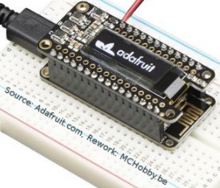
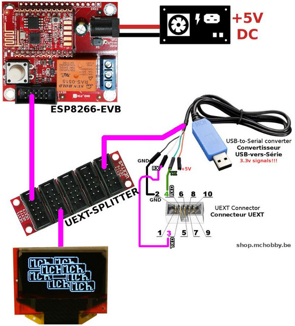
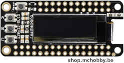
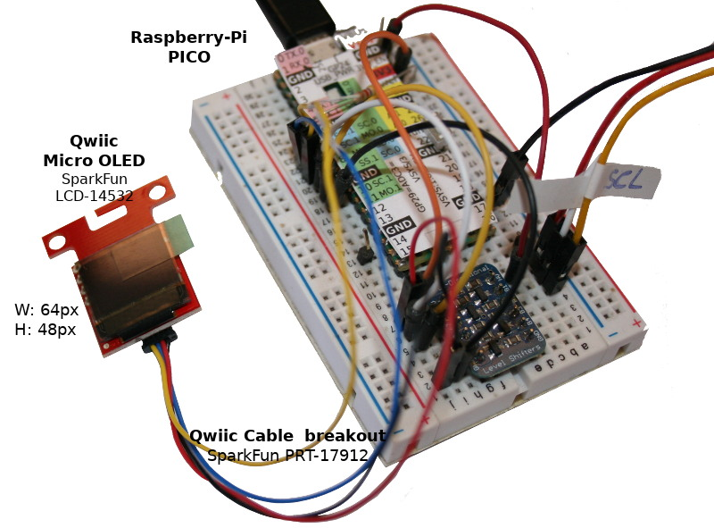
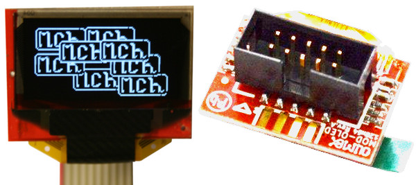
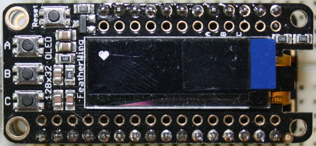

[This file also exists in ENGLISH](readme_ENG.md)

# Utilisation d'écran OLED ssd1306 avec MicroPython

MicroPython permet d'utiliser très facilement un écran OLED I2C basé sur le contrôleur ssd1306.

__Remarques:__
* Ce dépôt couvre plusieurs modèles de cartes sous MicroPython et plusieurs afficheurs OLEDs a base de SSD1306.
* Plus d'information sur les [écrans OLEDs sur la page Wiki de MC Hobby](https://wiki.mchobby.be/index.php?title=MicroPython-Accueil#ESP8266_en_MicroPython)

# Bibliothèque

La bibliothèque `sd1306.py` (MicroPyhton GitHub) est un pilote SSD1306 I2C et SPI  pour écran OLED ssd1306.

Cette bibliothèque doit être copiée sur la carte MicroPython avant d'utiliser les exemples.

Sur une plateforme connectée:
```
>>> import mip
>>> mip.install("github:mchobby/esp8266-upy/oled-ssd1306")
```

Ou via l'utilitaire `mpremote` :
```
mpremote mip install github:mchobby/esp8266-upy/oled-ssd1306
```

# Brancher

## OLED sur PyBoard

Note: pas encore fait!

## OLED Featherwing sur ESP8266
Le FeatherWing OLED (Adafruit 2900) s'insère simplement sur la carte Feather (ex: Feather ESP8266) et propose une résolution de 128 x 32 pixels.

Le pilote MicroPython.org pour ssd1306 fonctionne "out-of-the-box" avec les écrans OLED.



Le bus I2C (SDA, SCL) utilise respectivement les broches 4 et 5 (avec des pull-up de 2.2K).

La carte propose par ailleurs 3 boutons __A, B, C__ branchés respectivement sur les broches __0, 16, 2__ du Feather.

## Qwiic OLED sur MicroMod RP2040

L'afficheur [Qwiic Micro Oled](https://www.sparkfun.com/products/14532) de SparkFun (LCD-14532) dispose d'un connecteur Qwiic (bus I2C+alim 3.3V) facilitant le raccordement sur les plateformes exposant un connecteur Qwiic.

Cet afficheur propose une résolution de 64px * 48px avec une adresse I2C par défaut de 0x3D (modifiable à 0x3C).

L'exemple ci-dessous présente la mise en oeuvre sur un [MicroMod-RP2040](https://www.sparkfun.com/products/17720) (SparkFun, DEV-17720) + [Learning Machine Carrier Board](DEV-16400) (SparkFun, DEV-16400) .


Le bus I2C de utilisé par le MicroMod-RP2040 est placé sur les broches GP4 (sda) et GP5 (scl).

## Qwiic OLED sur Raspberry-Pi Pico

L'afficheur [Qwiic Micro Oled](https://www.sparkfun.com/products/14532) de SparkFun (LCD-14532) dispose d'un connecteur Qwiic (bus I2C+alim 3.3V) facilitant le raccordement sur les plateformes exposant un connecteur Qwiic.

Cet afficheur propose une résolution de 64px * 48px avec une adresse I2C par défaut de 0x3D (modifiable à 0x3C).

Dans le cas présent il est branché sur un [Raspberry-Pi Pico](https://shop.mchobby.be/fr/pico-rp2040/2036-pico-header-rp2040-microcontroleur-2-coeurs-raspberry-pi-3232100020368.html) de test Grove + Qwiic. Truc & astuce: Le Pico porte un [overlay facilitant l'identification des broches](https://github.com/mchobby/pyboard-driver/tree/master/Pico).

L'interface Qwiic est réalisée grâce à un [breakout connecteur Qwiic](https://www.sparkfun.com/products/14425) (SparkFun, PRT-17912).


## UEXT OLED et Olimex ESP8266-EVB

[Olimex Ltd](https://www.olimex.com/) produit des cartes d'évaluations basé sur ESP8266, ESP32 et bien d'autres microcontrôleurs aussi qu'un [périphérique UEXT OLED](https://www.olimex.com/Products/Modules/LCD/MOD-OLED-128x64/open-source-hardware) de 128x64 pixels.

L'intérêt des produits Olimex réside dans sa [connectique UEXT](https://en.wikipedia.org/wiki/UEXT) transportant une alimentation, un bus I2C, un bus SPI et un UART.

Le montage ci-dessous utilise un [ESP8266-EVB](https://www.olimex.com/Products/IoT/ESP8266/ESP8266-EVB/open-source-hardware) d'Olimex et [UEXT-OLED](https://www.olimex.com/Products/Modules/LCD/MOD-OLED-128x64/open-source-hardware).



Voir aussi [le tutoriel MicroPython Mod OLED](https://wiki.mchobby.be/index.php?title=MICROPYTHON-MOD-OLED) sur le Wiki de MCHobby.

# Créer l'instance OLED
Dans tous les cas de figure, l'écran OLED sera créé sous la référence `lcd` .

Choisissez la version de code correspond à votre configuration matérielle.

## OLED sur PyBoard
Il est important de savoir que le pilote ssd1306 écrit par MicroPython.org est prévu pour recevoir un machine.I2C .

``` python
from machine import I2C
import ssd1306
i2c = I2C(2)
lcd = ssd1306.SSD1306_I2C( 128, 64, i2c )
```
Le restant du code de test est identique.

__Note:__ Si vous rencontrez des problèmes de stabilité sur les versions antérieures de MicroPython, vous pouvez consulter le fil de discussion suivant.

Voir ce Topic: https://forum.micropython.org/viewtopic.php?f=6&t=4663

``` python
# Equivalent de I2C(2)
pscl = Pin('Y9', Pin.OUT_PP)
psda = Pin('Y10', Pin.OUT_PP)
i2c = I2C(scl=pscl, sda=psda)
lcd = ssd1306.SSD1306_I2C( 128, 64, i2c )
```
Le restant du code de test est identique.

## pour FeatherWing OLED

Adafruit propose un écran OLED 128*32 pixels placé sur une carte au facteur de forme Feather.



``` python
# Utilisation de la bibliothèque ssd1306 avec Feather ESP8266 sous MicroPython
from machine import Pin, I2C
import ssd1306
i2c = I2C( sda=Pin(4), scl=Pin(5) )
lcd = ssd1306.SSD1306_I2C( 128, 32, i2c )
```
* [Oled FeatherWing](https://shop.mchobby.be/feather/879-feather-ecran-oled-3232100008793-adafruit.html)
* [Wiki sur Oled FeatherWing](https://wiki.mchobby.be/index.php?title=FEATHER-MICROPYTHON-OLED)

## pour Qwiic Micro OLED + MicroMod RP2040

Sparkfun propose un [mini écran OLED de 64x48 pixels](https://www.sparkfun.com/products/14532) avec un connecteur Qwiic.


``` python
# Utilisation de la bibliothèque ssd1306 avec Micro Oled + MicroMod-RP2040 + Learning Machine Carrier Board de SparkFun
from machine import Pin, I2C
import ssd1306
i2c = I2C( 0, sda=Pin(4), scl=Pin(5) )
lcd = ssd1306.SSD1306_I2C( 64, 48, i2c, addr=0x3D )
```

## pour Qwiic Micro OLED + Raspberry-Pi Pico

Sparkfun propose un [mini écran OLED de 64x48 pixels](https://www.sparkfun.com/products/14532) avec un connecteur Qwiic.



Dans cet exemple, il est branché sur un [Raspberry-Pi Pico](https://shop.mchobby.be/fr/pico-rp2040/2036-pico-header-rp2040-microcontroleur-2-coeurs-raspberry-pi-3232100020368.html) grâce à un [connecteur breakout Qwiic](https://www.sparkfun.com/products/14425) (SparkFun, PRT-17912)


``` python
# Raspberry-Pi Pico + Qwiic Micro Oled ( SparkFun, LCD-14532)
i2c = I2C( 1 ) # sda=GP6, scl=GP7
lcd = ssd1306.SSD1306_I2C( 64, 48, i2c, addr=0x3D )
```

## pour UEXT OLED + Olimex ESP8266-EVB

Olimex Propose un écran [OLED UEXT](https://www.olimex.com/Products/Modules/LCD/MOD-OLED-128x64/open-source-hardware) avec [connecteur UEXT](https://en.wikipedia.org/wiki/UEXT) .



``` python
from machine import Pin, I2C
import ssd1306
i2c = I2C( sda=Pin(2), scl=Pin(4) )
lcd = ssd1306.SSD1306_I2C( 128, 64, i2c )
```

# Tester

## Dessiner
Dans les exemples ci-dessous, voici les paramètres que vous retrouverez dans les différents appels de fonction:


* __x__ : position du point par rapport au côté gauche de l'écran.
* __y__ : position du point par rapport au dessus de l'écran.
* __w__ : largeur (du mot Width).
* __h__ : hauteur (du mot Height).
* __c__ : __couleur (1=point allumé, 0=point éteint)__

Le code ci-dessous est repris dans le script d'exemple [test.py](examples/test.py) .

``` python
# -- Rempli l'écran en blanc --
lcd.fill(1)
lcd.show()  # Afficher!

# Remplis un rectangle en noir
# fill_rect( x, y, w, h, c )
lcd.fill_rect( 10,10, 20, 4, 0 )
lcd.show()  # Afficher!

# -- Dessine un pixel en noir --
lcd.fill(0) # Rempli l'écran en noir
# pixel( x, y, c )
lcd.pixel( 3, 4, 1 )
lcd.show()  # Afficher!

# -- Dessine un rectangle en blanc --
lcd.fill(0) # Rempli l'écran en noir
# rect( x, y, w, h, c )
lcd.rect( 3, 3, 128-2*3, 32-2*3, 1 )
lcd.show()  # Afficher!

# -- Ligne Horizontale et Verticale --
lcd.fill(0) # Rempli l'écran en noir
# Dessine des lignes en blanc.
# Ligne horizontale hline( x,y, w, c )
#   donc fournir la largeur.
# Ligne verticale vline( x,y, h, c )
#   donc fournir la hauteur.
lcd.hline( 0, 18, 128, 1 )
lcd.vline( 64, 0, 32, 1 )
lcd.show()  # Afficher!

# -- Lignes diverses --
lcd.fill(0) # Rempli l'écran en noir
# Dessine des lignes en blanc.
# line(x1,y1,x2,y2,c)
lcd.line(0,0,128,32,1)
lcd.line(0,32,128,0,1)
lcd.show()  # Afficher!

# -- Afficher texte --
lcd.fill(0) # Rempli l'écran en noir
# Dessine du texte en blanc.
#   text( str, x,y, c )
lcd.text("Bonjour!", 0,0, 1 )
lcd.show()  # Afficher!

# -- Défilement --
# Mise en place en dessinant une croix noir sur fond blanc.
lcd.fill(1) # Rempli l'écran en blanc
lcd.line(0,0,128,32,0) # noir
lcd.line(0,32,128,0,0) # noir
lcd.show()  # Afficher!
# Scroll Horizontal de 15 pixels vers la gauche.
lcd.scroll( -15, 0 )
lcd.show()
# Puis Scroll Vertical de 8 pixels vers le bas.
lcd.scroll( 0, 8 )
lcd.show()

```

## Afficher des Icons

Il est assez facile de créer et afficher une icône.

L'icône est définie avec un 1 pour un point allumé et un 0 pour un point éteint:
```
HEART_ICON = [
  [0,0,0,0,0,0,0,0,0,0,0],
  [0,0,1,1,1,0,1,1,1,0,0],
  [0,1,1,0,1,1,1,1,1,1,0],
  [0,1,0,1,1,1,1,1,1,1,0],
  [0,1,1,1,1,1,1,1,1,1,0],
  [0,0,1,1,1,1,1,1,1,0,0],
  [0,0,0,1,1,1,1,1,0,0,0],
  [0,0,0,0,1,1,1,0,0,0,0],
  [0,0,0,0,0,1,0,0,0,0,0],
  [0,0,0,0,0,0,0,0,0,0,0] ]
```
La fonction `draw_icon()` permet de dupliquer le contenu d'un "pseudo tableau" (l'icône) sur l'écran aux coordonnées x,y.

```
def draw_icon( lcd, from_x, from_y, icon ):
    for y, row in enumerate( icon ):
        for x, color in enumerate( row ):
            if color==None:
                continue
            lcd.pixel( from_x+x,
                       from_y+y,
                       color )
```



Voir aussi le script d'exemple [icon.py](examples/icon.py) montrant comment utiliser des icons deux couleurs (noir/blanc) ainsi qu'un exemple 2 couleurs + Canal Alpha.


## Contrôle avancé
Bien que la classe SSD1306_I2C hérite de framebuf qui propose de nombreuses méthodes, la classe SSD1306 de base offre des services complémentaires:
* `lcd.poweron()` et `lcd.poweroff()` pour allumer et eteindre l'afficheur.
* `lcd.contrast(value)` pour fixer la valeur du contraste entre 0 et 255.
* `lcd.invert(1)` pour inverser les couleurs de l'arrière plan et le premier plan, `lcd.invert(0)` pour revenir à l'affichage normal Idéal pour réaliser des messages d'alertes.

# Ressources
* [FEATHER MICROPYTHON OLED](https://wiki.mchobby.be/index.php?title=FEATHER-MICROPYTHON-OLED) (Wiki, MCHobby)
* [Comment afficher des images](https://www.twobitarcade.net/article/displaying-images-oled-displays/) (_How to display images_, twobutarcade.net)
* [FreeType generator & MicroPython FontDrawer](https://github.com/mchobby/freetype-generator) (GitHub, MCHobby)

# Où acheter
* Shop: [OLED 128x32 FeatherWing](https://shop.mchobby.be/feather/879-feather-ecran-oled-3232100008793-adafruit.html) @ MC Hobby
* Shop: [Feather ESP8266](https://shop.mchobby.be/feather/846-feather-huzzah-avec-esp8266-3232100008465-adafruit.html) @ MC Hobby<br />utilisé dans cet exemple.
