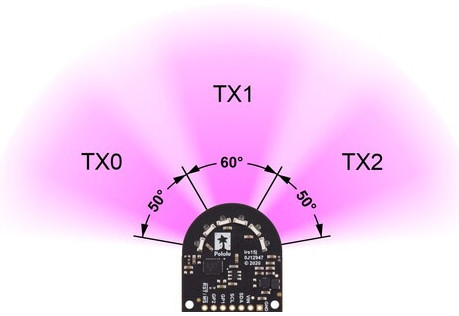
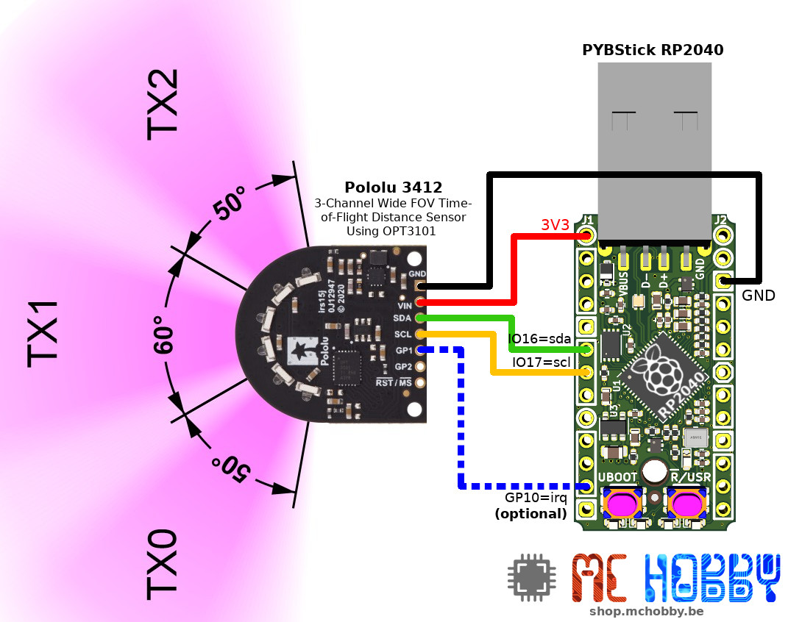

[This file also exists in ENGLISH](readme_ENG.md)

# Utiliser le capteur de distance FoV 3 canaux de Pololu (POL 3412) avec MicroPython

Le capteur de distance FoV (champs de vue) de Pololu est basé sur le composant OPT3101 de Texas Instrument. Cette carte permet de mesurer la distance d'objets dans l'environnement de la carte (jusqu'à 1 mètre).


Le champs de capture de 160° est divisé en trois sections (3 canaux) permettant d'estimer la position et emplacement des obstacles situés à l'avant frontal ainsi que avant-droit et avant-gauche.

Il s'agit d'un capteur bien pratique pour automatiser le mouvement de véhicule pour qu'il puisse évoluer en évitant les obstacles.



La mesure de proximité exploite le procédé Time-of-Flight (ToF) basé sur le temps que met la lumière à pour atteindre un objet et revenir vers les capteurs afin d'en déduire la distance.

## Limitations
* Le changement d'adresse I2C de la carte se fait en manipulant des registres via le bus I2C. Cette fonctionnalité n'est pas implémentée.
* La distance 0mm semble se trouver à environ 80mm physique du bord de la carte. Cela doit encore être contrôlé et vérifié en situation (plutôt que sur mon bureau).<br />Après contrôle, les données semblent consistantes par rapport à l'implémentation Arduino.

# Bibliothèque

Cette bibliothèque doit être copiée sur la carte MicroPython avant d'utiliser les exemples.

Sur une plateforme connectée:

```
>>> import mip
>>> mip.install("github:mchobby/esp8266-upy/opt3101-fov")
```

Ou via l'utilitaire mpremote :

```
mpremote mip install github:mchobby/esp8266-upy/opt3101-fov
```

# Brancher

## Sur Raspberry-Pi Pico


## Sur PYBStick-RP2040

Dans le cas du PYBStick-RP2040, le bus I2C doit être créé en mentionnant les broches sur le Bus Fabric.

``` python
from machine import I2C, Pin

i2c = I2C(0, sda=Pin(16), scl=Pin(17))
```



# Tester

Avant de pouvoir tester les [scripts d'exemples](examples), il est nécessaire de copier la bibliothèque [opt3101.py](lib/opt3101.py) sur la carte MicroPython.

## test.py - test basique (bloquant)

Le script d'exemple basique [test.py](examples/test.py) effectue des lectures sur le canal 1 (TX1, celui à l'avant) et affiche toutes les informations concernant les données collectées.

Les LEDs émitrice sont utilisée en mode adaptatif... la luminosité des LEDs est automatiquement adapté en fonction des conditions de luminosité.

``` python
# Informe l'OPT3101 du nombre de lecture pour faire la moyenne avant de retourner une valeur.  
# Chaque capture prend 0.25 ms, donc 256 échantillon nécessite environ 64 ms.
# La bibliothèque sur-estime le temps de 6% pour garder une marge d'erreur(soit ~68 ms).
sensor.set_frame_timing( 256 ) # Specifier une puissance de 2 entre 1 et 4096

# 1 pour TX1, le canal central.
sensor.set_channel( 1 )

# "Adaptive" signifie une puissance automatiquement sélectionnée entre Forte (High) et Faible (Low) luminosité
sensor.set_brightness( BRIGHTNESS_ADAPTIVE )

print( "channel, brightness, temperature, ambiant, _i, _q, amplitude, distance(mm)")
while True:
	sensor.sample()
	print( "%s, %s, %s, %s, %s, %s, %s, %s" % (sensor.channel_used, sensor.brightness_used,
	           sensor.temperature, sensor.ambient, sensor._i, sensor._q, sensor.amplitude, sensor.distance) )
	time.sleep_ms(200)
```

Les valeurs les plus intéressantes sont:
* la première colonne: indique le canal (forcement 1 dans le cas présent).
* la seconde colonne: indique la luminosité de la LED (1=High=Forte, 0=Low-Faible).
* dernière colonne: la distance en millimètre

```
>>> import test
channel, brightness, temperature, ambiant, _i, _q, amplitude, distance(mm)
1, 0, 2296, 69, 0, 0, 8541, 23
1, 0, 2296, 69, 0, 0, 8531, 24
1, 0, 2296, 69, 0, 0, 8536, 24
1, 0, 2296, 69, 0, 0, 8529, 24
1, 0, 2296, 69, 0, 0, 8529, 24
1, 0, 2296, 69, 0, 0, 8525, 26
1, 0, 2296, 69, 0, 0, 8528, 25
1, 1, 2296, 68, 0, 0, 2771, 78
1, 1, 2296, 68, 0, 0, 3120, 72
1, 1, 2296, 68, 0, 0, 3415, 67
...
```

## testadv.py - lecture non-bloquante des 3 canaux

Ce script d'exemple avancé [testadv.py](examples/testadv.py) indique comment effectuer un échantillonnage non bloquant des 3 canaux. Cela signifie que le script principal peut continuer à exécuter des tâches pendant que le capteur effectue un échantillonnage pour estimer les distances.

Le script affiche les données seulement lorsque les données des 3 canaux ont été réceptionnés.

``` python
from machine import I2C
from opt3101 import OPT3101, BRIGHTNESS_ADAPTIVE
import time

# Code de test pour le Pico
i2c = I2C(0)
# pour PYBStick-RP2040
# i2c = I2C(0, sda=Pin(16), scl=Pin(17))

sensor = OPT3101( i2c )

# Stocke les dernières données du capteur (pour les 3 canaux)
amplitudes = list([0,0,0])
distances  = list([0,0,0]) # en mm

sensor.set_frame_timing(256)
sensor.set_channel(0)
sensor.set_brightness( BRIGHTNESS_ADAPTIVE )
sensor.start_sample()

# Boucle principale
print( '           :     TX0 :     TX1 :     TX2' )
print( '-'*40 )
while True:
	if sensor.is_sample_done():
		sensor.read_output_regs() # acquisition des données depuis la carte
		# Stocke l'information dans les listes
		amplitudes[sensor.channel_used] = sensor.amplitude
		distances[sensor.channel_used] = sensor.distance # in mm
		# Affiche les données (ou le traitement lié aux données)
		if sensor.channel_used == 2: # les 3 capteurs ont étés lu
			print( 'Amplitudes : %7i : %7i : %7i' % (amplitudes[0], amplitudes[1], amplitudes[2]) )
			print( 'Distancess : %7i : %7i : %7i' % (distances[0], distances[1], distances[2]) )
			print( '-'*40 )
		# Passer au prochain canal + échantillonnage
		sensor.next_channel()
		sensor.start_sample()

	# Effectuer les autres tâches du programme principam
```

Ce qui produit le résultat dans la console REPL:

```
>>> import testadv
:     TX0 :     TX1 :     TX2
----------------------------------------
Amplitudes :     422 :     556 :     561
Distancess :     394 :     282 :      76
----------------------------------------
Amplitudes :     424 :     550 :     559
Distancess :     425 :     259 :      85
----------------------------------------
Amplitudes :     422 :     548 :     557
Distancess :     387 :     280 :      68
----------------------------------------
Amplitudes :     421 :     545 :     560
Distancess :     416 :     265 :      79
----------------------------------------
Amplitudes :     424 :     549 :     556
Distancess :     404 :     282 :      58
----------------------------------------
Amplitudes :     687 :     636 :     566
Distancess :     294 :     229 :      84
----------------------------------------
Amplitudes :    1205 :     608 :     557
Distancess :     227 :     261 :      54
----------------------------------------
Amplitudes :     762 :     584 :     563
Distancess :     328 :     265 :      83
----------------------------------------
Amplitudes :     950 :     608 :     558
Distancess :     296 :     297 :      77
----------------------------------------
Amplitudes :    1103 :     595 :     561
Distancess :     265 :     266 :      91
----------------------------------------
Amplitudes :    1125 :     615 :     557
Distancess :     261 :     290 :      75
----------------------------------------
Amplitudes :    1223 :     650 :     565
Distancess :     248 :     259 :      78
----------------------------------------
```

## testcont.py - lecture non-bloquante avec interruption (IRQ)

Le script suivant effectue une lecture des trois canaux et attend que le capteur active le signal d'interruption informant le microcontrôleur que des données sont disponibles.

Le microcontrôleur pourra alors lire les registres du capteur pour en extraire les données.

L'exemple [testcont.py](examples/testcont.py) exploite une interruption (Interrupt Request/IRQ) pour effectuer un échantillonnage non bloquant.

Comme pour le précédent exemple, l'acquisition de données est effectuée sur les 3 canaux... mais avec un blocage du script exclusivement pour le rapatriement des données depuis le capteur. Cela laisse plus de temps de traitement pour d'autres tâches.

Le capteur FoV est configuré de telle sorte que sa sortie GP1 passe au niveau haut lorsque l'échantillonnage est terminé et les données prête à lire! Ce signal d'interruption est branché sur une broche du microcontrôleur (GP10 pour un Pico ou un PYBStick-RP2040) et une routine d'interruption attaché à cette broche.

Cette version non-bloquante du script est incroyablement rapide!

``` python
from machine import I2C, Pin
from opt3101 import OPT3101, BRIGHTNESS_ADAPTIVE, CHANNEL_AUTO_SWITCH

import micropython
micropython.alloc_emergency_exception_buf(100)

# Exemple pour Pico
i2c = I2C(0)
# Pour la PYBStick-RP2040
# i2c = I2C(0, sda=Pin(16), scl=Pin(17))

irqPin = Pin( 10, Pin.IN ) # Broche destinée à recevoir le signal d'interruptioni

data_ready = False # Flag/drapeau global (activé par la broche d'interruption)

# Routine d'interruption (IRQ Handler)... informe la boucle principale que des
# données sont disponibles.
def on_data_ready(p):
	global data_ready
	data_ready = True

# Attache la routine d'interruption à la broche (signal montant)
irqPin.irq( trigger=Pin.IRQ_RISING, handler=on_data_ready )

sensor = OPT3101( i2c )

amplitudes = list([0,0,0])
distances  = list([0,0,0]) # en mm

sensor.set_continuous_mode(); # Capteur configuré en acquisition continue
sensor.enable_data_ready_output( gpPin=1 ) # Capteur utilise la sortie GP1 comme broche d'interruption
sensor.set_frame_timing( 32 )
sensor.set_channel( CHANNEL_AUTO_SWITCH ) # Boucle automatiquement entre les canaux
sensor.set_brightness( BRIGHTNESS_ADAPTIVE ) # Adapte automatiquement la luminosité des LEDs
sensor.enable_timing_generator( enabled=True ) # Démarrage de l'acquisitioni automatique et génération d'IRQ

# Boucle principale
print( '           :     TX0 :     TX1 :     TX2' )
print( '-'*40 )
try:
	while True:
		if data_ready :
			data_ready = False
			sensor.read_output_regs() # lecture des données depuis le capteur
			# stored into array
			amplitudes[sensor.channel_used] = sensor.amplitude
			distances[sensor.channel_used] = sensor.distance # en mm
			# Afficher des données (et effectue le traitement ad-hoc)
			if sensor.channel_used == 2: # if we did read the 3 sensors
				print( 'Amplitudes : %7i : %7i : %7i' % (amplitudes[0], amplitudes[1], amplitudes[2]) )
				print( 'Distancess : %7i : %7i : %7i' % (distances[0], distances[1], distances[2]) )
				print( '-'*40 )


	# Effetuer d'autres tâches ici
except:
	# Si le programme est arrêté ALORS arrêter la génération d'IRQ
	sensor.enable_timing_generator( enabled=True )
```

# Où acheter
* [capteur de distance FoV 3 canaux de Pololu (POL 3412)](https://shop.mchobby.be/product.php?id_product=2289) @ MCHobby
* [3-Channel Wide FOV Time-of-Flight Distance Sensor Using OPT3101](https://www.pololu.com/product/3412) @ Pololu
* [Raspberry-Pi Pico avec connecteur](https://shop.mchobby.be/product.php?id_product=2036) @ MCHobby
* [PYBStick RP2040](https://shop.mchobby.be/product.php?id_product=2331) @ MCHobby
