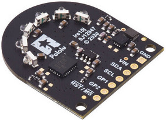
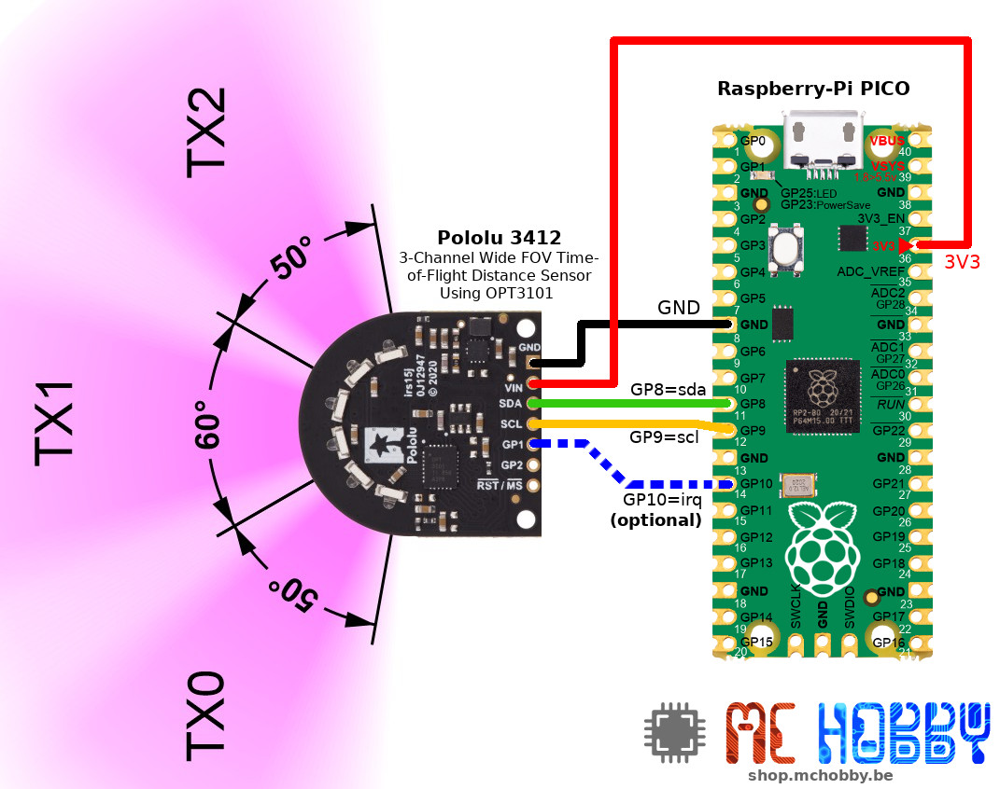

[Ce fichier existe également en FRANCAIS](readme.md)

# Use the Pololu (POL 3412) 3-Channel Wide FOV Time-of-Flight Distance Sensor Using OPT3101 with MicroPython

The FoV distance sensor of Pololu is based on the Texas Instrument OPT3101 component. This sensor can measure the distance to objects in the area of the board (up to 1 meter).



The field of view make 160° wide and is divided in trois area (3 channels) allowing to evaluate the obstacles on the front (front straight, front left & front right) of the sensor.

It is a very nice sensor to automate a vehicule/robot moving in the middle of objects.


The distance measurement is based on the Time-of-Flight (ToF) of the light. The board mesure the time needed for the light to bounce on the object and being returned to the sensor. From that time and because the speed of light is constant, the library can calculate the distance traveled by the light... so the distance of the object (at the half of the light travel distance).

## Limitations
* The I2C address change is done by manipulating sensor registers. This has not been implemented in this library.
* The 0mm distance seems to be physicaly located at about 80mm from the board. This should be double checked and confirmed in real situation (not on my development desk).<br />By the way, by compating the values against thoses returned by the Arduino implementation, the distances seems consistants.

# Wiring

## to Raspberry-Pi Pico



## to PYBStick-RP2040

When using the PYBStick-RP2040, the I2C bus must be created by specifying the Bus Fabric Pins to be used.

``` python
from machine import I2C, Pin

i2c = I2C(0, sda=Pin(16), scl=Pin(17))
```


# Testing

Before testing the various [examples scripts](examples), you will have to copy the [opt3101.py](lib/opt3101.py) library on the MicroPython board.

## test.py - Basic test

The basic [test.py](examples/test.py) just read the channel 1 (TX1, on the front) and display all the information regarding the collected data.

The emitting LED are set to adaptative mode... so the brightness is automatically adapted to ambiant luminosity conditions.

``` python
# This tells the OPT3101 how many readings to average together when it takes a sample.  
# Each reading takes 0.25 ms, so getting 256 takes about 64 ms.
# The library adds an extra 6% margin of error, making it 68 ms.
# You can specify any power of 2 between 1 and 4096.
sensor.set_frame_timing( 256 )

# 1 means to use TX1, the middle channel.
sensor.set_channel( 1 )

# Adaptive means to automatically choose high or low brightness.
sensor.set_brightness( BRIGHTNESS_ADAPTIVE )

print( "channel, brightness, temperature, ambiant, _i, _q, amplitude, distance(mm)")
while True:
	sensor.sample()
	print( "%s, %s, %s, %s, %s, %s, %s, %s" % (sensor.channel_used, sensor.brightness_used,
	           sensor.temperature, sensor.ambient, sensor._i, sensor._q, sensor.amplitude, sensor.distance) )
	time.sleep_ms(200)
```

The most interesting values are:
* the first column: indicating the channel (always 1 in this case).
* the second column: indicating the LED brightness power (1=High, 0=Low).
* the last column: showing the distance in millimeters

```
>>> import test
channel, brightness, temperature, ambiant, _i, _q, amplitude, distance(mm)
1, 0, 2296, 69, 0, 0, 8541, 23
1, 0, 2296, 69, 0, 0, 8531, 24
1, 0, 2296, 69, 0, 0, 8536, 24
1, 0, 2296, 69, 0, 0, 8529, 24
1, 0, 2296, 69, 0, 0, 8529, 24
1, 0, 2296, 69, 0, 0, 8525, 26
1, 0, 2296, 69, 0, 0, 8528, 25
1, 0, 2296, 69, 0, 0, 8526, 25
1, 0, 2296, 69, 0, 0, 8530, 24
1, 0, 2296, 69, 0, 0, 8526, 25
1, 0, 2296, 69, 0, 0, 8547, 25
1, 0, 2296, 69, 0, 0, 8595, 26
1, 0, 2296, 69, 0, 0, 8633, 25
1, 0, 2296, 69, 0, 0, 8720, 26
1, 0, 2296, 69, 0, 0, 8620, 27
1, 0, 2296, 69, 0, 0, 8411, 30
1, 0, 2296, 69, 0, 0, 9011, 33
1, 0, 2296, 69, 0, 0, 6733, 42
1, 0, 2296, 69, 0, 0, 5359, 51
1, 1, 2296, 68, 0, 0, 2771, 78
1, 1, 2296, 68, 0, 0, 3120, 72
1, 1, 2296, 68, 0, 0, 3415, 67
...
```

## testadv.py - non-blocking 3 channels reading

The advanced [testadv.py](examples/testadv.py) script perform show how to perform a non-blocking sampling of the Field-of-View (FoV) over the 3 channels without blocking the main process. So other tasks can takes places in the main loop while distances are estimated.

The script shows the collected data when the 3 channels are acquires (this is also were your detection and avoidance code shoud takes place).

``` python
from machine import I2C
from opt3101 import OPT3101, BRIGHTNESS_ADAPTIVE
import time

# Some testing code for Pico
i2c = I2C(0)
# for PYBStick-RP2040
# i2c = I2C(0, sda=Pin(16), scl=Pin(17))

sensor = OPT3101( i2c )

# Store the lastest sensor data
amplitudes = list([0,0,0])
distances  = list([0,0,0]) # in mm

sensor.set_frame_timing(256)
sensor.set_channel(0)
sensor.set_brightness( BRIGHTNESS_ADAPTIVE )
sensor.start_sample()

# Main program loop
print( '           :     TX0 :     TX1 :     TX2' )
print( '-'*40 )
while True:
	if sensor.is_sample_done():
		sensor.read_output_regs() # Read data from board
		# stored into array
		amplitudes[sensor.channel_used] = sensor.amplitude
		distances[sensor.channel_used] = sensor.distance # in mm
		# Display data (or perform processing on the data)
		if sensor.channel_used == 2: # if we did read the 3 sensors
			print( 'Amplitudes : %7i : %7i : %7i' % (amplitudes[0], amplitudes[1], amplitudes[2]) )
			print( 'Distancess : %7i : %7i : %7i' % (distances[0], distances[1], distances[2]) )
			print( '-'*40 )
		# loop to next channel + acquire
		sensor.next_channel()
		sensor.start_sample()

	# Perform other tasks here
```

wich produces the following results:

```
>>> import testadv
:     TX0 :     TX1 :     TX2
----------------------------------------
Amplitudes :     422 :     556 :     561
Distancess :     394 :     282 :      76
----------------------------------------
Amplitudes :     424 :     550 :     559
Distancess :     425 :     259 :      85
----------------------------------------
Amplitudes :     422 :     548 :     557
Distancess :     387 :     280 :      68
----------------------------------------
Amplitudes :     421 :     545 :     560
Distancess :     416 :     265 :      79
----------------------------------------
Amplitudes :     424 :     549 :     556
Distancess :     404 :     282 :      58
----------------------------------------
Amplitudes :     687 :     636 :     566
Distancess :     294 :     229 :      84
----------------------------------------
Amplitudes :    1205 :     608 :     557
Distancess :     227 :     261 :      54
----------------------------------------
Amplitudes :     762 :     584 :     563
Distancess :     328 :     265 :      83
----------------------------------------
Amplitudes :     950 :     608 :     558
Distancess :     296 :     297 :      77
----------------------------------------
Amplitudes :    1103 :     595 :     561
Distancess :     265 :     266 :      91
----------------------------------------
Amplitudes :    1125 :     615 :     557
Distancess :     261 :     290 :      75
----------------------------------------
Amplitudes :    1223 :     650 :     565
Distancess :     248 :     259 :      78
----------------------------------------
```

## testcont.py - non-blocking IRQ 3 channels reading

The [testcont.py](examples/testcont.py) example script use IRQ to perform non-blocking sampling of the Field-of-View (FoV).

As the previous example, the data are read over the 3 channels. So other tasks can takes places in the main loop while distances are estimated.

The FoV board is configured such a way to raise its GP1 output level to high when a sampling is achieved. The signal is wired to the microcontroler (GP10 on the Pico) and an interrupt handler attached to the pin.

The version of the non-blocking script is incredibly fast!

The code below have extra comments and shows how to configure the FoV board to raise Interrupts and how to acquire them in the Python script.

``` python
from machine import I2C, Pin
from opt3101 import OPT3101, BRIGHTNESS_ADAPTIVE, CHANNEL_AUTO_SWITCH

import micropython
micropython.alloc_emergency_exception_buf(100)

# Some testing code for Pico
i2c = I2C(0)
# for PYBStick-RP2040
# i2c = I2C(0, sda=Pin(16), scl=Pin(17))

irqPin = Pin( 10, Pin.IN ) # Additional IRQ pin to be IRQed when data is ready

data_ready = False # global flag

# IRQ Handler... just inform the main loop that some data are ready to handle
def on_data_ready(p):
	global data_ready
	data_ready = True

# Attach irq to the handler function
irqPin.irq( trigger=Pin.IRQ_RISING, handler=on_data_ready )

sensor = OPT3101( i2c )

amplitudes = list([0,0,0])
distances  = list([0,0,0]) # in mm

sensor.set_continuous_mode(); # sensor will continously acquire data
sensor.enable_data_ready_output( gpPin=1 ) # sensor must use it's GP1 output to raise IRQ when data are ready
sensor.set_frame_timing( 32 )
sensor.set_channel( CHANNEL_AUTO_SWITCH ) # Looping between channels automatically
sensor.set_brightness( BRIGHTNESS_ADAPTIVE ) # adapt automatically LED High/Low brightness
sensor.enable_timing_generator( enabled=True ) # start automatic acquisition and IRQ generation

# Main script loop
print( '           :     TX0 :     TX1 :     TX2' )
print( '-'*40 )
try:
	while True:
		if data_ready :
			data_ready = False
			sensor.read_output_regs() # Read data from sensor
			# stored into array
			amplitudes[sensor.channel_used] = sensor.amplitude
			distances[sensor.channel_used] = sensor.distance # in mm
			# Display data (or perform processing on the data)
			if sensor.channel_used == 2: # if we did read the 3 sensors
				print( 'Amplitudes : %7i : %7i : %7i' % (amplitudes[0], amplitudes[1], amplitudes[2]) )
				print( 'Distancess : %7i : %7i : %7i' % (distances[0], distances[1], distances[2]) )
				print( '-'*40 )


	# Perform other tasks here
except:
	# If program stopped, we disable the IRQ generator
	sensor.enable_timing_generator( enabled=True )
```

# Shopping list
* [3-Channel Wide FOV Time-of-Flight Distance Sensor Using OPT3101 (POL 3412)](https://shop.mchobby.be/product.php?id_product=2289) @ MCHobby
* [3-Channel Wide FOV Time-of-Flight Distance Sensor Using OPT3101](https://www.pololu.com/product/3412) @ Pololu
* [Raspberry-Pi Pico whth header](https://shop.mchobby.be/product.php?id_product=2036) @ MCHobby
* [PYBStick RP2040](https://shop.mchobby.be/product.php?id_product=2331) @ MCHobby
