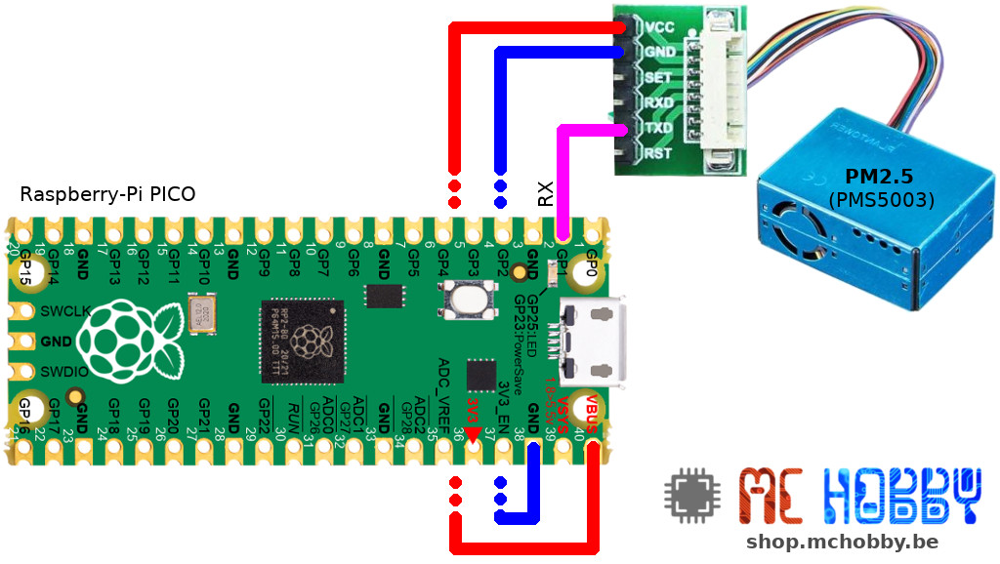

[Ce fichier existe également en FRANCAIS](readme.md)

# Use a PM2.5 fine particule sensors (PMS5003) with MicroPython

This sensor is designed to measure the PM2.5 dust concentration! PM2.5 means Particule Micron 2.5, it refer to the particle diameter that can be measured (2.5 microns or smaller).


The sensor use a laser light to illuminate the particles suspended in the air, then a sensor do collects the diffracted & reflected light to creates a curve of diffused light (scattering light) related to time. The embedded microcontroler do calculates the particles diameters and the number of particles per diameter per air volume unit.


Source: [Wikipedia - Dynamic Light Scattering](https://en.wikipedia.org/wiki/Dynamic_light_scattering)

The sensor do returns the following informations:
* The PM1.0, PM2.5 & PM10.0 concentrations par standard units (in µ g/m^3).<br />Should ne used in industrial environment.
* The PM1.0, PM2.5 & PM10.0 concentrations per environmental units (in µ g/m^3).<br />under athmopheric environment.
* The particle survey by 0.1L of air : indicates the number of particules over 0.3µm, 0.5µm, 1.0µm, 2.5µm, 5.0µm and 10µm diameter per 0.1 L of air.

[More technical information on this product sheet](https://shop.mchobby.be/fr/environnemental-press-temp-hrel-gaz/1332-senseur-qualite-d-air-pm25-pm5003-et-adaptateur-breadboard-3232100013322-adafruit.htm).

Notes:
* '''Set''' : the signal can be driven by a microcontroler to set the sensor in sleep mode.
* '''Reset''' : do reinitialize the sensor.
* the sensor do requires at least 30 seconds before producing coherent data.

# Library

The library must be copied on the MicroPython board before using the examples.

On a WiFi capable plateform:

```
>>> import mip
>>> mip.install("github:mchobby/esp8266-upy/pm25")
```

Or via the mpremote utility :

```
mpremote mip install github:mchobby/esp8266-upy/pm25
```

# Wiring

The examples will requires the [pm25.py](lib/pm25.py) library on the MicroPython board.

The sensor use a '''5V Power Supply''' but do use '''3.3V logic''' signals.

Only the TX sensor lines must be wired from the sensor to the microcontroler.

## Wire on a Raspberry-Pi Pico



# Tests

The [test_simple.py](examples/test_simple.py) example script (simplified here below) show the various informations returned by the sensor.

``` python
from machine import UART
from pm25 import PM25
import time

# Raspberry Pico : GP0=tx (not used), GP1=rx (used)
ser = UART( 0, baudrate=9600, timeout=800 )
pm25 = PM25( ser )

pm25.acquire() # Acquiring data from serial line
print( '-'*40 )
print( 'Concentration Units (standard)')
print( '  pm1.0: %i' % pm25.data.std.pm10 )
print( '  pm2.5: %i' % pm25.data.std.pm25 )
print( '  pm10.0: %i' % pm25.data.std.pm100 )
print( 'Concentration Units (Environmental)')
print( '  pm1.0: %i' % pm25.data.env.pm10 )
print( '  pm2.5: %i' % pm25.data.env.pm25 )
print( '  pm10.0: %i' % pm25.data.env.pm100 )
print( 'Particle > x um / 0.1L air')
print( '  0.3um: %i' % pm25.data.particles.um03 ) # Particules > 0.3 µM / 0.1L air
print( '  0.5um: %i' % pm25.data.particles.um05 ) # Particules > 0.5 µM / 0.1L air
print( '  1.0um: %i' % pm25.data.particles.um10 ) # Particules > 1.0 µM / 0.1L air
print( '  2.5um: %i' % pm25.data.particles.um25 )
print( '  5.0um: %i' % pm25.data.particles.um50 )
print( '  10.0um: %i' % pm25.data.particles.um100 )
```

The produced results here below have been measured at the Desk (with some dusts)

```
Concentration Units (standard)
  pm1.0: 36
  pm2.5: 52
  pm10.0: 53
Concentration Units (Environmental)
  pm1.0: 28
  pm2.5: 42
  pm10.0: 50
Particle > x um / 0.1L air
  0.3um: 6216
  0.5um: 1771
  1.0um: 302
  2.5um: 13
  5.0um: 1
  10.0um: 1
```

The following measurements correspond to my solder iron fumes (lead tin solder) producing fines particles in the fumes (see the 0.3um level)

```
----------------------------------------
Concentration Units (standard)
  pm1.0: 168
  pm2.5: 361
  pm10.0: 399
Concentration Units (Environmental)
  pm1.0: 111
  pm2.5: 240
  pm10.0: 265
Particle > x um / 0.1L air
  0.3um: 27864
  0.5um: 8497
  1.0um: 2937
  2.5um: 307
  5.0um: 50
  10.0um: 30
----------------------------------------
Concentration Units (standard)
  pm1.0: 104
  pm2.5: 188
  pm10.0: 209
Concentration Units (Environmental)
  pm1.0: 68
  pm2.5: 124
  pm10.0: 138
Particle > x um / 0.1L air
  0.3um: 17484
  0.5um: 5135
  1.0um: 1323
  2.5um: 142
  5.0um: 28
  10.0um: 18
----------------------------------------
Concentration Units (standard)
  pm1.0: 80
  pm2.5: 134
  pm10.0: 146
Concentration Units (Environmental)
  pm1.0: 52
  pm2.5: 88
  pm10.0: 96
Particle > x um / 0.1L air
  0.3um: 13620
  0.5um: 3934
  1.0um: 900
  2.5um: 87
  5.0um: 14
  10.0um: 9
```

# Shopping list

* [Capteur de qualité d'air PM2.5 (PMS5003) ](https://shop.mchobby.be/product.php?id_product=1332) @ MC Hobby
* [PM2.5 Air Quality Sensor (PMS5003)](https://www.adafruit.com/product/3686)  @ Adafruit
* [PMS5003 Particulate Matter Sensor](https://shop.pimoroni.com/products/pms5003-particulate-matter-sensor-with-cable)
* [Raspberry-Pi Pico](https://shop.mchobby.be/fr/157-pico-rp2040) @ MC Hobby
