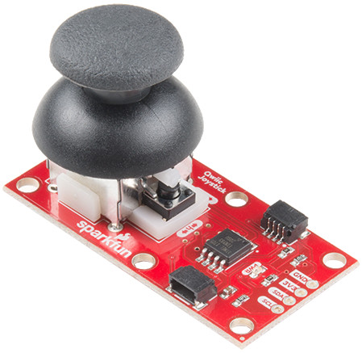
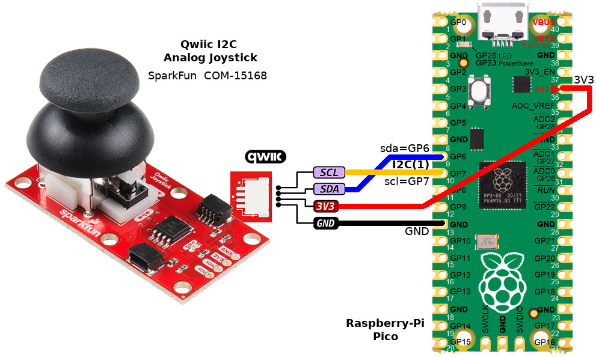

[This file also exists in ENGLISH](readme_ENG.md)

# Utiliser le Joystick Analogique Qwiic (I2C) avec MicroPython

Sparkfun produit un Joystick analogique I2C exploitant la connectique Qwiic (SparkFun, COM-15168).

Ce __joystick autonome__  permet de lire la position Horizontale `x` et Verticale `y` et la pression du bouton `pressed` via l'interface I2C.



La propriété `was_pressed` permet de savoir si le bouton a été pressé entre deux interrogations du joystick.


# Bibliothèque

Cette bibliothèque doit être copiée sur la carte MicroPython avant d'utiliser les exemples.

Sur une plateforme connectée:

```
>>> import mip
>>> mip.install("github:mchobby/esp8266-upy/qwiic-joystick-i2c")
```

Ou via l'utilitaire mpremote :

```
mpremote mip install github:mchobby/esp8266-upy/qwiic-joystick-i2c
```

# Brancher

## Brancher sur MicroMod-RP2040

Dans l'exemple ci-dessous, la carte périphérique [MicroMod Learning Machine](https://www.sparkfun.com/products/16400) (_Carrier board_, SparkFun,  DEV-16400) est utilisée pour apporter la connectivité Qwiic au MicroMod-RP2040.


## Brancher sur Raspberry-Pi Pico

Vous pouvez également brancher le joystick à l'aide d'un [Qwiic Cable Breakout](https://www.sparkfun.com/products/14425) (SparFun, PRT-14425)



# Tester

Avant d'exécuter les exemples, il est nécessaire de copier la bibliothèque [joyi2c.py](lib/joyi2c.py) sur la carte MicroPython.

## test.py

Le script d'exemple [test.py](examples/test.py) interroge le l'état du bouton et la position horizontale et verticale du joystick.

``` python
from machine import I2C, Pin
import time

# MicroMod-RP2040 - SparkFun
i2c = I2C( 0, sda=Pin(4), scl=Pin(5) )
# Raspberry-Pi Pico
# i2c = I2C( 1 ) # sda=GP6, scl=GP7

joy = Joystick_I2C( i2c )

print( 'Joystick connected:', 'Yes' if joy.is_connected else 'NO' )
print( 'Version:', joy.version )
print( 'Vertical/Horizontal range 0..1024' )
print( '')
print( 'Button is pressed, X (horizontal), Y (vertical)')
print( '-'*40 )
while True:
	print( '%5s, %4i, %4i ' % (joy.pressed, joy.x, joy.y) )
	time.sleep( 0.200 )
```

Ce qui produit le résultat suivant:

```
Joystick connected: Yes
Version: v2.6
Vertical/Horizontal range 0..1024
Button is pressed, X (horizontal), Y (vertical)
----------------------------------------
False,  506,  519
False,  506,  519
False,  506,  519
False,  506,  519
 True,  506,  519
False,  506,  519
False,  506,  519
False,  552,  519
False,  736,  519
False, 1023,  519
False, 1023,  519
False, 1023,  519
False, 1023,  519
False, 1023,  519
False, 1023,  519
False,  961,  519
False,  506,  519
False,  506,  519
False,  506,  519
False,  506,  519
False,  361,  519
False,    0,  519
False,    0,  519
False,    0,  519
False,  506,  519
False,  506,  519
False,  506,  519
False,  506,  519
False,  506,  519
False,  506,  519
False,   72,  519
False,   76,  519
False,  176,  519
False,  375,  519
False,  398,  519
False,  344,  519
False,  301,  519
False,  300,  519
False,  321,  519
False,  506,  519
False,  620,  519
False, 1023,  519
False, 1023,  519
False,  701,  519
False,  889,  468
False, 1023,  412
```

## test2.py

Le script d'exemple [test2.py](examples/test2.py) vérifie __si le bouton a été cliqué (et relâché) entre deux interrogations__ du joystick sur le bus I2C.

Cela permet de savoir si le bouton à été cliqué même si le script était affairé à d'autres traitements.

``` python
from machine import I2C, Pin
import time

# MicroMod-RP2040 - SparkFun
i2c = I2C( 0, sda=Pin(4), scl=Pin(5) )
# Raspberry-Pi Pico
# i2c = I2C( 1 ) # sda=GP6, scl=GP7

joy = Joystick_I2C( i2c )

while True:
	print( '------------------------')
	print( 'Pausing for 5 sec' )
	time.sleep( 5 )
	print( "Was Pressed : " % joy.was_pressed )
```
