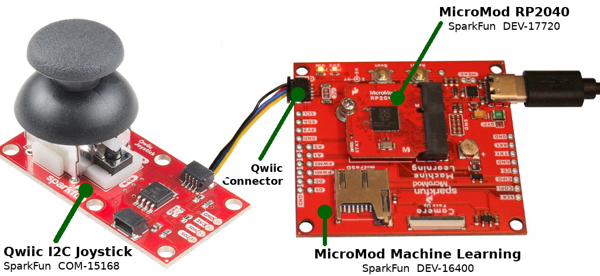

[Ce fichier existe également en Français](readme.md)

# Using the Qwiic Analog Qwiic (I2C) with MicroPython

Sparkfun do manufacture an I2C analog joystick exposing the Qwiic connector (SparkFun, COM-15168).

This __autonomous joystick__  allows to read the Horizontal position `x` and Vertical position `y` as well as the `pressed` button state. All of this via the I2C interface.


The `was_pressed` property do also allows the detect button click even when the board wasn't queried.


# Library

The library must be copied on the MicroPython board before using the examples.

On a WiFi capable plateform:

```
>>> import mip
>>> mip.install("github:mchobby/esp8266-upy/qwiic-joystick-i2c")
```

Or via the mpremote utility :

```
mpremote mip install github:mchobby/esp8266-upy/qwiic-joystick-i2c
```

# Wiring

## Wiring to MicroMod-RP2040

On the wiring below, the [MicroMod Learning Machine](https://www.sparkfun.com/products/16400) _Carrier board_ ( SparkFun,  DEV-16400) is used to bring the Qwiic connectivity to the MicroMod-RP2040.



## Wiring to Raspberry-Pi Pico

You can also wire the keyboard thanks to a [Qwiic Cable Breakout](https://www.sparkfun.com/products/14425) (SparFun, PRT-14425)


# Testing

before executing any examples, you will have to copy the [joyi2c.py](lib/joyi2c.py) library to the MicroPython board.

## test.py

The [test.py](examples/test.py) example script do query the button state as well as Horizontal & vertical joystick position.

``` python
from machine import I2C, Pin
import time

# MicroMod-RP2040 - SparkFun
i2c = I2C( 0, sda=Pin(4), scl=Pin(5) )
# Raspberry-Pi Pico
# i2c = I2C( 1 ) # sda=GP6, scl=GP7

joy = Joystick_I2C( i2c )

print( 'Joystick connected:', 'Yes' if joy.is_connected else 'NO' )
print( 'Version:', joy.version )
print( 'Vertical/Horizontal range 0..1024' )
print( '')
print( 'Button is pressed, X (horizontal), Y (vertical)')
print( '-'*40 )
while True:
	print( '%5s, %4i, %4i ' % (joy.pressed, joy.x, joy.y) )
	time.sleep( 0.200 )
```

Which produce the following results:

```
Joystick connected: Yes
Version: v2.6
Vertical/Horizontal range 0..1024
Button is pressed, X (horizontal), Y (vertical)
----------------------------------------
False,  506,  519
False,  506,  519
False,  506,  519
False,  506,  519
 True,  506,  519
False,  506,  519
False,  506,  519
False,  552,  519
False,  736,  519
False, 1023,  519
False, 1023,  519
False, 1023,  519
False, 1023,  519
False, 1023,  519
False, 1023,  519
False,  961,  519
False,  506,  519
False,  506,  519
False,  506,  519
False,  506,  519
False,  361,  519
False,    0,  519
False,    0,  519
False,    0,  519
False,  506,  519
False,  506,  519
False,  506,  519
False,  506,  519
False,  506,  519
False,  506,  519
False,   72,  519
False,   76,  519
False,  176,  519
False,  375,  519
False,  398,  519
False,  344,  519
False,  301,  519
False,  300,  519
False,  321,  519
False,  506,  519
False,  620,  519
False, 1023,  519
False, 1023,  519
False,  701,  519
False,  889,  468
False, 1023,  412
```

## test2.py

The [test2.py](examples/test2.py) example script do __check if the button has been pressed between joystick requests__ over the I2C bus.

That would allows to know if the button has been clicked (and release) even when the script was processing something (and not querying the joystick board).

``` python
from machine import I2C, Pin
import time

# MicroMod-RP2040 - SparkFun
i2c = I2C( 0, sda=Pin(4), scl=Pin(5) )
# Raspberry-Pi Pico
# i2c = I2C( 1 ) # sda=GP6, scl=GP7

joy = Joystick_I2C( i2c )

while True:
	print( '------------------------')
	print( 'Pausing for 5 sec' )
	time.sleep( 5 )
	print( "Was Pressed : " % joy.was_pressed )
```
