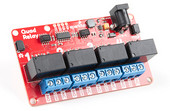
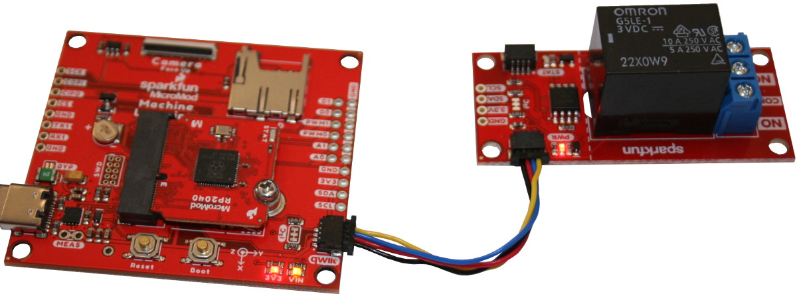

[This file also exists in English](readme_ENG.md)

# Utiliser les modules Relais/SSR Qwiic (I2C) avec MicroPython

SparkFun produit une série de produits de type Relais/SSR utilisant la connectique Qwiic.

| [SparkFun Qwiic Single Relay](https://www.sparkfun.com/products/15093)<br />(COM-15093) | [SparkFun Qwiic Quad Relay](https://www.sparkfun.com/products/16566)<br />(COM-16566) | [SparkFun Qwiic Quad Solid State Relay](https://www.sparkfun.com/products/16833)<br />(KIT-16833) | [SparkFun Qwiic Dual Solid State Relay](https://www.sparkfun.com/products/16810)<br />(COM-16810) |
|------------|---------------|--------|----------|
|  |  |  |    |

La bibliothèque [relayi2c.py](lib/relayi2c.py) propose deux classes `SingleRelay` et `MultiRelay` permettant de prendre le contrôle de toutes les cartes.

La bibliothèque propose également le support "Slow PWM" permettant de piloter un relais SSR avec un signal PWM à 1 Hz (de 0 à 100% de cycle utile).

__Note:__

Ne disposant pas des produits COM-16566, KIT-16833, COM-16810, je n'ai pas eu l'occasion de tester la classe `MultiRelay` en situation.

# Bibliothèque

Avant de tester les modules relais simple/multiples ou SSR via I2C, il est nécessaire de copier la bibliothèque [relayi2c.py](lib/relayi2c.py) sur la carte MicroPython.

# Brancher

## Brancher sur MicroMod-RP2040

Dans l'exemple ci-dessous, la carte périhpérique [MicroMod Learning Machine](https://www.sparkfun.com/products/16400) (_Carrier board_, SparkFun,  DEV-16400) est utilisée pour apporter la connectivité Qwiic au MicroMod-RP2040.



## Brancher sur Raspberry-Pi Pico

Vous pouvez également brancher le relais à l'aide d'un [Qwiic Cable Breakout](https://www.sparkfun.com/products/14425) (SparFun, PRT-14425)


# Tests

Tous les exemples nécessitent la présence de la bibliothèque [relayi2c.py](lib/relayi2c.py) sur la carte MicroPython.

## test1relay.py : test des fonctionnalités du relais

L'exemple [test1relay.py](examples/test1relay.py) indique comment utiliser la bibliothèque pour commander un module relais Qwiic avec la classe `SingleRelay`.

Les méthodes et fonctions permettant de contrôler les modules relais ont étés simplifiées par rapport aux [fonctions définies par SparkFun](https://github.com/sparkfun/SparkFun_Qwiic_Relay_Arduino_Library).

``` python
from machine import I2C, Pin
from relayi2c import SingleRelay
import time

# MicroMod-RP2040 - SparkFun
i2c = I2C( 0, sda=Pin(4), scl=Pin(5) )
# Raspberry-Pi Pico
# i2c = I2C( 1 ) # sda=GP6, scl=GP7

rel = SingleRelay( i2c )
print( 'version:', rel.version )

print('--- On/Off --------------')
rel.on()
print( "Relay is %s" % rel.state )
time.sleep( 2 )

rel.off()
print( "Relay is %s" % rel.state )
time.sleep( 2 )

print('--- Toggle --------------')
print( "Relay is %s" % rel.state )
print( "Toggle" )
rel.toggle()
print( "Relay is %s" % rel.state )
time.sleep(2)
print( "Toggle again" )
rel.toggle()
print( "Relay is %s" % rel.state )
time.sleep(2)

print('--- Value ---------------')
# Value() method does mimic the Pin class behaviour
rel.value( True )
print( "Relay is %s" % rel.value() )
time.sleep(2)
rel.value( False )
print( "Relay is %s" % rel.value() )
```

## test4relay.py : test des modules 4 relais/SSR

L'exemple [test4relay.py](examples/test4relay.py) met en oeuvre la classe `MultiRelay` permettant de commander des modules Qwiic 4 relais, 4 relais statique (SSR).

Ces différents modules ayant tous des adresses différentes (mais une même API), il est nécessaire de mentionner l'adresse I2C du module cible lors de la création de l'objet `MultiRelay` .
* QUAD_DEFAULT_ADDRESS : module 4 relais
* QUAD_SSR_DEFAULT_ADDRESS : module 4 relais statique (SSR)
* DUAL_SSR_DEFAULT_ADDRESS : module 2 relais statique (SSR)

Le morceau de code ci-dessous indique clairement les étapes à suivre. Le script [test4relay.py](examples/test4relay.py) détaille tous les appels possibles.


``` python
from machine import I2C, Pin
from relayi2c import MultiRelay, QUAD_DEFAULT_ADDRESS, QUAD_SSR_DEFAULT_ADDRESS, DUAL_SSR_DEFAULT_ADDRESS
import time

# MicroMod-RP2040 - SparkFun
i2c = I2C( 0, sda=Pin(4), scl=Pin(5) )
# Raspberry-Pi Pico
# i2c = I2C( 1 ) # sda=GP6, scl=GP7

# Can be used with one of the following depending on Qwiic product in use
#   QUAD_DEFAULT_ADDRESS (4 relais), QUAD_SSR_DEFAULT_ADDRESS, DUAL_SSR_DEFAULT_ADDRESS

rel = MultiRelay( i2c, address=QUAD_DEFAULT_ADDRESS )
print( 'version:', rel.version )

print('--- On/Off --------------')
for relay in range( 4 ): # 0..3
	rel.on(relay+1)      # 1..4
	print( "Relay %i is %s" % (relay+1, rel.state(relay+1)) )
	time.sleep( 2 )
```   
