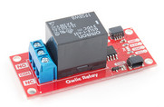
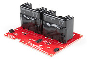
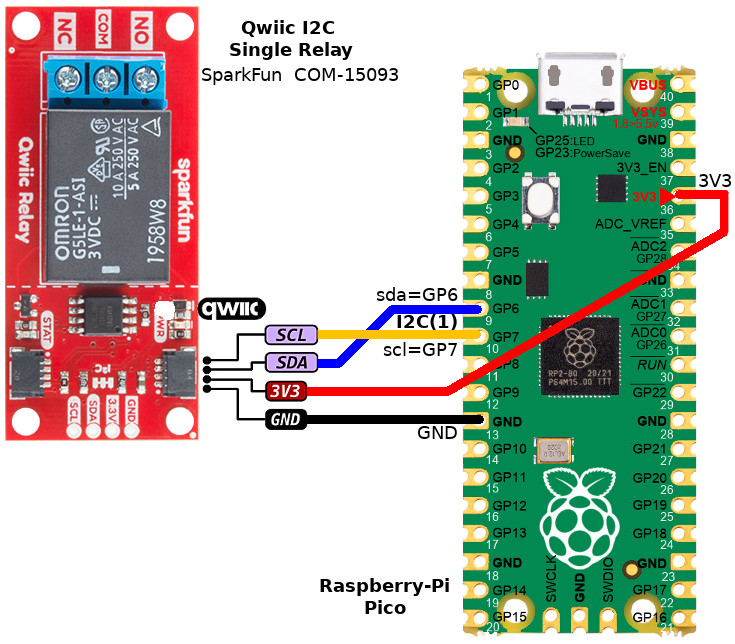

[Ce fichier existe aussi en Français](readme.md)

# Use a Qwiic relay/SSR module (I2C) with MicroPython

SparkFun do manufacture several kind of Relay/SSR board using the Qwiic connector.

| [SparkFun Qwiic Single Relay](https://www.sparkfun.com/products/15093)<br />(COM-15093) | [SparkFun Qwiic 4 Relay](https://www.sparkfun.com/products/16566)<br />(COM-16566) | [SparkFun Qwiic 4 Static Relay (SSR)](https://www.sparkfun.com/products/16833)<br />(KIT-16833) | [SparkFun Qwiic 2 Static Relay (SSR)](https://www.sparkfun.com/products/16810)<br />(COM-16810) |
|------------|---------------|--------|----------|
|  |  |  |    |

The [relayi2c.py](lib/relayi2c.py) library do contains the `SingleRelay` a `MultiRelay` classes used to controle the relay boards.

The library also feature the "Slow PWM" behavior running a 1 Hz PWM signal with duty cycle from 0 to 100%.

__Note:__

As I do not have any of the COM-16566, KIT-16833, COM-16810 product, it has not been possible to test the `MultiRelay` against real boards.


# Library

The library must be copied on the MicroPython board before using the examples.

On a WiFi capable plateform:

```
>>> import mip
>>> mip.install("github:mchobby/esp8266-upy/qwiic-relay-i2c")
```

Or via the mpremote utility :

```
mpremote mip install github:mchobby/esp8266-upy/qwiic-relay-i2c
```

# Wiring

## Wiring to MicroMod-RP2040

On the example here below, the [MicroMod Learning Machine](https://www.sparkfun.com/products/16400) Carrier board (SparkFun,  DEV-16400) is used the Qwiic connector from the MicroMod-RP2040.


## Wiring to Raspberry-Pi Pico

You can also wire the Qwiic module thanks to à [Qwiic Cable Breakout](https://www.sparkfun.com/products/14425) (SparFun, PRT-14425)



# Testing

All the examples scripts needs to have the [relayi2c.py](lib/relayi2c.py) library copied to the board.

## test1relay.py : Single Relay board

The [test1relay.py](examples/test1relay.py) example script shows how to use the library to control the Qwiic Single Relay module thank to the `SingleRelay` class.

The methods and functions names have been simplified regarding the [original Arduino implementation defined by SparkFun](https://github.com/sparkfun/SparkFun_Qwiic_Relay_Arduino_Library).

``` python
from machine import I2C, Pin
from relayi2c import SingleRelay
import time

# MicroMod-RP2040 - SparkFun
i2c = I2C( 0, sda=Pin(4), scl=Pin(5) )
# Raspberry-Pi Pico
# i2c = I2C( 1 ) # sda=GP6, scl=GP7

rel = SingleRelay( i2c )
print( 'version:', rel.version )

print('--- On/Off --------------')
rel.on()
print( "Relay is %s" % rel.state )
time.sleep( 2 )

rel.off()
print( "Relay is %s" % rel.state )
time.sleep( 2 )

print('--- Toggle --------------')
print( "Relay is %s" % rel.state )
print( "Toggle" )
rel.toggle()
print( "Relay is %s" % rel.state )
time.sleep(2)
print( "Toggle again" )
rel.toggle()
print( "Relay is %s" % rel.state )
time.sleep(2)

print('--- Value ---------------')
# Value() method does mimic the Pin class behaviour
rel.value( True )
print( "Relay is %s" % rel.value() )
time.sleep(2)
rel.value( False )
print( "Relay is %s" % rel.value() )
```

## test4relay.py : testing the 4 relay/SSR modules

The [test4relay.py](examples/test4relay.py) example script features the `MultiRelay` class used to control the Qwiic 4 relay, Qwiic 4 static relay (SSR).

As thoses boards are using distinct I2C addresses but the same API! Each the Qwiic relay board have specific I2C default address. That I2C address must be given as parameter when creating the `MultiRelay` object.

The code snippet here below shows the needed steps to create the`MultiRelay` instance. The [test4relay.py](examples/test4relay.py) example script details the various constants used.

``` python
from machine import I2C, Pin
from relayi2c import MultiRelay, QUAD_DEFAULT_ADDRESS, QUAD_SSR_DEFAULT_ADDRESS, DUAL_SSR_DEFAULT_ADDRESS
import time

# MicroMod-RP2040 - SparkFun
i2c = I2C( 0, sda=Pin(4), scl=Pin(5) )
# Raspberry-Pi Pico
# i2c = I2C( 1 ) # sda=GP6, scl=GP7

# Can be used with one of the following depending on Qwiic product in use
#   QUAD_DEFAULT_ADDRESS (4 relais), QUAD_SSR_DEFAULT_ADDRESS, DUAL_SSR_DEFAULT_ADDRESS

rel = MultiRelay( i2c, address=QUAD_DEFAULT_ADDRESS )
print( 'version:', rel.version )

print('--- On/Off --------------')
for relay in range( 4 ): # 0..3
	rel.on(relay+1)      # 1..4
	print( "Relay %i is %s" % (relay+1, rel.state(relay+1)) )
	time.sleep( 2 )
```   
