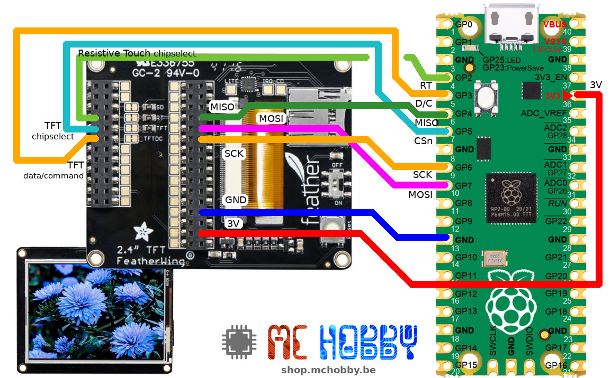

[Ce fichier existe également en FRANCAIS](readme.md)

# STMPE610 - Resistive Touch sensor over SPI

The STMPE610 is a SPI peripheral used on several Adafruit's TFT products (and also on some of thr Adafruit Breakout).


This library have been tested with the  [TFT FeatherWing 2.4"](https://shop.mchobby.be/fr/feather-adafruit/1050-tft-featherwing-24-touch-320x240-3232100010505-adafruit.html) from Adafruit based on the [ILI934x controler (see this MicroPython driver)](https://github.com/mchobby/esp8266-upy/tree/master/ili934x)

# Wiring

The tests have been performed by using the Raspberry-Pi Pico as described with the following wiring. See the [ILI934x MicroPython driver](https://github.com/mchobby/esp8266-upy/tree/master/ili934x) for more wiring.



Please note this schematic wire the __RT__ pin (ResistiveTouch chip select) to the __GP2__ pin. This will allow to activate the SPI communication with only the STMPE610.

# Test

The [test_touch.py](examples/test_touch.py) just returns the absolute coordinate of the touch interface.

For a correct usage, such values must be calibrated against the TFT width & height to be really useful.

``` python
from machine import SPI,Pin
from stmpe610 import *
import time

# Raspberry-Pi Pico
spi = SPI( 0, baudrate=1000000,  phase=1, polarity=0 ) # Mode 1
cs_pin = Pin(2) # GP2

stmp = STMPE610( spi, cs_pin )
# Value 0x811 espected
print( "Version: 0x%x" % stmp.version )
while True:
	if stmp.touched:
		pt = stmp.point
		if pt:
			print('Touched (x,y,z) @ (%i, %i, %i)' % pt )
		else:
			print('Touched (without point data)' )
	time.sleep_ms( 100 )
```
