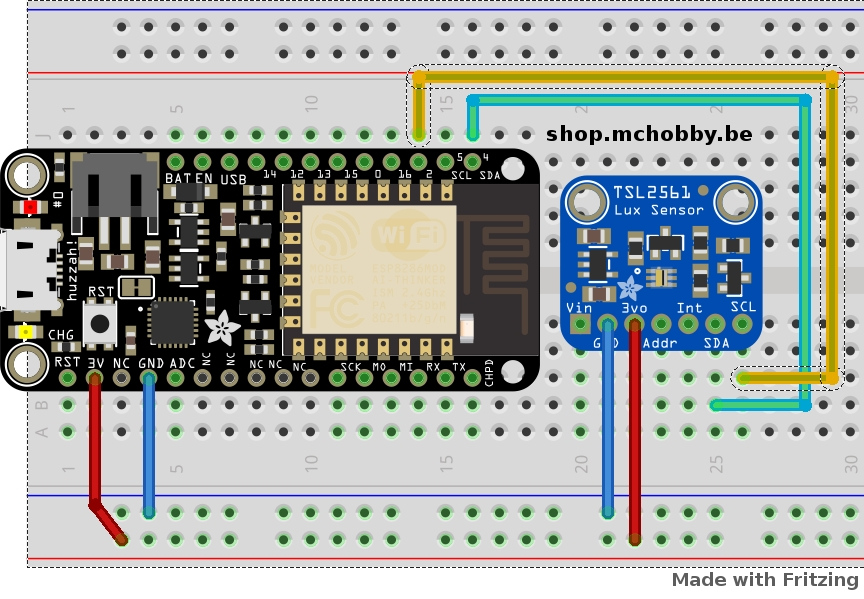

# Mesure de lumière avec Adafruit TSL2561 (ADA439) et ESP8266 MicroPython

Ce capteur est capable de mesure une intensité lumineuse entre 0.1 et 40,000+ Lux

* Shop: [Adafruit TSL2561 (ADA439)](http://shop.mchobby.be/product.php?id_product=238)
* Wiki: https://wiki.mchobby.be/index.php?title=MicroPython-Accueil#ESP8266_en_MicroPython

# Bibliothèque

Cette bibliothèque doit être copiée sur la carte MicroPython avant d'utiliser les exemples.

Sur une plateforme connectée:

```
>>> import mip
>>> mip.install("github:mchobby/esp8266-upy/tsl2561")
```

Ou via l'utilitaire mpremote :

```
mpremote mip install github:mchobby/esp8266-upy/tsl2561
```

# Brancher



# Tester

```
# Mesure de lumière avec Adafruit TSL2561 (ADA439) et ESP8266 MicroPython

* Shop: Adafruit TSL2561 (ADA439) - http://shop.mchobby.be/product.php?id_product=238
* Wiki: https://wiki.mchobby.be/index.php?title=MicroPython-Accueil#ESP8266_en_MicroPython

from tsl2561 import *
from machine import I2C, Pin

# Ne pas utiliser la broche 7 pour SCL parce ce qu'il perturbe la sequence
# de boot lorsqu'une alimentation est branchée sur le connecteur microUSB
#
i2c = I2C( sda=Pin(4), scl=Pin(2), freq=20000 )

tsl = TSL2561( i2c )
# Lecture d'une valeur
#   Cela activera automatiquement le senseur (ce qui prend du temps)
#   puis effectue la lecture ensuite désactive le senseur.
#   Retourne une valeur en lux (ex: 6.815804 Lux)
print( tsl.read() )

# Note: vous pouvez activer/désactiver manuellement le senseur avec
# active(True/False).

# Vous pouvez changer manuellement le gain et temps d'intégration
# * Le gain peut être 1 ou 16
# * Le temps d'intégration : 0 ou 13 ou 101 ou 402 (0=manuel)
tsl.gain( 16 )
tsl.integration_time( 402 )
print( tsl.read() )

# Vous pouvez également utiliser une sélection automatique du gain (AutoGain)
# (uniquement si vous n'utilisez pas d'intégration manuelle)
tsl.integration_time( 402 )
print( tsl.read(autogain=True) )
```

# Ressources et sources
* Source: [https://github.com/adafruit/micropython-adafruit-bundle/tree/master/libraries/drivers MicroPython-adafruit-bundle] (Adafruit, GitHub)
* [Documentation complete sur rtfd.io](http://micropython-tsl2561.rtfd.io/.)

## Luminosité vs Lux
* 0.002 lux : Nuit par temps clair sans lune.
* 0.2 lux : Minimum de lumière que doit produire un éclairage d'urgence (AS2293).
* 0.5 lux 	Pleine lune par temps clair.
* 3.4 lux : Limite crépusculaire (sombre) au couché du soleil en zone urbaine.
* 50 lux : Eclairage d'un living room
* 80 lux : Eclairage des toilette/Hall
* 100 lux : Journée très sombre/temps très couvert.
* 300 - 500 lux : Levé du soleil, luminosité par temps clair. Zone de bureau correctement éclairée.
* 1,000 lux : Temps couvert; Eclairage typique d'un studio TV
* 10,000 - 25,000 lux : Pleine journée (pas de soleil direct)
* 32,000 - 130,000 lux : Soleil direct

## Adresse I2C
__L'adresse par défaut est 0x39__ (lorsque la broche d'adresse reste déconnectée).

La broche d'adresse peut être utilisé pour modifier l'adresse I2C en cas de conflit. Connectez la broche ADDR sur la masse pour fixer l'adresse sur 0x29. Connectez sur 3.3V (vcc) pour fixer l'adresse sur 0x49.

## La broche INT
La broche INT est une sortie du senseur utilisé lorsque vous avez configuré le senseur pour signaler une modification du niveau lumineux. Si vous désirez utiliser ce signal, vous devez utiliser une résistance pull-up de 10K-100K branchée entre INT et 3.3V
