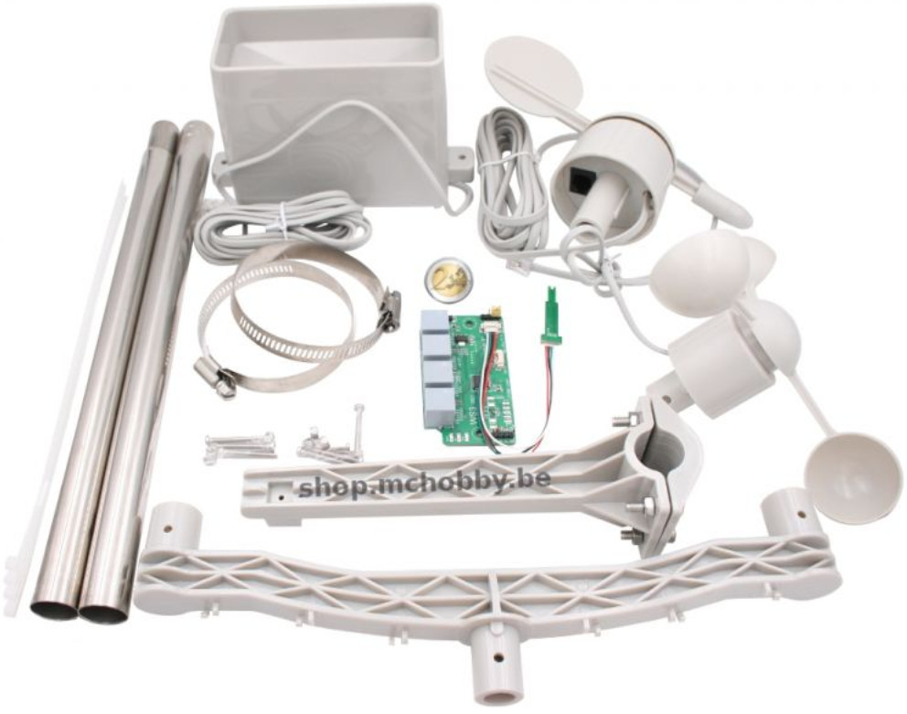
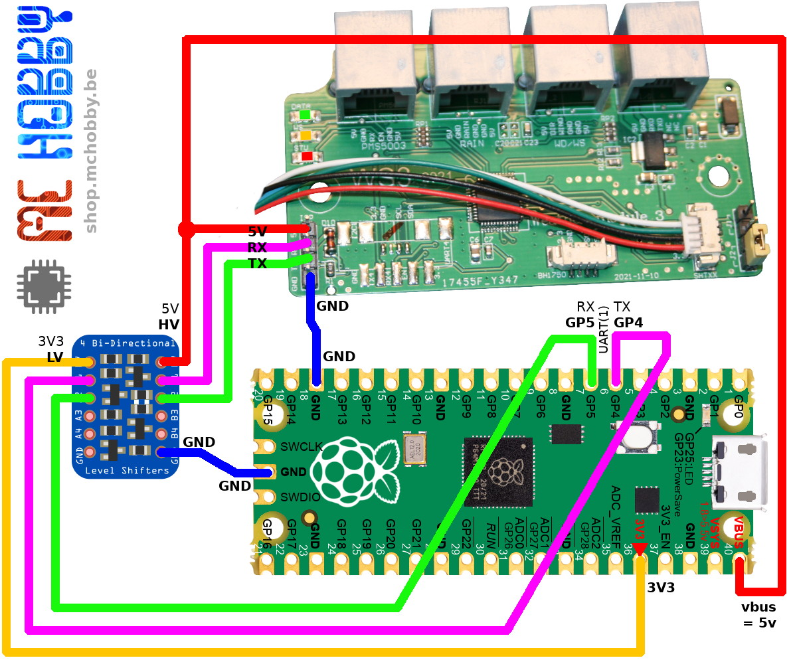

[This file also exists in ENGLISH](readme_ENG.md)

# Réceptionner et décoder les données de votre station météo "Weather-Station" avec MicroPython

La [Weather-Station (SEN0186)](https://shop.mchobby.be/fr/environnemental-press-temp-hrel-gaz/2385-station-meteo-kit-5-capteurs-anemometre-girouette-pluie-temperature-humidite-3232100023857.html) est un kit prêt à monter permettant de réaliser plus facilement vos propres stations météo.




Le kit s'articule autour d'une carte microcontrôleur rapatriant et traitant les données des différents capteurs. Cette carte produit alors un flux de données compacte sur son port-série (Logique 5V, 9600 bauds 8N1).


En inspectant plus précisément la carte, il est possible de compléter ce kit avec:
* Un capteur de [qualité d'air (PMS5003)](https://shop.mchobby.be/fr/environnemental-press-temp-hrel-gaz/1332-senseur-qualite-d-air-pm25-pm5003-et-adaptateur-breadboard-3232100013322-adafruit.html)
* Un capteur de [luminosité ambiante (BH1750)](https://shop.mchobby.be/fr/environnemental-press-temp-hrel-gaz/2444-m5stack-capteur-luminosite-ambiante-bh1750fvi-tr-grove-i2c-3232100024441-m5stack.html)

Au final l'assemblage du kit principal ressemble à ceci.


# Bibliothèque

Cette bibliothèque doit être copiée sur la carte MicroPython avant d'utiliser les exemples.

Sur une plateforme connectée:

```
>>> import mip
>>> mip.install("github:mchobby/esp8266-upy/weather-station")
```

Ou via l'utilitaire mpremote :

```
mpremote mip install github:mchobby/esp8266-upy/weather-station
```

# Brancher
## Brancher sur Raspberry-Pi Pico
Le Raspberry-Pi Pico est un système 3.3V, il faut donc prévoir un [convertisseur de niveau logique](https://shop.mchobby.be/fr/cartes-breakout/131-convertisseur-logique-4-canaux-bi-directionnel-i2c-compatible-3232100001312-adafruit.html) compatible avec un port série/uart.



# Bibliothèque
La bibliothèque [weather.py](lib/weather.py) doit être copiée dans le système de fichier MicroPython de votre carte.

La bibliothèque utilise le protocole dit "professionnel" pour réceptionner les données. Ce protocole est décrit dans le fichier [protocol.txt](docs/protocol.txt) (source: inconnue).

# Tester

## Lecture brute
Pour lire les données sur le port série, il suffit de l'ouvrir et de réceptionner les chaînes de caractères.

``` python
from machine import UART
import time
u = UART( 1, 9600 )
while True:
	print( u.readline() )
	time.sleep( 0.5 )
```

Ce qui produit le résultat suivant dans la session REPL.

```
b'A3143B000C0000D0000E0000F0000G0020H0000I0000J0000K0060L0213M319N09982O.....*5E\r\n'
None
b'A3141B000C0000D0000E0000F0000G0020H0000I0000J0000K0060L0213M319N09982O.....*5C\r\n'
None
b'A3143B000C0000D0000E0000F0000G0020H0000I0000J0000K0060L0213M319N09982O.....*5E\r\n'
None
b'A3142B000C0000D0000E0000F0000G0020H0000I0000J0000K0060L0213M320N09983O.....*54\r\n'
None
b'A3143B000C0000D0000E0000F0000G0020H0000I0000J0000K0060L0213M320N09983O.....*55\r\n'
None
b'A3142B000C0000D0000E0000F0000G0020H0000I0000J0000K0060L0213M320N09983O.....*54\r\n'
None
b'A3143B000C0000D0000E0000F0000G0020H0000I0000J0000K0060L0213M320N09982O.....*54\r\n'
None
b'A3141B000C0000D0000E0000F0000G0020H0000I0000J0000K0060L0213M320N09982O.....*56\r\n'
None
b'A3143B000C0000D0000E0000F0000G0020H0000I0000J0000K0060L0213M320N09982O.....*54\r\n'
```

## Utiliser la bibliothèque
Le script suivant permet de lire toutes les informations publiées par la station météo par l'intermédiaire de la bibliothèque.

Les informations sont clairement identifiée (par le nom des propriétés) et accessibles en tant que `int` ou `float` .

``` python
from machine import UART
from weather import WeatherStation

# Raspberry-Pi Pico, GP4=TX, GP5=RX
u = UART( 1, 9600, timeout=100 )

ws = WeatherStation( u )
iter = 0
while True:
	iter += 1
	print( '' )
	# update() retourne True lorsque qu'une nouvelle série de données est réceptionnée
	print( 'New data received: %s - iteration %i' % (ws.update(),iter) )
	# Direction du vent (en degrés)
	print( '  Wind Direction: %i degrees' % ws.wind_dir ) # 0..360
	# Vitesse du vent (mesure instantanée)
	print( '  Wind speed    : %f m/s (instantaneous)' % ws.wind_speed_real )
	# vitesse moyenne la dernière minute
	print( '  Wind speed    : %f m/s (mean last minute)' % ws.wind_speed )
	# Vitesse max sur les 5 dernières minutes
	print( '  Wind speed    : %f m/s (max last 5 minutes)' % ws.wind_speed_max )
	# Compteur de basculement du pluviomètre
	print( '  Rain cycles   : %i bucket (counter, 0-9999)' % ws.rain_cycle_real )
	# Compte de basculement sur la dernière minute
	print( '  Rain cycles   : %i bucket (last minute)' % ws.rain_cycle )
	# mm d'eau sur la dernière minutes
	print( '  Rain          : %f mm (last minute)' % ws.rain_mm )
	# mm d'eau sur la derniere heure
	print( '  Rain          : %f mm (last hour)' % ws.rain_mm_hour )
	# mm d'eau sur les dernières 24h
	print( '  Rain          : %f mm (last 24H)' % ws.rain_mm_day )
	# température en degrés Celcius
	print( '  Temperature   : %f Celcius' % ws.temp )
	# Humidité relative en pourcent
	print( '  Humidity      : %f %%Rel' % ws.hrel )
	# pression athmosphérique en hectoPascal.
	print( '  Pressure      : %f hPa' % ws.pressure )
```

The script do produce the following results on the REPL session.

```
New data received: True - iteration 4746
  Wind Direction: 90 degrees
  Wind speed    : 0.000000 m/s (instantaneous)
  Wind speed    : 0.000000 m/s (mean last minute)
  Wind speed    : 0.000000 m/s (max last 5 minutes)
  Rain cycles   : 48 bucket (counter, 0-9999)
  Rain cycles   : 0 bucket (last minute)
  Rain          : 0.000000 mm (last minute)
  Rain          : 0.000000 mm (last hour)
  Rain          : 1.400000 mm (last 24H)
  Temperature   : 21.500001 Celcius
  Humidity      : 37.400002 %Rel
  Pressure      : 995.300007 hPa
```

# Shopping list
The [Weather-Station (SEN0186)](https://shop.mchobby.be/fr/environnemental-press-temp-hrel-gaz/2385-station-meteo-kit-5-capteurs-anemometre-girouette-pluie-temperature-humidite-3232100023857.html) is available at MC Hobby.
* [Weather-Station](https://shop.mchobby.be/fr/environnemental-press-temp-hrel-gaz/2385-station-meteo-kit-5-capteurs-anemometre-girouette-pluie-temperature-humidite-3232100023857.html) @ MC Hobby
* [Weather-Station](https://www.dfrobot.com/product-1308.html) @ DFRobot
* [Convertisseur de Niveau logique 4bit](https://shop.mchobby.be/fr/cartes-breakout/131-convertisseur-logique-4-canaux-bi-directionnel-i2c-compatible-3232100001312-adafruit.html) @ MCHobby
* [Raspberry-Pi Pico](https://shop.mchobby.be/fr/pico-rp2040/2025-pico-rp2040-microcontroleur-2-coeurs-raspberry-pi-3232100020252.html) @ MCHobby
* [Raspberry-Pi Pico Wireless](https://shop.mchobby.be/fr/pico-rp2040/2434-pico-w-wireless-rp2040-2-coeurs-wifi-bluetooth-3232100024342.html) @ MCHobby
